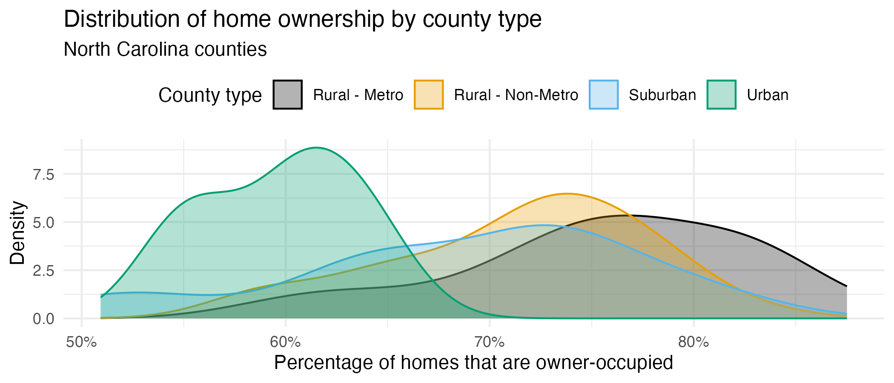

On this first homework, you'll continue to practice data visualization and summarization using the North Carolina counties data from [Lab 1](/lab/lab-1.html). At the end, you'll dip into the textbook a little bit and think about some conceptual questions. Along the way, we'll ask you to get a little fancier with the plots, which will require some extra packages:

```{r}
#| eval: true
#| message: false
library(tidyverse)
library(scales)    # for better axis labels
library(ggthemes)  # for additional color palettes
```

```{r}
#| echo: false
q_no <- 0
```

## Setup



### Exercise `{r} q_no`




## Part 1: Exploring NC Counties


As a reminder, this dataset contains information on North Carolina counties retrieved from the 2020 Census as well as from [myFutureNC Dashboard](https://dashboard.myfuturenc.org/county-data-and-resources/) maintained by Carolina Demography at the University of North Carolina at Chapel Hill.

This dataset is stored in the file `nc-county.csv`, which you can read into R with the following code:

```{r}
#| eval: false
nc_county <- read_csv("data/nc-county.csv")
```

This will read the CSV (comma separated values) file from the `data` folder and store the dataset as a data frame called `nc_county` in R.

The variables in the dataset and their descriptions are as follows:

-   `county`: Name of county;
-   `land_area_m2`: Land area of county in meters-squared, based on the 2020 census;
-   `land_area_mi2`: Land area of county in miles-squared, based on the 2020 census;
-   `pop_2020`: Population of county, based on the 2020 Census;
-   `pop_dens_2020`: Population density calculated as population (`pop_2020`) divided by land area in miles-squared (people per mile-squared);
-   `county_type`: Peer county type classification based on population characteristics, socioeconomic status, and geographic features used for grouping counties with similar demographic, social, and economic characteristics, allowing them to be compared and benchmarked against one another;
-   `median_hh_income`: Median household income;
-   `p_foreign_born`: Percentage of population that is foreign-born;
-   `p_child_poverty`: Percentage of children living in poverty;
-   `p_single_parent_hh`: Percentage of households with children that are single-parent households;
-   `p_broadband`: Percentage of households with broadband internet access;
-   `p_home_ownership`: Percentage of households that are owner-occupied;
-   `p_family_sustaining_wage`: Percentage of adults that earn a family-sustaining wage -- typically a wage that covers essential costs like housing, food, childcare, transportation, and healthcare for a family's basic needs within a specific geographic area;
-   `p_edu_lths`: Percentage of 25-44-year-olds with less than a high school diploma;
-   `p_edu_hsged`: Percentage of 25-44-year-olds with a high school diploma or equivalent;
-   `p_edu_scnd`: Percentage of 25-44-year-olds with some college or an associate degree;
-   `p_edu_ndc`: Percentage of 25-44-year-olds with non-degree credentials -- certifications, licenses, or other credentials that demonstrate specific skills or knowledge but do not confer a formal academic degree;
-   `p_edu_assoc`: Percentage of 25-44-year-olds with an associate degree;
-   `p_edu_ba`: Percentage of 25-44-year-olds with a bachelor's degree;
-   `p_edu_mapl`: Percentage of 25-44-year-olds with a master's, professional, or doctoral degree;
-   `p_edu_hs_grad_rate`: High school graduation rate;
-   `p_edu_chronic_absent_rate`: Chronic absenteeism rate.

```{r}
#| echo: false
q_no <- q_no + 1
```

### Exercise `{r} q_no`

Make a bar plot of the number of counties by `county_type`. What type of county is most common in North Carolina? What type of county is least common?


```{r}
#| echo: false
q_no <- q_no + 1
```

### Exercise `{r} q_no`

Make a boxplot of median household income (`median_hh_income`) by `county_type`. In 2-3 sentences, compare the distributions of median household income across the four county types touching on shape, center, spread, and any potential outliers.


```{r}
#| echo: false
q_no <- q_no + 1
```

### Exercise `{r} q_no`

Make a boxplot of the proportion of 25-44-year-olds with a master's, professional, or doctoral degree (`p_edu_mapl`) by `county_type`. How do the median proportions compare across the four county types?


```{r}
#| echo: false
q_no <- q_no + 1
```

### Exercise `{r} q_no`

Recreate the following visualization that compares the distribution of home ownership (`p_home_ownership`) by `county_type`. Then, highlight one feature of home ownership that this plot reveals in 1-2 sentences.



::: {.callout-tip collapse="true"}
## Hints

- x-axis: You can modify the x-axis labels to be percentages in a `scale_x_continuous()` layer. The **scales** package offers a handy function for formatting percentages, `label_percent()`. You can use this in the `labels` argument of `scale_x_continuous()`.

- Color palette: The `scale_color_colorblind()` and `scale_fill_colorblind()` functions from the **ggthemes** package provide a color palette that is friendly for individuals with color vision deficiencies.

- Transparancy: You should adjust the transparency of the filled density curves. You don't have to worry about the exact transparency value, but you should try a few to get close.

- Theme: This plot uses a non-default theme. See [theme options documentation](https://ggplot2.tidyverse.org/reference/ggtheme.html) for options.

- Legend: You should move the legend to the top of the plot. You can do this in a `theme()` layer. See [theme documentation](https://ggplot2.tidyverse.org/reference/theme.html) to identify the argument you need to change to move the legend.

- Aspect ratio: You can adjust the aspect ratio by setting the `fig-asp` option in the code cell. A smaller (closer to 0) value makes the plot shorter and wider, while a larger (closer to 1) value makes the plot square-ish.

- Width: You can also adjust the width of the plot by setting the `fig-width` option in the code cell. A larger value makes the plot wider.
:::

```{r}
#| echo: false
q_no <- q_no + 1
```

### Exercise `{r} q_no`

a.  Report the number of rows and columns in `nc_county`.

b.  Create a new variable called `p_edu_he` (short for "percentage of population with higher education") that is the sum of the percentages of 

    - 25-44-year-olds with some college or an associate degree (`p_edu_scnd`), 
    - non-degree credentials (`p_edu_ndc`), 
    - an associate degree (`p_edu_assoc`), 
    - a bachelor's degree (`p_edu_ba`), and
    - a master's, professional, or doctoral degree (`p_edu_mapl`).

    and store this variable in the `nc_county` data frame.

    Then, report the number of rows and columns in `nc_county` after adding this variable.

c.  In a single pipeline, calculate the 

    - minimum,
    - first quartile (25th percentile),
    - median (50th percentile),
    - mean,
    - third quartile (75th percentile), and
    - maximum

    of `p_edu_he`.

d.  In a single pipeline, calculate the same statistics as in the previous part, but for each `county_type`.

::: {.callout-warning collapse="true"}
If you don't create the new variable `p_edu_he` in part (b), you will not be able to answer the remaining parts of this question or any of the remaining questions on the homework.

Therefore, here is a quick check to make sure you created the variable correctly -- after creating the variable, run the following code:

```{r}
#| eval: false
nc_county |> 
  select(p_edu_he) |> 
  slice_head(n = 3)
```

You should see the following output:

```
# A tibble: 3 × 1
  p_edu_he
     <dbl>
1    0.615
2    0.525
3    0.525
```

If you do not see this output, please revisit part (b) of this question and make sure you created the variable correctly. Ask for help on Ed or in office hours if you need assistance.

:::

```{r}
#| echo: false
q_no <- q_no + 1
```

### Exercise `{r} q_no`

Re-create the following plot that shows the distribution of `p_edu_he` by `county_type`.


::: {.callout-tip collapse="true"}
- x-axis: Same hint as before.

- Points: The points are drawn with the `geom_beeswarm()` function from the **ggbeeswarm** package.

- Outliers: The outliers in the box plots are drawn as _open circles_. You can specify this with the `outlier.shape` argument in `geom_boxplot()`. You can also adjust the size of the outliers with the `outlier.size` argument. The ggplot2 [aesthetic specifications documentation](https://ggplot2.tidyverse.org/articles/ggplot2-specs.html#point) has a list of shape names you can use for help.

- Color palette: The colors for the box plots are manually specified in a `scale_color_manual()` layer. You do not need to worry about the exact colors, but you should try to get close, e.g., use blue-ish colors for Rural counties, red-ish for Suburban, and brown-ish for Urban. You can use HEX codes for colors or look up named colors in R in the [R colors cheatsheet](https://www.nceas.ucsb.edu/sites/default/files/2020-04/colorPaletteCheatsheet.pdf)

- Transparency: You should adjust the transparency of the box plots. You don't have to worry about the exact transparency value, but you should try to get close.

- Theme: This plot uses a non-default theme. See [theme options documentation](https://ggplot2.tidyverse.org/reference/ggtheme.html) for options.

- Aspect ratio and width: You can adjust the aspect ratio and width of your plot in your _rendered document_ by setting `fig-asp` and `fig-width` options in the code cell.
:::


```{r}
#| echo: false
q_no <- q_no + 1
```

### Exercise `{r} q_no`

Create a scatter plot with percentage of 25-44 year olds with higher education (`p_edu_he`) on the x-axis and median household income (`median_hh_income`) on the y-axis. Describe the relationship between these two variables. In your description, make sure to comment on the direction, form, strength, and any unusual observations. 

Requirements for the plot:

- The x-axis should be formatted as percentages, e.g., 30%, not 0.3;
- The y-axis should be formatted as dollar amounts, e.g., \$40,000, not 4e+04.

## Part 2: IMS exercises

These exercises from the textbook do not require code, but you should type your responses into the same Quarto file you've been using. Make sure to answer the questions in full sentences.

```{r}
#| echo: false
q_no <- q_no + 1
```

### Exercise `{r} q_no`


[IMS Chapter 1 exercises](https://openintrostat.github.io/ims/data-hello.html#sec-chp1-exercises), #4: Cheaters, study components.


```{r}
#| echo: false
q_no <- q_no + 1
```

### Exercise `{r} q_no`


[IMS Chapter 1 exercises](https://openintrostat.github.io/ims/data-hello.html#sec-chp1-exercises), #14: UN Votes.


```{r}
#| echo: false
q_no <- q_no + 1
```

### Exercise `{r} q_no`


[IMS Chapter 1 exercises](https://openintrostat.github.io/ims/data-hello.html#sec-chp1-exercises), #16: Shows on Netflix.


## Submission


