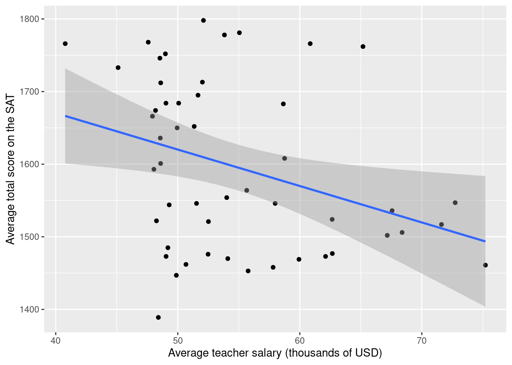
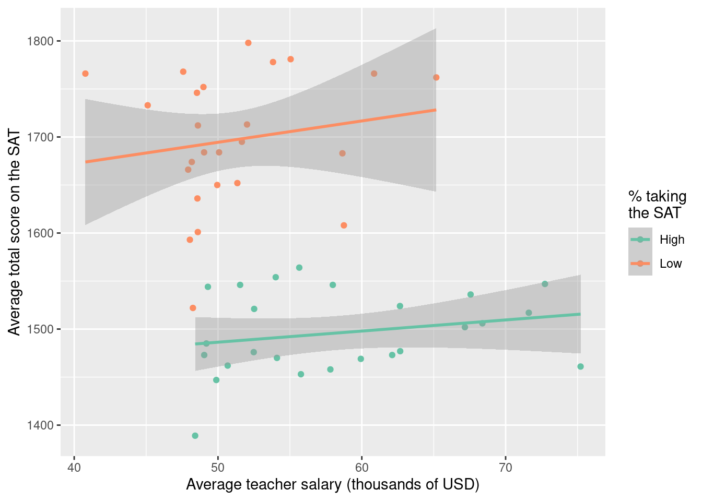

This homework will give you a workout with all of the linear regression ideas we've studied so far.

```{r}
#| echo: false
#| message: false
library(tidyverse)
library(tidymodels)
```

## Setup



```{r}
#| echo: false
q_no <- 0
```

### Exercise `{r} q_no`




## Part 1: credit cards

In this part you will analyze a small dataset on personal finances:

```{r}
#| eval: false
credit <- read_csv("data/credit.csv")
```

Each row is an American adult, and the variables are as follows:

| Variable | Description |
|------------------------------------|------------------------------------|
| `balance` | Credit card balance in \$ |
| `income` | Income in \$1,000 |
| `student_status` | Whether the individual is a student (`Student`) or not (`Not student`) |
| `marriage_status` | Whether the individual is a married (`Married`) or not (`Not married`) |
| `limit` | Credit limit |
| `marriage_student` | 4-level categorical variable that mixes and matches marriage and student status |
: {tbl-colwidths="[25, 75]"}

Our goal is to understand how well a person's income predicts their credit card balance, and we want to know how this relationship varies according to the person's marriage and student status.


```{r}
#| echo: false
q_no <- q_no + 1
```

### Exercise `{r} q_no` (visualize and summarize)

a. Create a scatter plot visualizing `income` and `balance`, and include on your scatter plot the least squares line;
a. Write a single data pipeline that computes:
    - The means and standard deviations of the two variables;
    - The correlation between the two variables;
    - The slope and intercept of the least squares line in your plot. You should do this using the formulas from lecture that involve the five summaries above.


```{r}
#| echo: false
q_no <- q_no + 1
```

### Exercise `{r} q_no` (simple linear regression)

a. Use the commands from `tidymodels` to fit the simple linear regression model that predicts `balance` from `income`. Make sure you *store* this model fit by giving it a useful name. Then display the regression output and verify that your slope and intercept estimates are the same as the ones from the previous exercise;
a. Interpret the slope and the intercept estimates, and comment about whether or not the intercept estimate is *meaningful* in the context of the application.

```{r}
#| echo: false
q_no <- q_no + 1
```


### Exercise `{r} q_no` ("simple" linear regression)

a. Fit the linear model that predicts `balance` from `marriage_student` only. Make sure you *store* this model fit by giving it a useful name. Then display the regression output;
a. Interpret the coefficient estimates in this model;
a. In a single pipeline, compute the average `balance` within each level of `marriage_student`. Do these averages agree with the estimates from the model you just fit?

```{r}
#| echo: false
q_no <- q_no + 1
```

### Exercise `{r} q_no` (multiple linear regression 1)

a. Fit the *additive* model that predicts `balance` from `income` *and* `marriage_student`. Make sure you *store* this model fit by giving it a useful name. Then display the regression output;
a. Interpret the coefficient estimates in this model;
a. What credit card balance does this model predict for a married non-student whose income is $70,000?

```{r}
#| echo: false
q_no <- q_no + 1
```

### Exercise `{r} q_no` (multiple linear regression 2)

a. Create a scatter plot visualizing `income` and `balance`. Color the points on the scatter plot according to the levels of `marriage_student`, and add to the plot a different best fit line for each of those groups;
a. Fit the *interaction* model that predicts `balance` from `income` *and* `marriage_student`. Make sure you *store* this model fit by giving it a useful name. Then display the regression output;
a. Interpret the coefficient estimates in this model.

```{r}
#| echo: false
q_no <- q_no + 1
```

### Exercise `{r} q_no` (selection)

You just fit four separate models, but each one is meant to predict the same response variable: credit card balance. Which of these four models is "best"? Please provide a thorough explanation of why you made your choice.


## Part 2: think about it

This exercise does not require code, but you should type your responses into the same Quarto file you've been using. Make sure to answer the question in full sentences.

```{r}
#| echo: false
q_no <- q_no + 1
```

### Exercise `{r} q_no`

Imagine we wish to study the relationship between the salary of high school teachers and the SAT scores of their students. So we collect data on a bunch of schools, and for each school we record average teacher salary and average SAT score, as well as a categorical variable indicating whether taking the SAT is common or not at that school. 

As we saw, there are many models that we could fit in an attempt to summarize the relationship. Here are two:

{width="48%"}{width="48%"}

How do these model fits differ? Can you speculate about *why* they differ? Which of these two models do you think is more appropriate for faithfully describing the relationship?


## Submission


