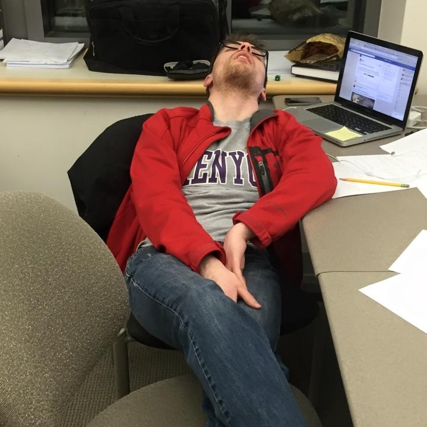
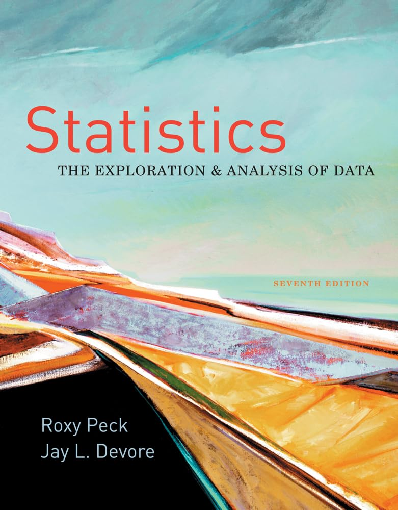
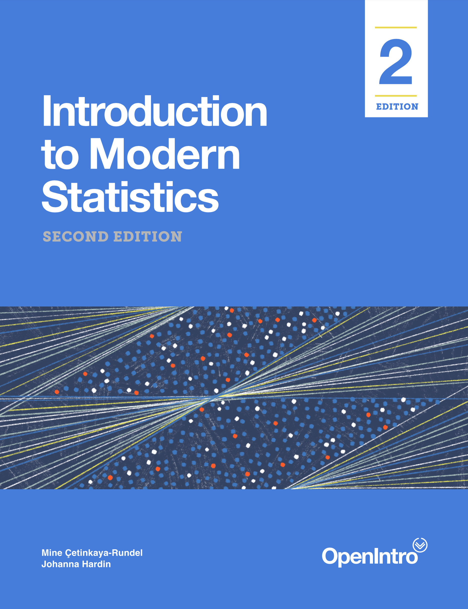
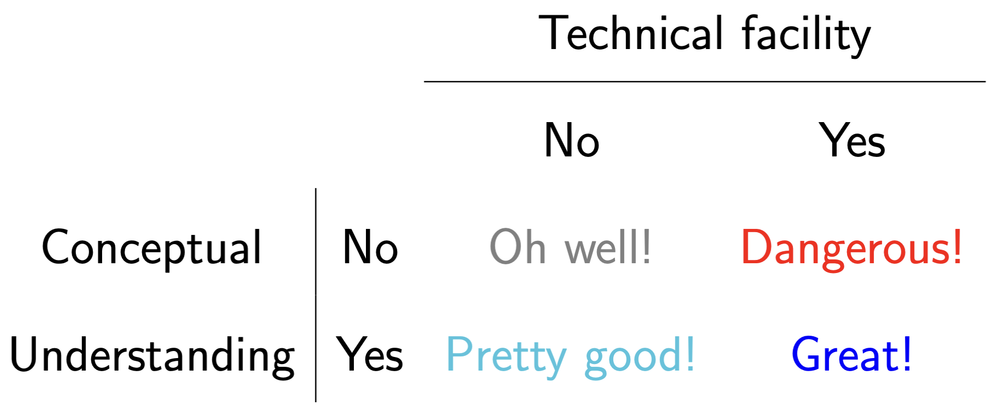
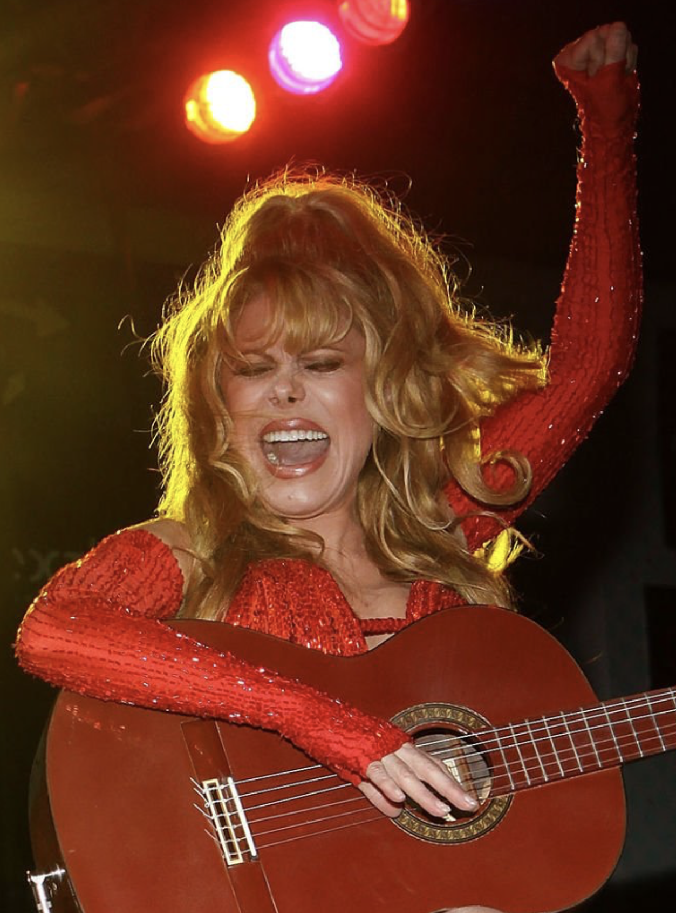

## Imagine this dialog {.small}

. . .

[**Campaign manager**]{style="color:blue;"}: What share of the popular vote do we think our candidate will receive?

. . .

(A flurry of analysis takes place.)

. . .

[**Data scientist**]{style="color:red;"}: Our best guess is 54%.

. . .

[**Campaign manager**]{style="color:blue;"}: How reliable is that estimate? How confident are we in that? What's the margin of error?


. . .

::: columns
::: {.column width="50%"}

**Parallel Universe 1**

[**Data scientist**]{style="color:red;"}: It's 54% give or take 3%.

:::

::: {.column width="50%"}

:::  {.fragment}

**Parallel Universe 2**

[**Data scientist**]{style="color:red;"}: It's 54% give or take 20%.

:::

:::
:::

. . .

::: callout-note
## It's all about decision-making under uncertainty

The manager is going to make wildly different decisions about campaign spending and strategy depending on how uncertain the environment is. Therefore, it pays to know what you're dealing with. Statistics can help!
:::

## What are we studying?

. . .

::: callout-note
## Data analysis

- Transforming messy, incomplete, imperfect data into *knowledge*;
- *Knowledge* often takes the form of pictures and a concise set of numerical summaries.
:::

. . .

::: callout-warning
## Statistical inference

Quantifying our uncertainty about that knowledge.
:::

# A brief history of intro stat

## A Portrait of the Instructor as a Young Man {.medium}

Back in Spring 2014...

::: {.columns}
::: {.column width="50%"}

:::

::: {.column width="50%"}

:::
:::

## The old way

::: {.columns}
::: {.column width="30%"}

:::

::: {.column width="43%"}

:::
:::

- [$272.00](https://www.amazon.com/Statistics-Exploration-Analysis-Available-Titles/dp/0840058012/ref=sr_1_1?crid=297Y6VX5WF0LD&dib=eyJ2IjoiMSJ9.RTkd3TOK5o_5S6Od8Xp80uexK2SC2vRaH_rynYzQZK7qvVNENbOUBRRpDEYKU2wJpZsw1Ed8UpW4STCgvqhmBUn3WR4klCWPrQkcwPcg8cbn7EYWKOpjh-BTI61npfat-Nd8jlxfz9O3S0B0F4bPPdoDv4PStUS3_DsGyl9dCc5pPqB3ByuS5uQpJBTnQOfD5szbMsEgMlLSlaRLDw_Bmy67IAY1HhMvaje_n6x7hSU.lZJavCwQ49gLr9h5HlCM7Flkd1RmTRJwptoVL5yj8RQ&dib_tag=se&keywords=peck+devore+statistics&qid=1786473057&sprefix=peck+devore+statistic%2Caps%2C188&sr=8-1) textbook;
- Point-and-click spreadsheet software ($???.??).

## The new way {.medium}

::: {.columns}
::: {.column width="30%"}

:::

::: {.column width="43%"}

:::
:::

- Flexible, simulation-based approach to inference (\$0.00);
- Computer programming (\$0.00).

This is much closer to what contemporary practitioners actually do.

## "The ladder" {.small}

::: incremental
- This course has no prerequisites. If your body temperature is roughly in the nineties, you are welcome in STA 101;
- You will encounter many new technical ideas in this class, and we will introduce them in several styles:
    - in words;
    - in pictures;
    - in code and data;
    - in math and formulas;
- It's not a one-way street, and these styles of understanding are mutually reninforcing;
- Sometimes you'll go "all the way" with a topic, and sometimes you'll stop short ("I can explain the idea, and the picture makes sense, but the math remains a mystery").
:::

. . .

That's okay!

## Do what you can do, at the pace you can do it {.medium}



. . .

I can't guarantee where exactly on this grid the actual letter grades fall, but wherever you land, there is no judgement.

# Syllabus highlights

## Bookmark the course page! {.large}

::::: {.columns .v-center-container}
::: {.column width="30%"}

:::

::: {.column width="70%"}
<https://sta101-f26.github.io/>
:::
:::::

## Grading {.medium}

Your final course grade will be calculated as follows:

| Category       | Percentage |
|----------------|------------|
| Labs           | 10%        |
| Homeworks      | 20%        |
| Project        | 20%        |
| Midterm Exam   | 25%        |
| Final exam     | 25%        |

The final letter grade is based on the [usual thresholds](/syllabus/syllabus-assignments.html).

. . .

::: callout-warning
## What you see is what you get
No curve, no rounding, no extra credit. 
:::

## Wiggle room

-   10 labs in total, and we drop the lowest 2;
-   8 homeworks in total, and we drop the lowest 1;
-   We replace your midterm score with your final score (if it's better).

## Lab (10%)

-   Hands-on practice with coding and data analysis;

-   Completed in-person, in lab, in randomly-assigned teams;

-   Developed collaboratively, but turned in individually by the end of the lab session;

-   10 throughout semester; 2 lowest scores dropped;

-   No late work accepted.

## Homework (20%)

- Posted on Friday; due at 10 am the following Friday;
- 8 in total, and I'll drop the lowest;
- No late work accepted unless you request an extension in advance by e-mailing me. All reasonable requests will be entertained, but extensions will not be long;
- Collaboration strongly encouraged, but you must cite your collaborators, and your write-up must be your own.

## Project (20%) {.medium}

- Randomly-assigned teams within your lab;
- Pick a dataset and a research question and write an original analysis;
- **Kick-off**: Friday October 16;
- **Presentation**: Friday December 4 (LDOC);
- **Submit write-up**: Monday December 7 @ 5pm;
- In-between: intermediate deadlines, peer evaluations of teammates, peer review of other groups;
- Regardless your enrollment status, you must complete this to pass.

## Exam (50%)

Traditional, in-class, no-tech exams:

- **Midterm**: Thursday October 8 during lecture;
- **Final**: Thursday December 10 at 2pm in this room.

You are only allowed both sides of one 8.5" x 11" note sheet created by you.

. . .

::: callout-note
## If you seek testing accommodations...

Make sure I get an SDAO letter, and make your appointments in the [Testing Center](https://testingcenter.duke.edu/) now.
:::

## Attendance

- **Lecture**: not required. Live your life. All materials posted;
- **Lab**: required for credit. You can't leave your group hanging. I let our "drop 2" policy automatically handle most attendance hiccups.

## Communication

If you wish to ask questions in writing...

-   **Post on Ed**: about general course policies and content;

-   **Email JZ directly**: personal matters.

You should not really be emailing the TAs directly for any reason.

## Collaboration

You are *enthusiastically encouraged* to work together on labs and homeworks. You will learn a lot from each other! Two policies:

- ✅ Acknowledge your collaborators: "Aloysius, Cybill, and I worked together on this problem;"
- ❌ Do not outright share or copy solutions. All submitted work must be your own.

Violation of the second policy is plagiarism. Sharers and recipients alike are referred to the conduct office and receive zeros.

## Use of outside resources, including AI

Check out the [discussion](/syllabus/syllabus-policies.html#use-of-outside-resources-including-ai) in the syllabus.

tl; dr: 

- Everything is pretty much fair game so long as you cite it;
- Uncited use of outside resources is treated as plagiarism;
- If you spend the entire semester outsourcing all of your *thinking* to a chatbot, you will probably humiliate yourself on both exams, which are worth 50% of your grade.


## FAQ: 101 vs 198 vs 199?

They're similar (101 and 199 use the same textbook), but:

::: incremental
- 101: much more stats, much less coding;
- 199: much less stats, much more coding;
- 198: part of Constellations, closer perhaps to 199, focuses on applications to the health sciences.
:::

. . .

Also, 198/199 counts as an elective for the stats major. 101 does not. 101 can only count towards the minor.

# A game

## How old is this person? {.large}

::: {layout="[[-1], [1], [-1]]"}
Ethel Merman
:::

## Ethel Merman

::: {.columns .v-center-container}
::: {.column width="40%"}

:::

::: {.column width="60%"}
|               |                                                                     |
|------------------------------------|------------------------------------|
| Born          | January 16, 1908                                                    |
| Died          | February 15, 1984                                                   |
| Age           | 76                                                                  |
| Claim to fame | [JZ's favorite singer](https://youtu.be/s62MrU8mHx4?feature=shared) |
:::
:::

## How old is this person? {.large}

::: {layout="[[-1], [1], [-1]]"}
Megan Pete
:::

## Megan Thee Stallion

::: {.columns .v-center-container}
::: {.column width="40%"}

:::

::: {.column width="60%"}
|               |                                                       |
|---------------|-------------------------------------------------------|
| Born          | February 15, 1995                                     |
| Age           | 31                                                    |
| Claim to fame | [Rapper](https://youtu.be/4Fhm9ulCwUU?feature=shared) |
:::
:::

## How old is this person? {.large}

::: {layout="[[-1], [1], [-1]]"}
봉준호
:::

## Bong Joon-ho

::: {.columns .v-center-container}
::: {.column width="40%"}

:::

::: {.column width="60%"}
|               |                                         |
|---------------|-----------------------------------------|
| Born          | September 14, 1969                      |
| Age           | 56                                      |
| Claim to fame | Directed *Parasite*, *Snowpiercer*, etc |
:::
:::

## Now do it with pictures... {.large}

::: {.columns .v-center-container}
::: {.column width="50%"}
When the picture was taken, how old was the person?
:::

::: {.column width="50%"}

:::
:::

# Let's see how you did

## Baby's first spreadsheet

```{r}
#| message: false 
#| warning: false
library(tidyverse)
age_guesses <- read_csv("data/age_guesses.csv")
```

```{r}
#| echo: false
age_guesses |>
  select(celeb1, celeb2, celeb3, celeb4, celeb5, celeb6)
```

Each row is a 101 student, and the columns record their guesses for each celeb.


## Anyone know who this is?

::: {.columns .v-center-container}
::: {.column width="40%"}
{fig-align="center" width="80%"}
:::

::: {.column width="60%"}

:::
:::


## Yuja Wang

::: {.columns .v-center-container}
::: {.column width="40%"}
{fig-align="center" width="80%"}
:::

::: {.column width="60%"}
|               |                                                                  |
|------------------------------------|------------------------------------|
| Born          | 2/10/1987                                                        |
| Age in pic    | 36                                                               |
| Claim to fame | [Classical pianist](https://youtu.be/RGAPTRrAilY?feature=shared) |
:::
:::

## Baby's first dataviz {.medium}

What dataset do we want to visualize?

```{r}
#| warning: false
#| message: false
ggplot(age_guesses)
```

## Baby's first dataviz {.medium}

What part of it do we want to visualize?

```{r}
#| warning: false
#| message: false
ggplot(age_guesses, aes(x = celeb1))
```

## Baby's first dataviz {.medium}

What kind of plot do we want?

```{r}
#| warning: false
#| message: false
ggplot(age_guesses, aes(x = celeb1)) + 
  geom_histogram()
```

## Baby's first dataviz {.medium}

Change the horizontal axis range:

```{r}
#| warning: false
#| message: false
ggplot(age_guesses, aes(x = celeb1)) + 
  geom_histogram() + 
  xlim(0, 100)
```

## Baby's first dataviz {.medium}

Add some human-readable labels:

```{r}
#| warning: false
#| message: false
ggplot(age_guesses, aes(x = celeb1)) + 
  geom_histogram()  + 
  xlim(0, 100) + 
  labs(title = "sta101-f26 students guess Yuja Wang's age",
       x = "Guess")
```

## Baby's first dataviz {.medium}

Add a vertical line at the answer:

```{r}
#| warning: false
#| message: false
ggplot(age_guesses, aes(x = celeb1)) + 
  geom_histogram() + 
  xlim(0, 100) + 
  labs(title = "sta101-f26 students guess Yuja Wang's age",
       x = "Guess") + 
  geom_vline(xintercept = 36, color = "red")
```

## Concise numerical summaries {.scrollable}

Where are your guesses concentrated? How spread out are they?

```{r}
#| warning: false
#| message: false

age_guesses |>
  summarize(
    average = mean(celeb1),
    sdev = sd(celeb1)
  )

```

Say hello to the **mean** and **standard deviation**.

## We'll see this stuff daily

::: incremental
- A data frame is R's version of a spreadsheet. It has rows (observations) and columns (variables);
- A histogram is a way of visualizing the *distribution* of a *numerical* variable;
- Features of the distribution can be concisely summarized with numbers like the *mean* and the *standard deviation*;
- You will learn how to build up data visualizations by stacking layers, like a cake;
- You will learn how to transform and summarize data by building *data pipelines* using `|>`.
:::

## Anyone know who this is?

::: {.columns .v-center-container}
::: {.column width="40%"}
{fig-align="center"}
:::

::: {.column width="60%"}

:::
:::

## María Rosario Pilar Martínez Molina Baeza

Better known as *Charo*.

::: {.columns .v-center-container}
::: {.column width="40%"}
{fig-align="center"}
:::

::: {.column width="60%"}
|               |                                                                    |
|------------------------------------|------------------------------------|
| Born          | 3/13/1941? 1/15/1951? Who knows.                                                 |
| Age in pic    | 58 - 68                                                            |
| Claim to fame | [Renaissance woman](https://youtu.be/AO1RtMNuJHU?si=JmqkT4n32RTVLksT) |
:::
:::

## Charo

```{r}
#| echo: false
#| warning: false
#| message: false

ggplot() +
  geom_histogram(data = age_guesses, aes(x = celeb2)) + 
  labs(title = "sta101-f26 students guess Charo's age",
       x = "Guess") + 
  geom_rect(aes(xmin = 58, xmax = 68, ymin = 0, ymax = Inf), 
            alpha = 0.5, fill = "red") + 
  xlim(0, 100)

```

## Anyone know who this is?

::: {.columns .v-center-container}
::: {.column width="50%"}
{fig-align="center"}
:::

::: {.column width="50%"}

:::
:::

## Eubie Blake

His actual birthday was not known at the time:

::: {.columns .v-center-container}
::: {.column width="50%"}
{fig-align="center"}
:::

::: {.column width="50%"}
|               |                                                         |
|---------------|---------------------------------------------------------|
| Born          | 2/7/1887                                                |
| Died          | 2/12/1983                                               |
| Age in pic    | 82                                                      |
| Claim to fame | [Composer](https://youtu.be/mN89vHZ414s?feature=shared) |
:::
:::

## Eubie Blake

```{r}
#| echo: false
#| warning: false
#| message: false

ggplot(age_guesses, aes(x = celeb3)) + 
  geom_histogram() + 
  labs(title = "sta101-f26 students guess Eubie Blake's age",
       x = "Guess") + 
  geom_vline(xintercept = 82, color = "red") + 
  xlim(0, 100)

```

## Watch out for data quality!

::: {.columns .v-center-container}
::: {.column width="50%"}
{width="75%"}
:::

::: {.column width="50%"}
{width="75%"}
:::
:::

## Raghuram Rajan

::: {.columns .v-center-container}
::: {.column width="35%"}
{width="90%"}
:::

::: {.column width="65%"}
|               |                                                                   |
|------------------------------------|------------------------------------|
| Born          | 2/3/1963                                                          |
| Age in pic    | 48                                                                |
| Claim to fame | [UChicago economist](https://youtu.be/3rvUXmrv5Hk?feature=shared) |
|               | [RBI governor](https://en.wikipedia.org/wiki/Raghuram_Rajan)      |
:::
:::

## Raghuram Rajan

```{r}
#| echo: false
#| warning: false
#| message: false

ggplot(age_guesses, aes(x = celeb4)) + 
  geom_histogram() + 
  labs(title = "sta101-f26 students guess Raghuram Rajan's age",
       x = "Guess") + 
  geom_vline(xintercept = 48, color = "red") + 
  xlim(0, 100)

```

## Anyone know who this is?

::: {.columns .v-center-container}
::: {.column width="39%"}
{fig-align="center"}
:::

::: {.column .fragment width="61%"}
<iframe width="560" height="315" src="https://www.youtube.com/embed/Z85lxckrtzg?si=0fMfYg6Ma5eFYh71&amp;start=328" title="YouTube video player" frameborder="0" allow="accelerometer; autoplay; clipboard-write; encrypted-media; gyroscope; picture-in-picture; web-share" referrerpolicy="strict-origin-when-cross-origin" allowfullscreen></iframe>
:::
:::

## Vincent Price

::: {.columns .v-center-container}
::: {.column width="39%"}
{fig-align="center"}
:::

::: {.column width="61%"}
|               |                                                                    |
|------------------------------------|------------------------------------|
| Born          | 5/27/1911                                                          |
| Died          | 10/25/1993                                                          |
| Age in pic    | 38 - 39                                                                 |
| Claim to fame | [Horror actor](https://youtu.be/RpEfX1IKEak?si=s7QEYjjqJj1smJSl) |
:::
:::

## Vincent Price

```{r}
#| echo: false
#| warning: false
#| message: false

ggplot(age_guesses, aes(x = celeb5)) + 
  geom_histogram() + 
  labs(title = "sta101-f26 students guess Vincent Price's age",
       x = "Guess") + 
  geom_vline(xintercept = 38.5, color = "red") + 
  xlim(0, 100)

```

## Anyone know who this is?

::: {.columns .v-center-container}
::: {.column width="40%"}
{fig-align="center"}
:::

::: {.column width="60%"}

:::
:::

## Celia Cruz

::: {.columns .v-center-container}
::: {.column width="40%"}
{fig-align="center"}
:::

::: {.column width="60%"}
|               |                                                               |
|------------------------------------|------------------------------------|
| Born          | 10/21/1925                                                    |
| Died          | 7/16/2003                                                     |
| Age in pic    | 76                                                            |
| Claim to fame | [Queen of Salsa](https://youtu.be/AXN-_asIaYs?feature=shared) |
:::
:::

## Celia Cruz

```{r}
#| echo: false
#| warning: false
#| message: false

ggplot(age_guesses, aes(x = celeb6)) + 
  geom_histogram() + 
  labs(title = "sta101-f26 students guess Celia Cruz's age",
       x = "Guess") + 
  geom_vline(xintercept = 76, color = "red") + 
  xlim(0, 100)

```

## Who guessed best? {.small .scrollable}

```{r}
#| echo: false
true_ages <- c(36, 63, 82, 48, 38.5, 76)

age_guesses |>
  add_row(
    Timestamp = "Whenever",
    `Your name` = "(answers)",
    celeb1 = true_ages[1],
    celeb2 = true_ages[2],
    celeb3 = true_ages[3],
    celeb4 = true_ages[4],
    celeb5 = true_ages[5],
    celeb6 = true_ages[6],
  ) |>
  mutate(
    sqerror = rowMeans(
      sweep(as.matrix(pick(celeb1:celeb6)), 2, true_ages, "-")^2
    )
  ) |>
  select(-Timestamp) |>
  arrange(sqerror) |> 
  slice_head(n = 7) |>
  knitr::kable()

```

(no doxxing version)

## Meet your new best friend

:::: columns

::: {.column width="60%"}

```{r}
#| echo: false
#| fig-align: center
#| fig-asp: 0.5

curve(dnorm(x), from = -3, to = 3, n = 1000, col = "blue", bty = "n",
      xaxt = "n", yaxt = "n", xlab = "", ylab = "", lwd = 2)
abline(h = 0, lwd = 2)
```

:::

::: {.column width="40%"}

:::

::::

## Silly exercise; serious themes {.scrollable .medium}

::: incremental
-   **Domain knowledge and modeling assumptions**: data do not speak for themselves. You need some subject-matter expertise about what you're studying, as well as an interpretive lens;

    - Not all models or assumptions are created equal!

-   Are you asking questions the data can actually answer?
-   Uncertainty has many sources, and in some cases, it may be simply irreducible, no matter how hard you try;
-   **Data quality and data cleaning**: Data are not gospel. There could be noise and mistakes. Then what?
-   **Wisdom of crowds**: aggregating many imperfect guesses can do better than any one individual guess.
:::

# Questions?

# One last thing


## Reserve your container

::::: columns

::: {.column width="40%"}


:::

::: {.column width="60%"}

1. Visit the [Duke Container Manager](https://cmgr.oit.duke.edu/containers) (and log in with your NetID);
2. Reserve the STA101 container on the right-hand-side;
3. Click STA101 under "My reservations" on the left-hand side;
4. Login, start, and give it a sec to launch in your browser.

:::

:::::

## Connect to the course files {.medium}

1. Click {width="30%"} in the upper right;
1. Click {width="30%"} in the drop-down menu;
1. Click {width="30%"} in the dialog box;
1. Click {width="30%"} in the dialog box;
1. Input these and **Create Project**:
    - Repository URL: <https://github.com/sta101-f26/sta101-f26-files.git>
    - Project directory name: `sta101-f26-files`
    
    

