## What are we studying? 

::: incremental
- Data analysis
  - The *art* of transforming messy, incomplete, imperfect data into *knowledge*;
  - *Knowledge* often takes the form of pictures and a concise set of numerical summaries;
- Statistical Inference
  - Quantifying our uncertainty about that knowledge;
  - Reporting this faithfully to help people make decisions.
:::

## Before we begin

Any questions about the syllabus?

. . .

If anything occurs to you later, please post on [Ed](https://edstem.org/us/courses/101045/discussion).

## Today

. . .

::::: columns

::: {.column width="50%"}

We'll take...


:::

::: {.column .fragment width="50%"}


So that you can see...

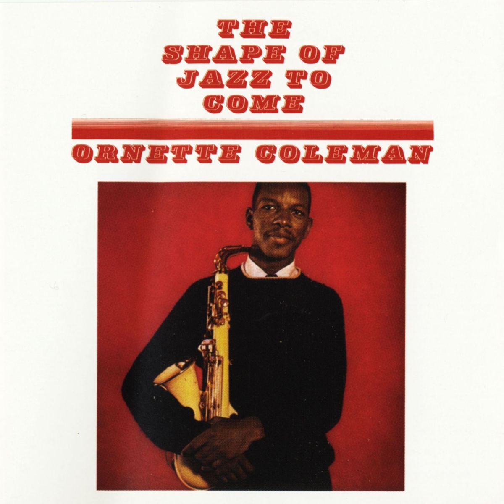

:::

:::::

## Today

::: incremental
- We'll speedrun essentially all of the main ideas of the course so that you can get a sense of the outline of everything. Then we'll spend the next fourteen weeks elaborating;

- It's gonna be a lot, and some things might be easier to follow than others. All you have to do is sit back and let it wash over you. We have the whole rest of the course to refine;

- Please ask questions!

:::

## Basically

{fig-align="center"}

# 0. The toolkit

## Access your container

::::: columns

::: {.column width="40%"}

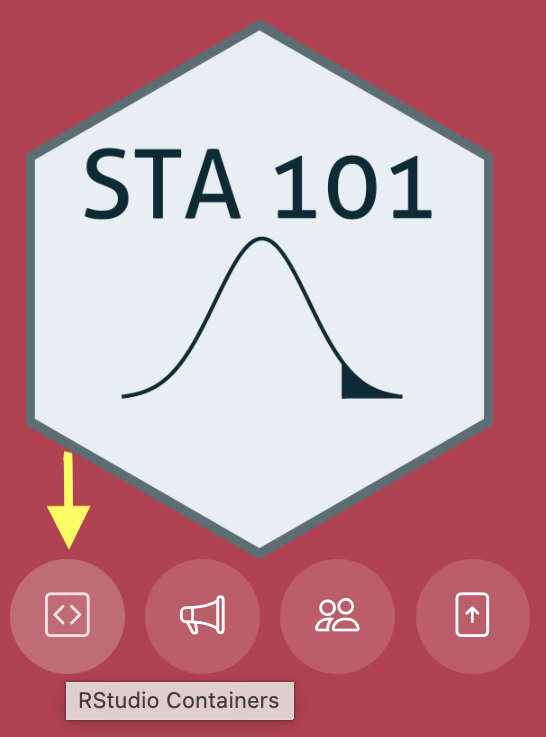

:::

::: {.column width="60%"}

1. Visit the [Duke Container Manager](https://cmgr.oit.duke.edu/containers) (and log in with your NetID);
2. (If you haven't already, reserve the STA101 container on the right-hand-side)
3. Click STA101 under "My reservations" on the left-hand side;
4. Login, start, and give it a sec to launch in your browser.

:::

:::::

## R + RStudio {.medium}

::::: columns

::: {.column width="50%"}

{fig-alt="R logo" fig-align="center"}

**R** is a programming language that statisticians created to make their work easier. If you learn to "speak" this language, you can instruct a computer to perform data analysis tasks that would be tedious to perform by hand.

:::

::: {.column .fragment width="50%"}

{fig-alt="RStudio logo"}

**RStudio** is a convenient interface that allows you to use R in a clean and organized way. It is an example of an *integrated development environment* (IDE), but don't worry about that. 

:::

:::::

## R + RStudio

[{fig-alt="On the left: a car engine. On the right: a car dashboard. The engine is labelled R. The dashboard is labelled RStudio." fig-align="center" width="1001"}](https://moderndive.com/1-getting-started.html)

::: aside

Source: [Modern Dive](https://moderndive.com/1-getting-started.html).

:::


## The lay of the land

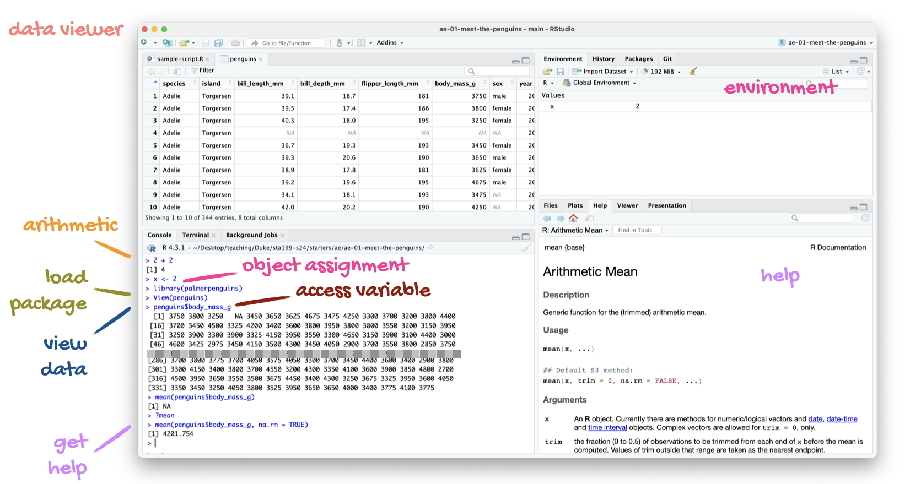

## Grab today's files {.scrollable}

- Double-check that you have the course project loaded in the upper right corner;
- Go to the **Git** tab in the upper right pane and click **Pull**.

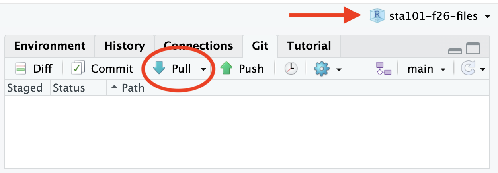

## Packages {.medium}

- Some of R's functionality is built-in (like the sink or the dishwasher), and other stuff is an add-on you need grab separately (like a food processor);
- The add-ons are bundled in **packages**, which you can load in by typing commands like this:

```{r}
#| message: false
library(tidyverse)
library(tidymodels)
```

- Such commands will appear *once* at the top of pretty much every document you work on.

## The `tidyverse` 

The [`tidyverse`](https://tidyverse.org) is the package we will use most often. In fact, it's really a "meta-package" that bundles many smaller packages that we will use:

::::: columns

::: {.column width="40%"}
[{fig-alt="Hex logos for dplyr, ggplot2, forcats, tibble, readr, stringr, tidyr, and purrr"}](https://tidyverse.org)
:::

::: {.column width="50%"}
- `ggplot2`: data visualization;
- `dplyr`: data transformation;
- `readr`: data import and export;
- ...and so on.
:::

::::


## Quarto

::::: {.columns .v-center-container}

::: {.column width="50%"}

:::

::: {.column width="50%"}

Quarto is a technical publishing system that allows you to write documents where text, math, code, and the output of that code are seamlessly integrated in a reproducible way.

:::

::::


## The lay of the land

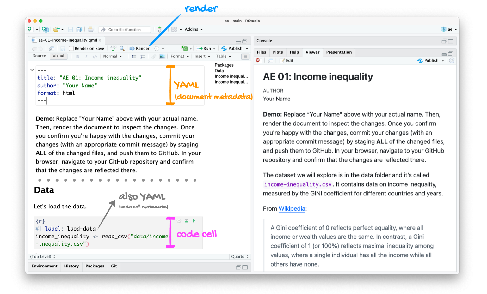

## How it works {.medium}

This is pretty much it:

> Edit the `.qmd` file → hit **Render** → get a `.pdf`

-   Fully reproducible reports -- each time you render the analysis is run from the beginning;
-   Code goes in cells (between the three back ticks);
-   Written English goes outside cells, the same way you would write in Google Docs or MS Word;
-   Every application exercise, lab, project, etc. is a Quarto document;
-   You'll always have a template Quarto document to start with;
-   The amount of scaffolding in the template will decrease over the semester.

## Two important concepts {.smaller}

. . .

Computational *reproducibility*:

::: incremental
- If you give me your code and your data and I hit "Run," do I get the same numbers and the same pictures that you published in your article? 
- If so...phew! If not...what the 🤬?
:::

. . .

Scientific *replication*:

. . .

- Can new researchers conduct an independent analysis with different data and reach the same substantive conclusions that you did?
- Just because your analysis is computationally reproducible does not mean that you have a robust result that **generalizes**.

. . .

Our tools will help you achieve the first, which is necessary (but not sufficient!) for the second.

# 1. A research question

## Minimum wage policy {.scrollable}

[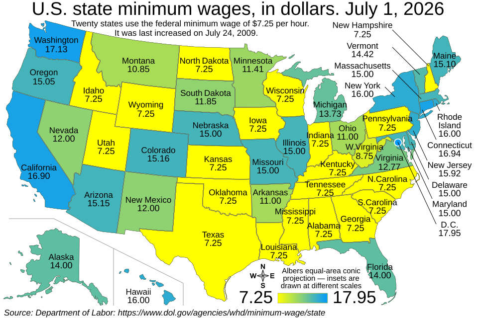{fig-align="center" width="90%"}](https://en.wikipedia.org/wiki/Minimum_wage_in_the_United_States)

## What do you think?

Is a higher minimum wage good? bad? neutral? idfk?


## The ECON 101 story

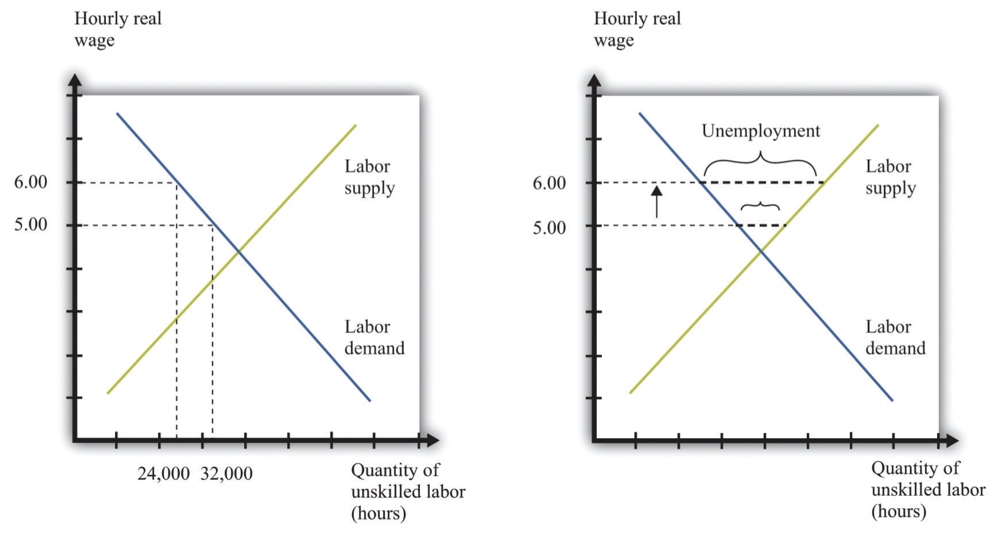

## The ECON 101 story

The reasoning goes like this:


::: incremental
- if you make something more expensive, then people generally do less of it ("demand curves slope down");
- the wage is the *price* that firms pay to employ people. Make it more expensive to employ people, and firms will do less of it.
:::

. . .

This *theoretical argument* motivates a prediction about the world:

. . .

::: callout-important
## Claim

Raising the minimum wage *decreases* employment (puts people out of work).

:::

## The question {.medium}

::: callout-tip
## Does real world experience (data) agree with the theoretical claim in the 101 textbook?
If you raise the minimum wage, does it decrease employment?
:::

::: incremental
- If no: are minimum wage hikes a "free lunch" for reducing poverty?
- If yes: how big is the decrease? Is it worth the trade-off: more people working at lower wage or fewer people working at higher wage?
- Reasonable people can disagree about these questions, and I won't tell you what to think (see further reading at the end);
- For our purposes, I don't even really care about the answer. I'm using it as an excuse to show off the tools, methods, and ways of thinking that can produce *an* answer. That's what our class is about.
:::


## Firstly, the question is too broad

> If you raise the minimum wage, does it decrease employment?

There is no cosmic, forever-and-always answer to that question. It will depend on:

::: incremental
- time: 1950s versus 2020s;
- place: Manhattan versus Dodge City, Kansas;
- industry: nail salons versus management consultants;
- size: \$8 $\to$ \$15 versus \$8 $\to$ \$80.
:::

## So let's zoom in

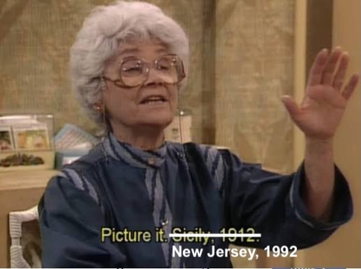{fig-align="center"}

## Specific time, place, industry, and size

::::: columns

::: {.column width="40%"}
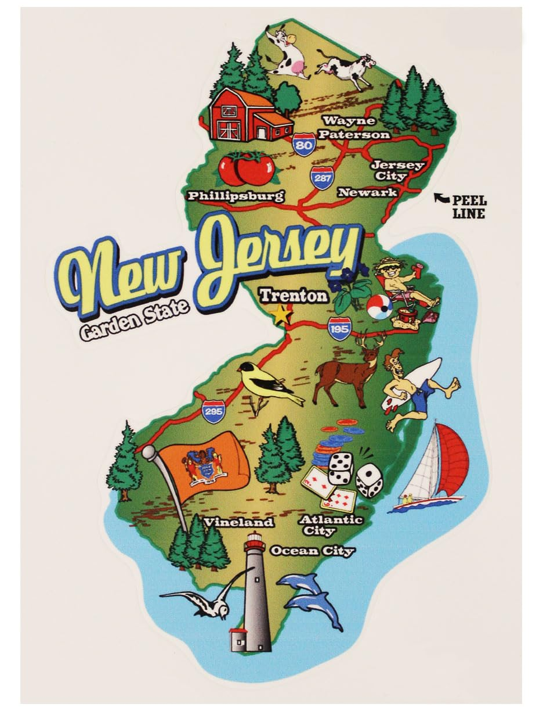
:::

::: {.column width="60%"}
> On April 1, 1992, New Jersey's minimum wage rose from $4.25 to $5.05 per hour. 

Did this policy change decrease employment in the **fast-food industry**?
:::

:::::


## 🚨 Warning: this is a causal question!

If you've heard it once you've heard it a thousand times:

> Correlation does not imply causation.

::: incremental
- However, we don't care about the mere *coincidence* of the minimum wage going up and employment going down. We want to know if the wage hike is the root cause;
- Let's be real from the jump: this is [very difficult]{style="color:red;"} to isolate. But it *is* what we truly care about. So let's not chicken out!
:::

## Wait, why *doesn't* correlation imply causation? {.medium}

{fig-align="center"}

## Wait, why *doesn't* correlation imply causation? {.medium}

{fig-align="center"}

## Because of the possibility of *confounding*

::: incremental
- It's relatively easy to establish *mere association*. See here: <https://tylervigen.com/spurious-correlations>;
- Just because two variables are associated does not necessarily mean that one causes the other;
- Their observed association could be the result of a third thing (a *confounder* or *lurking variable*) that acts on both;
- If you were lucky enough to measure that confounder, then maybe you can account for its effects. If you weren't so lucky, watch out!
- If you want to have a prayer of dealing with this, you need to think carefully about...
:::

# 2. Data collection and study design

## The ideal: a randomized experiment

::: incremental
- Recruit a large group of fast-food restaurants;
- Randomly assign half to raise their minimum wage and half to keep it unchanged;
- Let them operate normally for a suitable period of time;
- Measure employment afterward and compare the treatment and control groups;
- Because the groups were created by random assignment, any systematic difference in employment can plausibly be attributed to the wage increase.
:::

## Why is that ideal? {.medium}

::: incremental
- Random assignment makes the treatment and control groups comparable from the start;
- On average, any differences between the groups are due to chance, not systematic differences in the kinds of restaurants they contain;
- This protects us from confounding, including confounders we didn't even know to measure;
- If the groups differ systematically afterward, the minimum-wage increase is the most plausible explanation;
- In short: randomization gives us a credible comparison, and therefore a plausible basis for a causal conclusion.
:::

## The reality (for our example)

::: incremental
- Who the hell even has the power to impose such a thing?
- Who's going to give you permission to do that?
- Why would restaurants (especially the ones being assigned to hike wages) agree to participate?
- How would the workers feel?
- How much would it cost to administer such a study?
:::

. . .

For many causal questions we care about, cost, practicality, and ethics make it unfeasible to run the proper experiment that would actually be capable of answering the question.


## Observational data

> Just seein' what happened.

- The researcher "passively" collects measurements without intervening to manipulate anything. So they can't dictate treatment versus control, and they don't know if observed differences between groups are caused by the treatment or by some other lurking factors.

- When experiments are unfeasible to carry out, these are the only data we have.


## Observational data + causal inference = 🤮 

As you learned at your grandmother's knee:

> Correlation does not imply causation.

If we observe a mere association in observational data, we have all of our work ahead of us to argue that there is *nothing else going on*, and therefore the association can plausibly support a causal interpretation.

## 🤔 Unless...

- The four-leaf clover of applied statistics is the so-called "natural experiment;"
- This is a special kind of observational study where you *believe* that "nature" has created variation in treatment versus control that acts *as if* an experiment were performed;
- If you’re lucky and careful and shrewd, maybe you can use these special observational data to tell a plausible causal story.

## Example: military service and lifetime earnings

::: incremental
- Does serving in the military put you at an advantage or a disadvantage in terms of the amount of money you make over your lifetime (lifetime earnings)?
- We don't care about mere *conincidence*. We care about the causal effect of military service on lifetime earnings;
- But obviously, we cannot run a laboratory experiment where we randomly assign subjects to tours of duty and then study their tax returns for the next twenty years.
:::

. . .

Or can we?

## The Vietnam Draft Lottery



## Angrist (1990 AER)


## Back to the minimum wage {.scrollable}

{fig-align="center"}

## Card and Krueger (1994 AER)

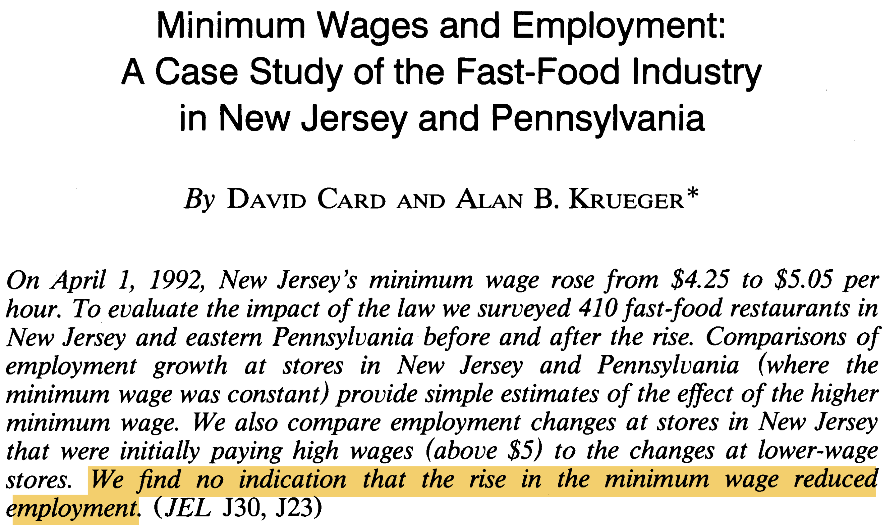

## Card and Krueger's main idea

- Restaurants on either side of the PA/NJ border are probably quite similar, but the NJ restaurants will be treated to a wage hike, and the PA restaurants will not;
- Because the placement of restaurants on either side of the border is largely arbitrary, we can compare these two groups *as if* an experiment were done;
- Any difference in employment patterns that we observe between the two groups can be attributed to the *causal effect* of the wage hike and not some other confounding factor.

## So what did they do?

They *surveyed* restaurants before and after:

- Before the wage hike went into effect, they called a bunch of restaurants in both states and asked them about their business: how many workers they employ, the wage they pay, the prices they charge, etc;
- After the wage hike went into effect, they called the restaurants again and asked the same questions.

## Any concerns about *survey* data?

::: incremental
- What if some restaurants don't respond? (inevitable)
- If not, why not? Was non-response a *random* decision on their part, or are they hiding something?
- How accurate are their responses? Does the person I got ahold of actually know the answers to my questions, or is this just a guesstimate?
- Does the wording of the questions affect how they respond? ([very possible](https://www.cnn.com/2019/03/22/politics/poll-questions-analysis))
:::

. . .

Each of these is a source of *uncertainty* that affects the reliability of any downstream results. 

## Reality check {.medium}

::: incremental
- You don't just give up because the data aren't perfect. They'll never be perfect, if for no other reason that you would always enjoy *more*;
- Alternative definition of data science, statistics, etc: "learning to make do with the data you actually have;"
- Use the best techniques available to wring as much juice out of the data as possible...
- ...BUT THEN, be honest and faithful and rigorous about the limitations of your results. That's the whole *uncertainty quantification* part.
:::

. . .

That last bit doesn't always make statisticians the most popular ("can you please just tell me the 🤬ing answer?"), but it's our professional duty 🫡. 


## Anyway, we have the data! {.small}

Behold, your second spreadsheet:

```{r}
card_krueger <- read_csv("data/card-krueger.csv")

card_krueger
```

```{r}
#| echo: false
card_krueger <- card_krueger |>
  mutate(
    state = fct_relevel(state, "PA", "NJ")
  )
```

## Aside: variable assignment `<-` {.medium}

You just saw me do this:

```{r}
#| eval: false
card_krueger <- read_csv("data/card-krueger.csv")
```

::: incremental
- This is called *variable assignment*. We're saving an object so we can use it later;
- **Right-hand side**: the thing you want to store (the data);
- **Left-hand side**: the name you want to give it so you can refer to it later;
- **In the middle**: the *assignment operator* `<-`.
:::

## The anatomy of a data frame

A data frame is R's version of a *spreadsheet.* 

-   each row of a data frame is an **observation**, in this case a restaurant;
-   each column of a data frame is a **variable**, a piece of information that was recorded about that restaurant.

## The dimensions

How many rows and columns?

```{r}
nrow(card_krueger)
ncol(card_krueger)
```

So they surveyed `{r} nrow(card_krueger)` restaurants in all, and they recorded `{r} ncol(card_krueger)` pieces of information about each one.


## Our variables {.small}

Each row is a restaurant, and for each restaurant, we record the following:

::: incremental
-   `state`: which state is the restaurant in?
-   `chain`: which restaurant chain does the store belong to?
-   `co_owned`: is the restaurant company owned?
-   `wage_st` and `wage_st2`: the starting wage in US dollars before and after policy change;
-   `fte` and `fte2`: full-time-equivalent employment before and after the change, calculated as the number of full-time workers (including managers) plus 0.5 times the number of part-time workers;
-   `hrsopen` and `hrsopen2`: number of hours open per day;
-   `meal_price` and `meal_price2`: the price of a meal (soda, fries, entree);
-   `emp_diff`: `fte2 - fte`.
:::

## Your first taste of variable types {.medium}

The `chain` variable is an example of a *categorical* variable:

```{r}
#| eval: false
card_krueger$chain
```

```{r}
#| echo: false
head(card_krueger$chain)
```

. . .

The `wage_st` variable is an example of a *numerical* variable:

```{r}
#| eval: false
card_krueger$meal_price
```

```{r}
#| echo: false
head(card_krueger$meal_price)
```

. . .

The appropriate visualization or summary depends on the variable type.


# 3. Exploration

## Baby's first summary

How many restaurants do we observe in each state?

```{r}
card_krueger |> 
  count(state)
```


## What restaurant chains are included?

```{r}
card_krueger |> 
  count(chain)
```

. . .

::: callout-note
## Feels like something's missing, doesn't it?
They did try calling McDonald's restaurants, but they got very low response rates and chose to omit them from the study. 
:::

## Aside: the pipe operator `|>`

The pipe operator passes what comes before it into the function that comes after it as the first argument in that function:

::::: columns
::: {.column .fragment width="55%"}
```{r}
sum(1, 2)
```
:::

::: {.column .fragment width="45%"}
```{r}
1 |> 
  sum(2)
```
:::
:::::

. . .

We will use it to build up data summaries and transformations step-by-step.


## Like a Russian stacking doll

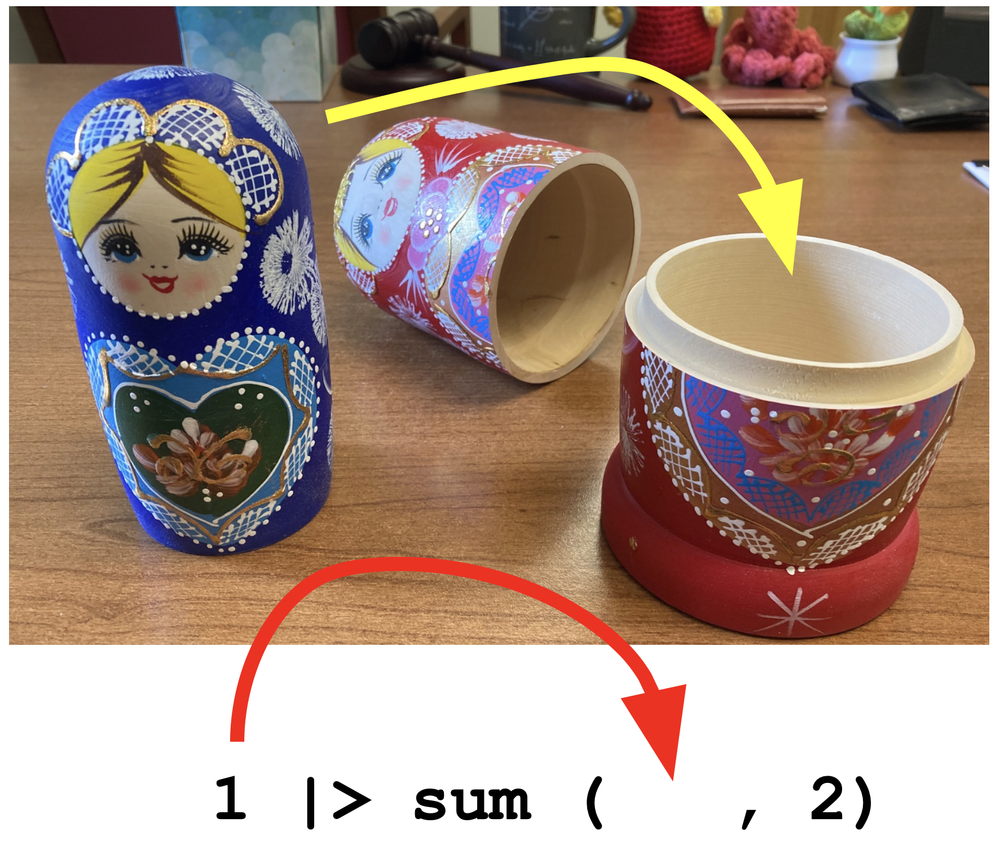{fig-align="center"}

## Next, let's compare states

In order for Card and Krueger's idea to hold water, the restaurants in NJ and PA should look broadly similar prior to the intervention. 

So let's compare:

- similar mix of chains?
- similar prices?
- similar operating hours?
- similar wages and employee counts prior to the wage hike?

## Compare the mix of chains {.medium}

These are the overall totals. How do we get the totals *within* the states?

```{r}
#| output-location: column
card_krueger |>
  count(chain)
```

## Compare the mix of chains {.medium}

Make it a *grouped* data frame:

```{r}
#| output-location: column
#| wrap: false
#| eval: false
card_krueger |>
  group_by(state)
```

## Compare the mix of chains {.medium}

Subsequent calculations will now be done within the groups (eg. states):

```{r}
#| output-location: column
card_krueger |>
  group_by(state) |>
  count(chain)
```

## Compare the mix of chains {.medium}

To directly compare, let's look at *proportions*:

```{r}
#| output-location: column
card_krueger |>
  group_by(state) |>
  count(chain) |>
  mutate(
    prop = n / sum(n)
  )
```

## Compare the mix of chains {.medium}

Let's make it easier to compare by eye:

```{r}
#| output-location: column
card_krueger |>
  group_by(state) |>
  count(chain) |>
  mutate(
    prop = n / sum(n)
  ) |>
  arrange(chain)
```


## Seriously, it's just like Russian stacking dolls


## Let's compare meal prices next {.small}

Start with a blank canvas:

```{r}
#| warning: false
#| message: false
#| output-location: column
ggplot(card_krueger)
```

## Let's compare meal prices next {.small}

What variables are we looking at?

```{r}
#| warning: false
#| message: false
#| output-location: column
#| code-line-numbers: "|2"
ggplot(card_krueger, 
       aes(x = meal_price))
```

The *aesthetic mapping* is where we tell the computer what variables in the data frame we want to use and how we want to use them.

## Let's compare meal prices next {.small}

What kind of plot for this *numerical* variable:

```{r}
#| warning: false
#| message: false
#| output-location: column
#| code-line-numbers: "|3"
ggplot(card_krueger, 
       aes(x = meal_price)) + 
  geom_histogram()
```

## Let's compare meal prices next {.small}

Another option:

```{r}
#| warning: false
#| message: false
#| output-location: column
#| code-line-numbers: "|3"
ggplot(card_krueger, 
       aes(x = meal_price)) + 
  geom_density()
```

A density plot is a "smoothed out" histogram.

## Let's compare meal prices next {.small}

Add labels:

```{r}
#| warning: false
#| message: false
#| output-location: column
#| code-line-numbers: "|4-8"
ggplot(card_krueger, 
       aes(x = meal_price)) + 
  geom_density() + 
  labs(
    x = "Price in USD ($)",
    title = "Meal prices prior to wage hike",
    subtitle = "Meal = soda, fries, entree"
  )
```

Y'know...so we know what we're looking at!

## Let's compare meal prices next {.small}

Increase font size and give it a minimalist look:

```{r}
#| warning: false
#| message: false
#| output-location: column
#| code-line-numbers: "|9"
ggplot(card_krueger, 
       aes(x = meal_price)) + 
  geom_density() + 
  labs(
    x = "Price in USD ($)",
    title = "Meal prices prior to wage hike",
    subtitle = "Meal = soda, fries, entree"
  ) +
  theme_minimal(base_size = 20)
```

## Let's compare meal prices next {.small}

Distinguish the two states with color:

```{r}
#| warning: false
#| message: false
#| output-location: column
#| code-line-numbers: "|3"
ggplot(card_krueger, 
       aes(x = meal_price,
           color = state)) + 
  geom_density() + 
  labs(
    x = "Price in USD ($)",
    title = "Meal prices prior to wage hike",
    subtitle = "Meal = soda, fries, entree"
  ) +
  theme_minimal(base_size = 20)
```

## Let's compare meal prices next {.small}

Shade (fill) beneath the curves:

```{r}
#| warning: false
#| message: false
#| output-location: column
#| code-line-numbers: "|4"
ggplot(card_krueger, 
       aes(x = meal_price,
           color = state,
           fill = state)) + 
  geom_density() + 
  labs(
    x = "Price in USD ($)",
    title = "Meal prices prior to wage hike",
    subtitle = "Meal = soda, fries, entree"
  ) +
  theme_minimal(base_size = 20)
```

## Let's compare meal prices next {.small}

Make the color translucent:

```{r}
#| warning: false
#| message: false
#| output-location: column
#| code-line-numbers: "|5"
ggplot(card_krueger, 
       aes(x = meal_price,
           color = state,
           fill = state)) + 
  geom_density(alpha = 0.5) + 
  labs(
    x = "Price in USD ($)",
    title = "Meal prices prior to wage hike",
    subtitle = "Meal = soda, fries, entree"
  ) +
  theme_minimal(base_size = 20)
```

. . .

These distributions look *pretty* similar.

## Dataviz with ggplot is like building a cake

::::: columns
::: {.column width="35%"}

:::

::: {.column .fragment width="65%"}
- Every plot element is a new layer, and you stack 'em up;
- If the different commands are like the layers of sponge, then the plus signs in between are like the icing. Don't forget the icing!
:::
:::::

## The grammar of graphics 

::: columns
::: {.column width="50%"}

This design philosophy is described in the book *The Grammar of Graphics* and implemented in the `ggplot2` package.


:::

::: {.column width="20%"}
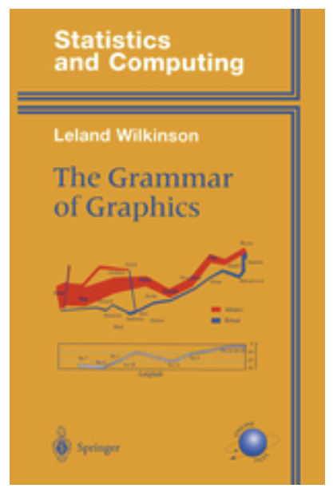
:::

::: {.column width="30%"}

:::
:::

## Compare hours of operation (prior to NJ hike)

```{r}
#| echo: false
#| warning: false
#| message: false
ggplot(card_krueger, aes(x = hrsopen, color = state, fill = state)) +
  geom_density(alpha = 0.5) + 
  labs(
    x = "Hours open per day",
    title = ""
  ) #+ 
  #theme_minimal(base_size = 20)
```

## Compare starting wage (prior to NJ hike)

```{r}
#| echo: false
#| warning: false
#| message: false
ggplot(card_krueger, aes(x = wage_st, color = state, fill = state)) +
  geom_density(alpha = 0.5) + 
  labs(
    x = "Starting wage ($)",
    title = ""
  ) #+ 
  #theme_minimal(base_size = 20)
```

## Compare number of workers (prior to NJ hike)

```{r}
#| echo: false
#| warning: false
#| message: false
ggplot(card_krueger, aes(x = fte, color = state, fill = state)) +
  geom_density(alpha = 0.5) + 
  labs(
    x = "Number of workers",
    title = ""
  ) #+ 
  #theme_minimal(base_size = 20)
```

## So far so good

These data seem to pass the first sanity check: prior to "treatment," the restaurants looked roughly comparable across the two states. What about after treatment?


## The `emp_diff` variable

This is employment after the wage hike minus employment before the wage hike:

- `emp_diff > 0`: the restaurant added workers;
- `emp_diff == 0`: the restaurant didn't change;
- `emp_diff < 0`: the restaurant shed workers.

If the ECON 101 story is correct, we expect `emp_diff` to be lower on average for NJ than for PA. 

## So how about it?

```{r}
card_krueger |>
  group_by(state) |>
  summarize(
    avg_emp_diff = mean(emp_diff)
  )
```

. . .

Oh. That is...flipped from what we expected.


## Pics or it didn't happen

```{r}
#| echo: false
ggplot(card_krueger, aes(x = emp_diff, color = state, fill = state)) +
  geom_density(alpha = 0.5) + 
  labs(
    x = "After - Before difference in employment",
    title = ""
  ) + 
  theme_minimal(base_size = 20)
```

## Pause

If the ECON 101 story is true, then the minimum wage hike should put NJ below PA, either adding fewer workers, or literally laying them off. Pictures and simple summaries are not showing that. 

Now what?

# 4. Modeling

## Data do not speak for themselves

- Pictures and summaries are *powerful*, and they can get you very far, but they cannot do everything;
- Data do not speak for themselves, and there is no such thing as a "neutral" analysis. We are always making assumptions, whether they are implicit or explicit;
- In general, it is better that our assumptions be *explicit*, and the most rigorous way to achieve this is with a *mathematical model*. 

## What do I mean by a "model"? {.medium}

Think of the "line of best fit:"

```{r}
#| echo: false 
#| message: false 
#| warning: false 

set.seed(12345)
tibble(
  x = rnorm(100),
  y = 2 * x + rnorm(100)
) |>
  ggplot(aes(x = x, y = y)) + 
  geom_point() + 
  geom_smooth(method = "lm")
```

. . .

This is an example of a *linear regression model*. All of the models in our class will have this flavor.

## Why do we need one here? {.medium}

(this is where things will start to get technical...)

. . .

Our analysis has several ingredients:

::: incremental
- Response variable $y_i$: that's `emp_diff`;
- Treatment variable $T_i$: the `state`, NJ or PA;
- Extra covariates $\mathbf{x}_i$: `chain`, `hrsopen`, `meal_price`, etc.
:::

. . .

Our goal is to estimate the (causal!) effect that the treatment has on the response. In order to make sure we are isolating the causal effect of the treatment, unconfounded by other factors, we may want to *control* for the extra covariates. A model helps us do this.

## The only equation today {.medium}

(feel free to avert your gaze)

. . .

Here's a linear regression model for the data:

$$
y_i = \alpha + \tau T_i+\mathbf{x}_i^{\scriptscriptstyle\mathsf{T}}\boldsymbol{\beta}+\varepsilon_i,
$$

where $y_i$ is `emp_diff`, $\mathbf{x}_i$ is a collection of covariates, and 

$$
T_i
=
\begin{cases}
0 & \text{for PA}\\
1 & \text{for NJ}.
\end{cases}
$$

. . .

So $\tau$ is the average difference between `emp_diff` in NJ and in PA. ECON 101 says this should be negative. Our exploratory analysis looked like it was zero, or possibly even positive. 

## It's not as bad as it looks

- In this class, math is primarily a language that we will use to concisely communicate certain technical ideas; 
- You will not *do* a tremendous amount of math in the sense of pencil-and-paper calculations, but you will be expected to read and interpret certain mathematical expressions;
- In a few weeks you will start to see a lot of equations like the previous slide, and we will help you become a fluent reader of them.

## Estimating the model in R {.medium}

There's that pipe again:

```{r}
linear_reg() |>
  fit(emp_diff ~ state + chain + co_owned, data = card_krueger) |>
  tidy()
```

. . .

The `estimate` on `stateNJ` is what we interpret as the *treatment effect*.

## Interpretation

Our estimate of the treatment effect is roughly 2.3, with a standard error of 1.2;

- On average, employment increased by about 2.3 more workers in New Jersey restaurants than in Pennsylvania restaurants. So if anything, NJ had a *better* outcome compared to PA;
- The *standard error* is a metric that speaks to uncertainty quantification. The larger it is, the less certain we are of the estimate. More on this later.

## BTW: three cheers for reproducible research

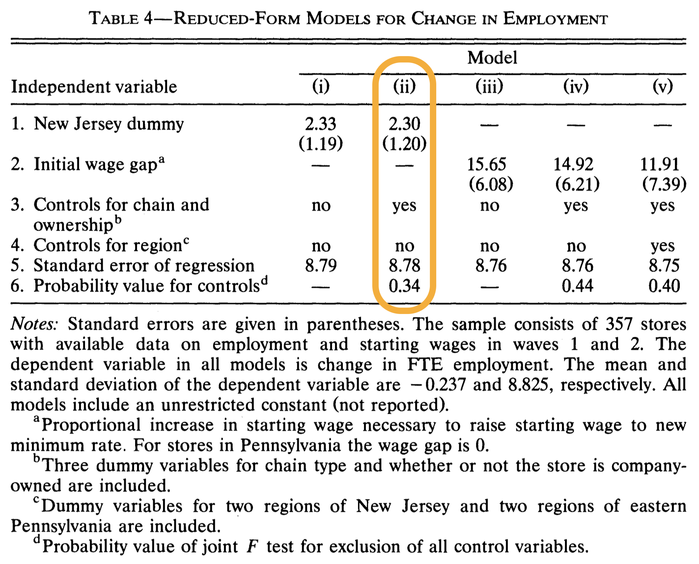{fig-align="center"}

# 5. Statistical inference

## Our point estimate

Our headline finding:

> On average, employment increased by about 2.3 more workers in New Jersey restaurants than in Pennsylvania restaurants. So if anything, NJ had a *better* outcome compared to PA. 

. . .

Is this a slam dunk, money-in-the-bank, bulletproof result? Of course not. It's the best we can do with the imperfect data we have. So let's be honest and faithful and say something about its reliability.

## What do we mean by reliability?

::: incremental
- What's the worry? That our result is simply a fluke. We got unlucky, the data we collected are quirky and unrepresentative, and the estimate is an aberration;
- If we collect more or different data, redo the analysis, and the result totally changes, how reliable could it be?
- In this class, we will consider a result more reliable if it stays approximately the same across alternative datasets.
:::

. . .

How can we evaluate that?

## Sampling variation

::: incremental
- If you want to know how the results change across datasets...redo the survey;
- Call up more restaurants, redo the analysis, see if the results change. Easier said than done, but what if?
- The variation of your estimates across these different datasets is called *sampling variation*;
- If the variation is high, that's bad for reliability. If the variation is low, that's better;
- Quantifying the extent of this variation allows you to report on the uncertainty of your conclusions.
:::

## Different data, different result {.small}

::::: columns
::: {.column width="50%"}

Redo the survey and get a new data frame:

```{r}
#| echo: false
set.seed(3456)
n <- nrow(card_krueger)
ids <- sample(1:n, n, replace = TRUE)
card_krueger_new <- card_krueger[ids, ]

card_krueger_new |>
  select(emp_diff, state, chain,  co_owned)
```

:::

::: {.column .fragment width="50%"}

Rerun the regression and get a new estimate:

```{r}
linear_reg() |>
  fit(emp_diff ~ state + chain + co_owned, data = card_krueger_new) |>
  tidy() |>
  select(term, estimate, std.error)
```

:::
:::::

## Different data, different result {.small}

::::: columns
::: {.column width="50%"}

Redo the survey and get a new data frame:

```{r}
#| echo: false

n <- nrow(card_krueger)
ids <- sample(1:n, n, replace = TRUE)
card_krueger_new <- card_krueger[ids, ]

card_krueger_new |>
  select(emp_diff, state, chain,  co_owned)
```

:::

::: {.column .fragment width="50%"}

Rerun the regression and get a new estimate:

```{r}
linear_reg() |>
  fit(emp_diff ~ state + chain + co_owned, data = card_krueger_new) |>
  tidy() |>
  select(term, estimate, std.error)
```

:::
:::::

## Different data, different result {.small}

::::: columns
::: {.column width="50%"}

Redo the survey and get a new data frame:

```{r}
#| echo: false

n <- nrow(card_krueger)
ids <- sample(1:n, n, replace = TRUE)
card_krueger_new <- card_krueger[ids, ]

card_krueger_new |>
  select(emp_diff, state, chain,  co_owned)
```

:::

::: {.column .fragment width="50%"}

Rerun the regression and get a new estimate:

```{r}
linear_reg() |>
  fit(emp_diff ~ state + chain + co_owned, data = card_krueger_new) |>
  tidy() |>
  select(term, estimate, std.error)
```

:::
:::::

## The Full Monty

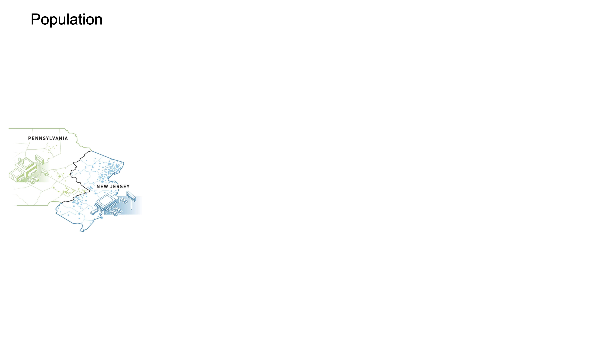

## The Full Monty

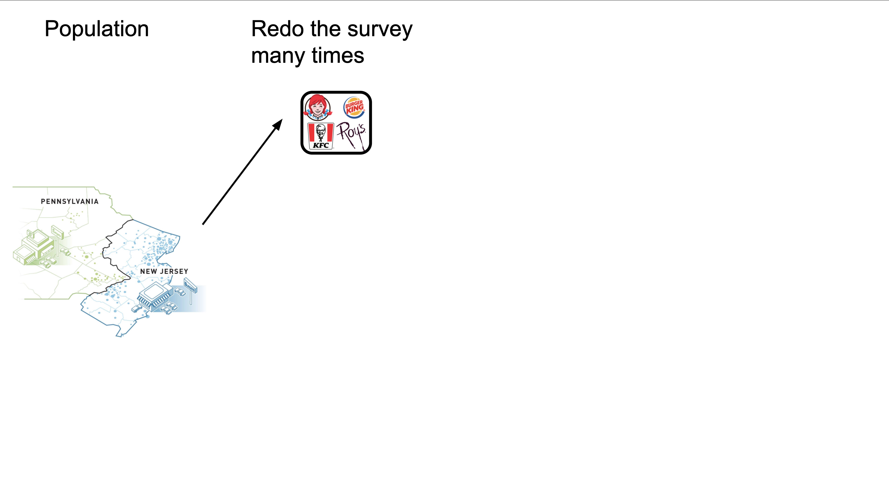

## The Full Monty

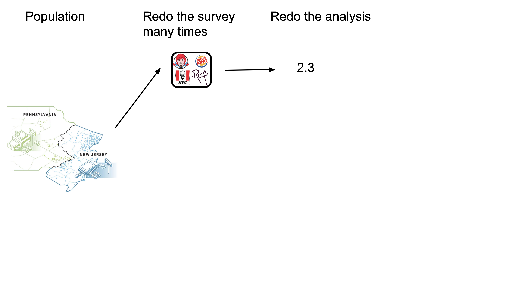

## The Full Monty

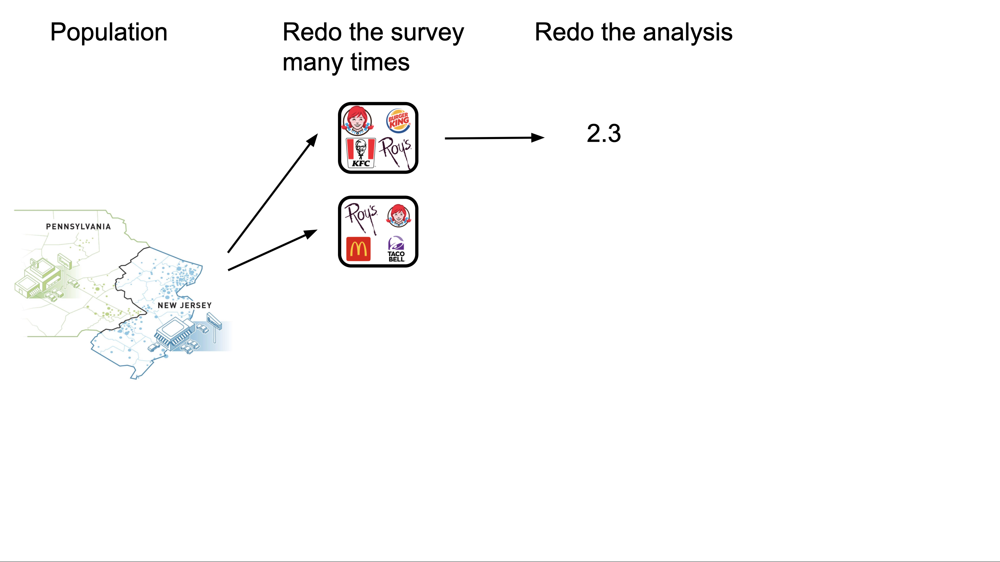

## The Full Monty

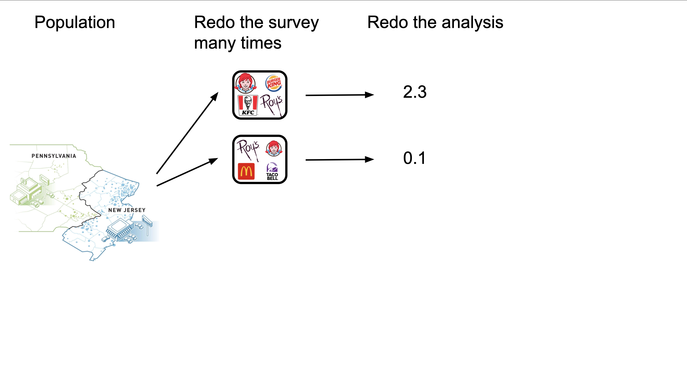

## The Full Monty

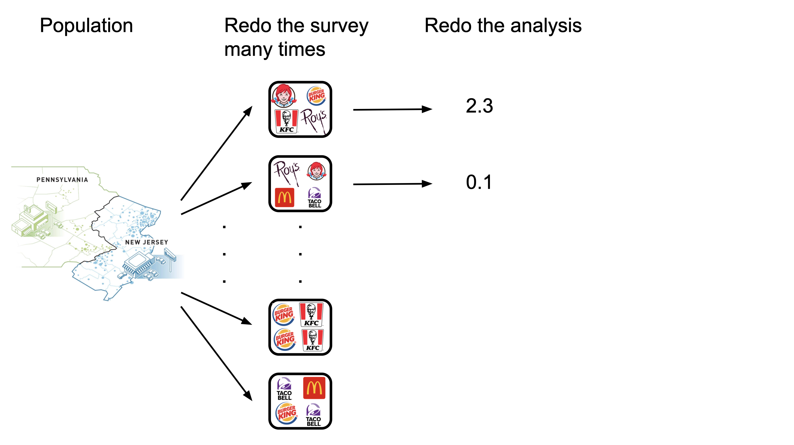

## The Full Monty

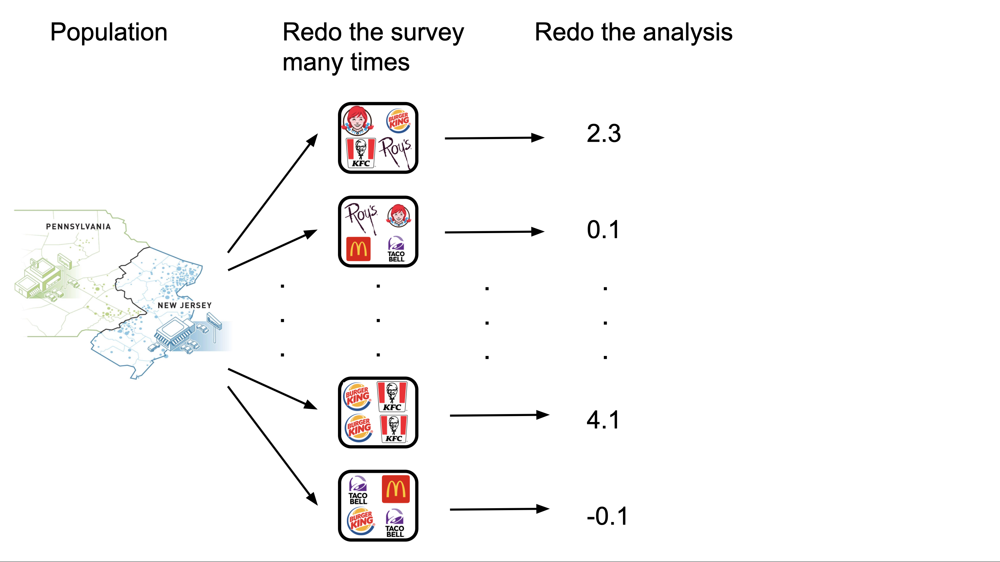

## The Full Monty

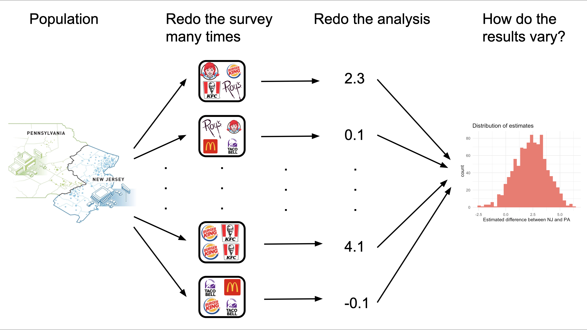

## The sampling distribution for our example

What do you think? Are our conclusions reliable?

```{r}
#| echo: false
#| warning: false
#| message: false
empdiff_state_fit <- card_krueger |>
  specify(emp_diff ~ state + chain + co_owned) |>
  fit()

set.seed(8675309)
boot_fits <- card_krueger |>
  specify(emp_diff ~ state + chain + co_owned) |>
  generate(reps = 1000, type = "bootstrap") |>
  fit()

boot_fits |>
  filter(term == "stateNJ") |>
  ggplot(aes(x = estimate, color = NULL, fill = "salmon")) +
  geom_histogram() + 
  labs(
    x = "Estimated difference between NJ and PA",
    title = "Sampling distribution (bootstrap approximation)"
  ) + 
  theme(legend.position = "none")


```

## Conclusion

::: incremental
- Genuine uncertainty remains about the specific numerical value;
    - 2.3 may be our best guess, but if "the truth" ends up being 0, 1, 3, 4, or 5, don't be surprised. Based on the data we have, you can't rule that out;
- However, the data are speaking pretty loudly that the estimate is more likely to be positive than negative;
    *Qualitatively*, the evidence for the usual ECON 101 story is looking weak.
:::

## Towards quantifying uncertainty {.medium}

What if our sampling distribution had looked like one of these?


```{r}
#| echo: false
#| warning: false
#| message: false
#| fig-width: 12

set.seed(45678)
n <- 5000
tibble(
  type = c(rep("Parallel Universe 1", n), rep("Parallel Universe 2", n)),
  x = c(rnorm(n, mean = 2.3, sd = 0.5), rnorm(n, mean = 2.3, sd = 3.2))
) |>
  ggplot(aes(x = x, color = NULL, fill = type)) + 
  geom_histogram() + 
  xlim(-5, 10) + 
  labs(
    x = "Estimated difference between NJ and PA",
    title = "Hypothetical sampling distributions (JZ made them up)",
    subtitle = "Which of these indicates more reliable conclusions?"
  ) + 
  facet_wrap(~ type) +
  theme_minimal(base_size = 20) + 
  theme(legend.position = "none")
```


. . .


Measuring the *spread* of the sampling distribution allows us to quantify uncertainty about the conclusions. That's what the *standard error* does.

## Reality check {.medium}

::: incremental
- This idea of "redoing the survey to see how the results change" is more of a thought experiment;
- If collecting new data were so easy, we would have collected a bigger sample to begin with;
- Instead of literally collecting new data, which is costly, statisticians *approximate* sampling variability. We will study two techniques for doing this:
    - simulation-based: resampling the data with the *bootstrap*;
    - mathematical: appealing to the *central limit theorem* (*CLT*).
:::

. . .
    
More on all that in...nine weeks.

# 6. Interpretation

## At the end of the day

Data analysis is just a sophisticated form of *rhetoric*. We're trying to marshall facts to convince other humans of claims. If a living, breathing person is not convinced, then none of it actually matters.

So...

## Do you believe it?

Card and Krueger argue that the placement of restaurants on either side of the NJ/PA border acts *as if* an experiment took place, and so any observed discrepancy between the two states can largely be attributed to the *causal* effect of the minimum wage hike alone.

. . .

Do you think this is plausible?

## Things to keep you up at night {.small}

::: incremental
- Let's face it: this wasn't an experiment; Random assignment *did not* take place here;
- NJ chose to raise the minimum wage for specific reasons, and PA didn't. If those reasons mean that underlying conditions in NJ are systematically different from those in PA, this could confound the relationship;
- If NJ was on a different economic trajectory to begin with (NJ on the upswing and PA on the downswing), then we might be observing *that* difference, and nothing to do with the minimum wage;
- Was "before" really "before"? NJ restaurants knew in advance that the wage hike was coming. It wasn't a surprise. How do we know they hadn't already started adjusting before Card and Krueger made their first call?
- Even if we found the causal argument completely convincing, does it *generalize*? What, if anything, can this study teach us about larger wage hikes in different industries elsewhere?
:::


# Parting thoughts

## Further reading {.small}

Dive in if you're interested:

- WSJ March 2026: "[The 30-Year Debate Over the Minimum Wage Is Still Not Settled](https://www.wsj.com/economy/jobs/minimum-wage-jobs-cost-debate-card-krueger-63b21af2?st=HuPYPY&reflink=desktopwebshare_permalink)" (featuring an unhinged comment section);
- Card and Krueger's [original paper](https://www.jstor.org/stable/2118030) and Card's Nobel citation ([popular](https://www.nobelprize.org/prizes/economic-sciences/2021/popular-information/) and [advanced](https://www.nobelprize.org/uploads/2021/10/advanced-economicsciencesprize2021.pdf));
- The more recent [Seattle Minimum Wage Study](https://evans.uw.edu/faculty-research/the-minimum-wage-study/);
- Neumark and Shirley's 2021 [literature review](https://www.nber.org/papers/w28388): "there is a clear preponderance of negative estimates in the literature;"
- Noah Smith is an opinion journalist with an economics PhD:
  - "[Why $15 minimum wage is pretty safe](https://www.noahpinion.blog/p/why-15-minimum-wage-is-pretty-safe);"
  - "[The minimum wage pushback](https://www.noahpinion.blog/p/the-minimum-wage-pushback)."

## Intellectual themes {.scrollable}

These will last us fifteen weeks (and then some!):

::: incremental
- Data analysis is essentially rhetoric. We're marshaling evidence in order to be convincing to other humans. Don't forget your audience;
- All data analyses should be *reproducible*. Give me the same data (and code) that you used, I should be able to get the exact same pictures and numbers. R + Quarto make this easier to achieve;
- Even a small data set is too much information for a human to process. We need to compress it down to pictures and a concise set of numerical summaries. Doing this well is as much art as it is science;
- When analyzing data, so often the questions that we *truly* care about are *causal* questions. It's silly to bury our heads in the sand and pretend that's not true, but it's also dangerous to recklessly make causal claims that your data cannot support;
- The gold standard for isolating a causal effect is a randomized, controlled experiment, but sometimes these are costly and impractical (or downright unethical) to perform;
- Observational data can sometimes support causal claims, but causation does not magically emerge from comparing two groups. You need a design and an argument about why the comparison isolates the treatment;
- Data do not speak for themselves. Every analysis requires assumptions about how the world works. Explicit mathematical models force us to state those assumptions clearly;
- Data are not manna from heaven. The data collection process is subject to countless flaws and compromises, and at some point you need to get on with it and make do. We're trying to do the best we can with what we've got;
- But because of that, all data analysts have a responsibility to honestly and faithfully report the limitations of their results by *quantifying uncertainty*. That's what *statistics* is all about.
:::


## Computational themes {.medium}

Every coding task in this class will be some combo of these two things:

. . .

::::: columns
::: {.column width="35%"}
Building cakes (`ggplot`) 
:::

::: {.column .fragment width="65%"}
Stacking dolls (pipe `|>`) 
:::
:::::

. . .

Master these, and everything will be coming up roses!

## Long-term plan

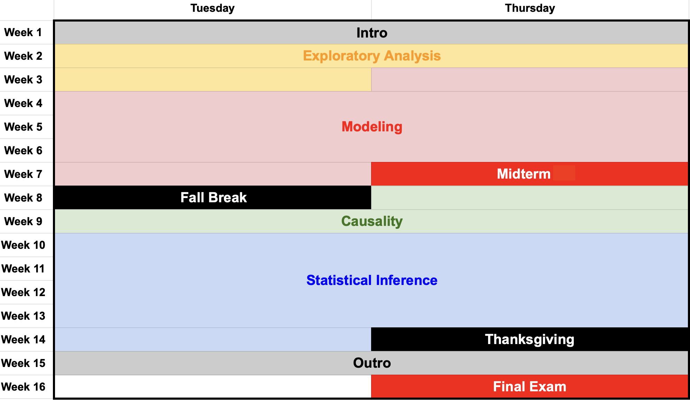

## Near-term plan

::: incremental
- **Tomorrow**: no graded assignment. Follow along with the TA and get your first taste of writing R code from scratch;
- **Next TuTh**: lectures on exploratory data analysis. More live practice with data viz and transformation in R;
- **Next Friday**: first graded lab, and HW 1 posted.
:::

. . .

Also, please complete the [Getting to Know You Survey](https://docs.google.com/forms/d/e/1FAIpQLScfaJqPiDmTdaKLzql6nlDi3bxqfBItMJUIYmA_6QS5P_Yj4Q/viewform?usp=publish-editor).

# Questions?


