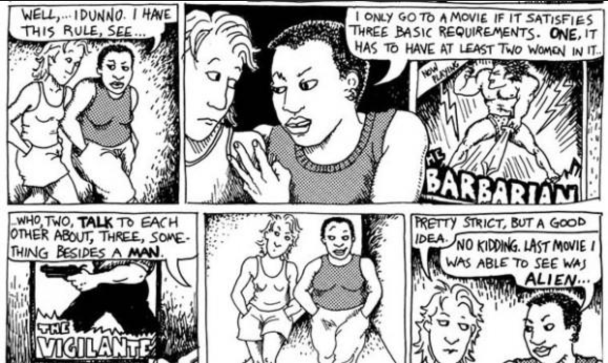
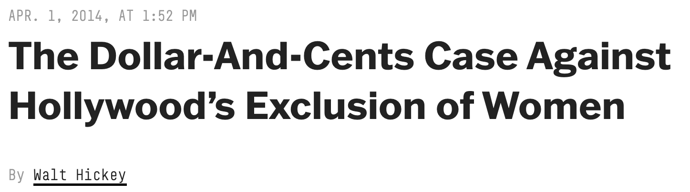
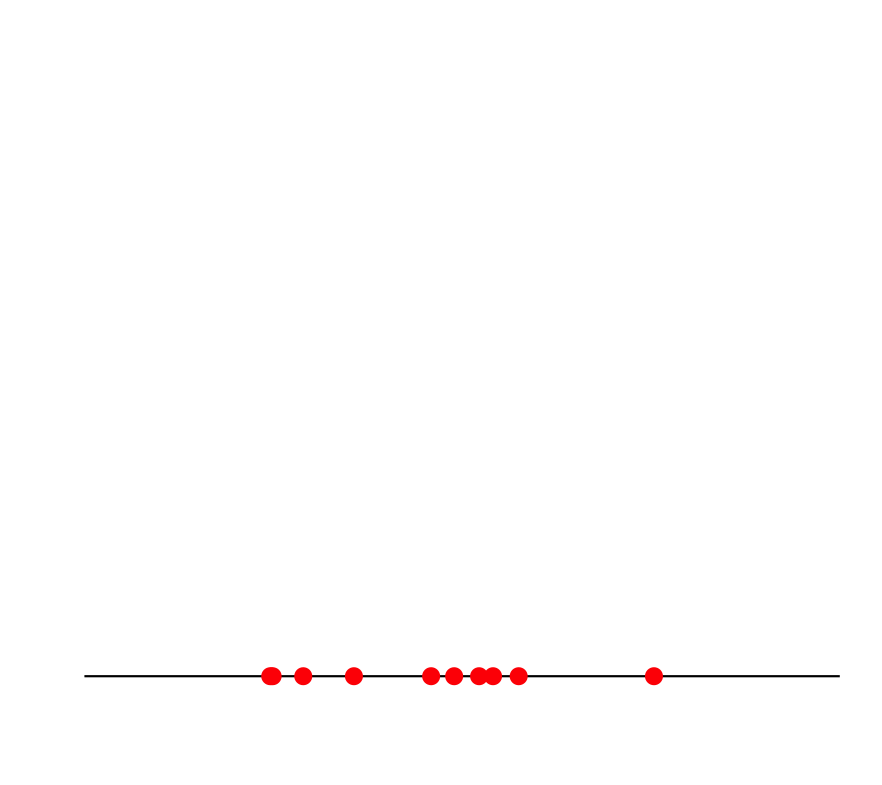
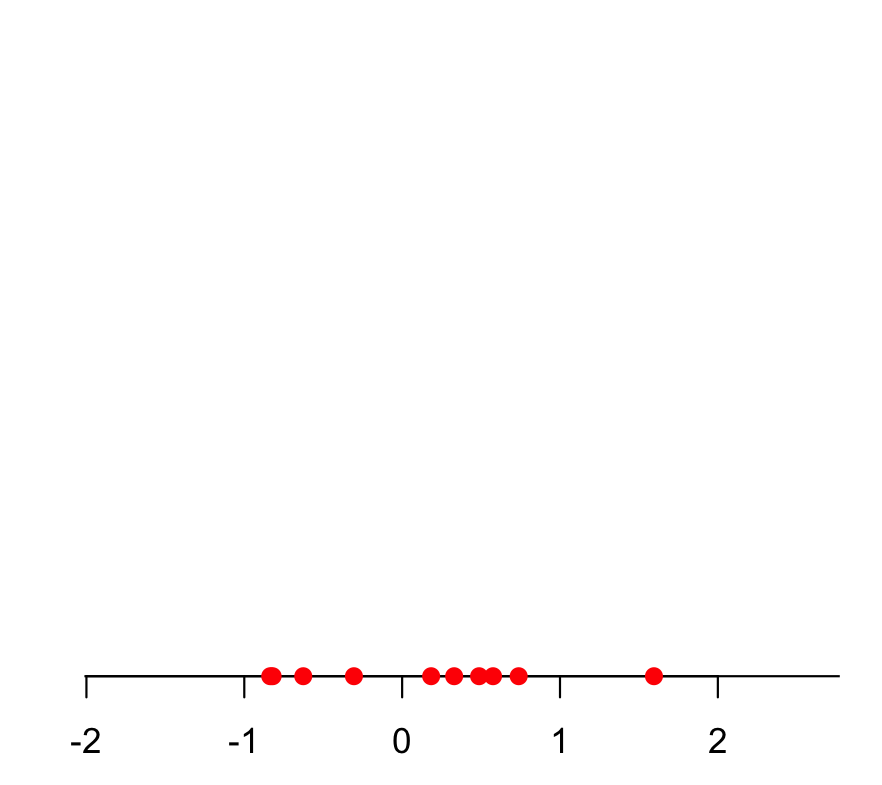
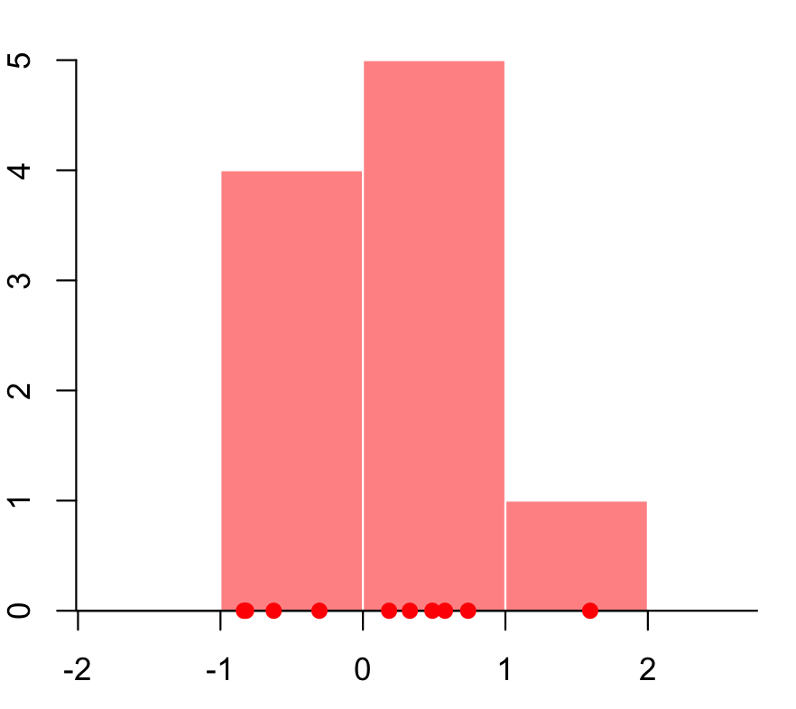
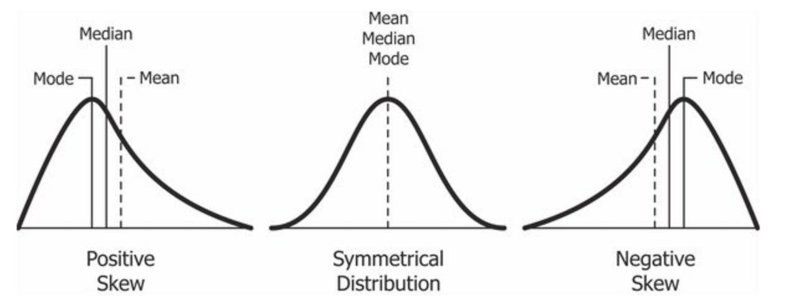
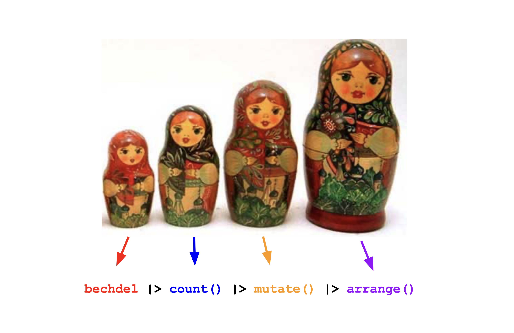
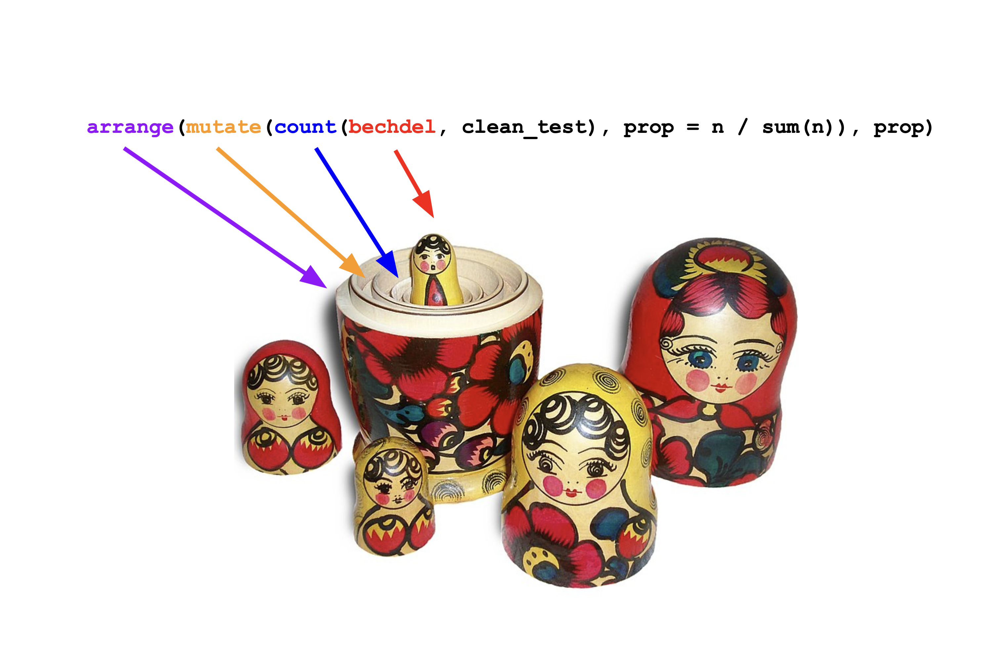

# Last week

## The shape of the course


## Study these carefully!

Every main idea, intellectual theme, and computational skill makes an appearance:

- [Lecture 1](/slides/01-crash-course.html): "All of STA 101 in 75 minutes;"
- [Lab 0](/lab/lab-0.html): your coding "one-stop-shop."

Study these carefully and return to them often. By December 4, it will all make sense!

# Dispatches from the intro survey

## Getting to know you

```{r}
#| echo: false
#| message: false
#| warning: false
library(tidyverse)
survey <- read_csv("data/getting-to-know-you.csv")
```

|       | No |     Yes      |
| ----------- | ----------- | ----------- |
| AP Stats?      |   `{r} survey |> count(apstat) |> mutate(prop = n / sum(n)) |> filter(apstat == "No") |> pull(prop) |> round(4) * 100`%     | `{r} survey |> count(apstat) |> mutate(prop = n / sum(n)) |> filter(apstat == "Yes") |> pull(prop) |> round(4) * 100`% |
| Prior coding?   | `{r} survey |> count(programming) |> drop_na() |> mutate(prop = n / sum(n)) |> filter(programming == "no") |> pull(prop) |> round(4) * 100`% | `{r} survey |> count(programming) |> drop_na() |> mutate(prop = n / sum(n)) |> filter(programming == "yes") |> pull(prop) |> round(4) * 100`% |
| Friends?   | `{r} survey |> count(friends) |> drop_na() |> mutate(prop = n / sum(n)) |> filter(friends == "no") |> pull(prop) |> round(4) * 100`% |  `{r} survey |> count(friends) |> drop_na() |> mutate(prop = n / sum(n)) |> filter(friends == "yes") |> pull(prop) |> round(4) * 100`% |


## What’s the last movie you saw in a theater?

```{r}
#| echo: false
#| message: false
#| warning: false

survey |>
  mutate(film = fct_lump_min(film, min = 4, other_level = "Other")) |> 
  filter(film != "Other") |>
  mutate(film = fct_infreq(film)) |>
  ggplot(aes(y = film)) +
  geom_bar(fill = "skyblue") +
  theme_minimal() + 
  labs(y = "",
       title = "What's the last film you saw in a theater?",
       subtitle = "From the sta101-f26 survey",
       caption = "(Films with fewer than 4 responses were omitted for readability.)")
```


# Today

## What are we studying? 

::: incremental
- Data analysis
  - The *art* of transforming messy, incomplete, imperfect data into *knowledge*;
  - *Knowledge* often takes the form of pictures and a concise set of numerical summaries;
- Statistical Inference
  - Quantifying our uncertainty about that knowledge.
:::

## Let's focus on the first part

*How* do you compress a dataset down to pictures and numerical summaries?

- What kinds of pictures and summaries are available?
- How do you know what to use, and when?
- How do you get a computer to implement these things?

The *type* of a variable (numerical, categorical, etc) plays a big role in determining the menu of options. After that, good visualization and summarization is an *art* that requires *good taste*. 

# Our running example

## Alison Bechdel

::::: columns
::: {.column width="50%"}
{fig-align="center" width="80%"}
:::

::: {.column width="50%"}
{fig-align="center" width="80%"}
:::
:::::

## The Bechdel Test

Measures female representation in film:

::::: columns
::: {.column width="72%"}
{fig-align="center"} (*Dykes to Watch Out For* - 1985)
:::

::: {.column width="28%"}
Film passes if...

1.  two female characters;
2.  talk to each other;
3.  about something besides a man.
:::
:::::

## Since I moved to Durham... {.small}

It's been a pitiful two years of filmgoing:

| Title                    | Year | JZ's review | Bechdel |
|-------------------------|------|-------------|---------|
| *Conclave*              | 2024 | ★★☆☆☆       | ❌      |
| *Wicked 1*              | 2024 | ★★☆☆☆     | ✅      |
| *Nosferatu*             | 2024 | ★★★★☆    | ❌      |
| *Naked Gun*             | 2025 | ★★★☆☆     | ❌      |
| *Bugonia*               | 2025 | ★★★☆☆    | ❌      |
| *Wicked 2*              | 2025 | ★☆☆☆☆          | ✅      |
| *Marty Supreme*         | 2026 | ★★★★☆    | ❌      |
| *Obsession*         | 2026 | ★★★★☆    | ❌      |
| *The Odyssey*         | 2026 | ★★☆☆☆   | ❌      |
| *Coyote vs. Acme*         | 2026 | ★★★☆☆   | ❌      |


## Go to your container

::::: columns

::: {.column width="40%"}


:::

::: {.column width="60%"}

1. Visit the [Duke Container Manager](https://cmgr.oit.duke.edu/containers) (and log in with your NetID);
2. (If you haven't already, reserve the STA101 container on the right-hand-side)
3. Click STA101 under "My reservations" on the left-hand side;
4. Login, start, and give it a sec to launch in your browser.

:::

:::::


## Grab today's files {.scrollable}

- Double-check that you have the course project loaded in the upper right corner;
- Go to the **Git** tab in the upper right pane and click **Pull**.


## Load today's package(s)

It's just the one today:

```{r}
library(tidyverse)
```


## Today's data {.small}

```{r}
bechdel <- read_csv("data/bechdel.csv")

bechdel
```

## Aside: variable assignment `<-` {.medium}

You just saw me do this:

```{r}
#| eval: false
bechdel <- read_csv("data/bechdel.csv")
```

::: incremental
- This is called *variable assignment*. We're saving an object so we can use it later;
- **Right-hand side**: the thing you want to store (the data);
- **Left-hand side**: the name you want to give it so you can refer to it later;
- **In the middle**: the *assignment operator* `<-`.
:::

## Our variables {.small .scrollable}

Every row is a *film*, and the columns include:

::: incremental
-   `title`: name of movie
-   `year`: release year of movie (between 1990 and 2013);
-   `gross_2013`: how much did the movie earn at the box office (in 2013 $);
-   `budget_2013`: how much did the movie cost to make (in 2013 $); 
-   `roi`: Return on investment, calculated as the ratio of the gross to budget;
    - If the movie broke even, roi is **1**;
    - If the movie made money, roi is **greater than 1**;
    - If the movie lost money, roi is **between 0 and 1**;
-   `clean_test`: Bechdel test result:
    -   `ok` = passes test;
    -   `dubious` = unclear;
    -   `men` = women only talk about men
    -   `notalk` = women don't talk to each other;
    -   `nowomen` = fewer than two women;
-   `binary`: Bechdel Test PASS vs FAIL binary
:::

## Can we reproduce this claim?

::: callout-note
## From [FiveThirtyEight](https://fivethirtyeight.com/features/the-dollar-and-cents-case-against-hollywoods-exclusion-of-women/)

{fig-align="center" width="85%"}
:::

"We did a statistical analysis of films to test two claims: first, that films that pass the Bechdel test — featuring women in stronger roles — see a lower return on investment, and second, that they see lower gross profits. We found no evidence to support either claim."

## 🚨 Warning: resist the causal temptation!

These data are *purely* observational. No experiment was done, and I don't think "nature" delivered any conditions that mimic experimental variation. We will only be able to talk about the *mere* association between female representation and box office performance.


# Exploring a single numerical variable

## The films' grosses {.medium}

The box office revenue for the films is a *numerical* variable:

```{r}
#| eval: false
bechdel$gross_2013
```

```{r}
#| echo: false
head(bechdel$gross_2013, n = 10)
```


- A human cannot stare at this list of numbers and learn anything. We need pictures and summaries. So...what pictures? what summaries? what are we even trying to learn?
- We want to know where these numbers are *typically* concentrated, how spread out are they, and what is their shape;
- A *histogram* can answer those questions.

## Plotting a histogram {.small}

Start with a blank canvas:

```{r}
#| warning: false
#| message: false
#| output-location: column
ggplot(bechdel)
```

## Plotting a histogram {.small}

What variables are we looking at?

```{r}
#| warning: false
#| message: false
#| output-location: column
#| code-line-numbers: "|2"
ggplot(bechdel, 
       aes(x = gross_2013))
```

The *aesthetic mapping* is where we tell the computer what variables in the data frame we want to use and how we want to use them.

## Plotting a histogram {.small}

What kind of plot for this *numerical* variable:

```{r}
#| warning: false
#| message: false
#| output-location: column
#| code-line-numbers: "|3"
ggplot(bechdel, 
       aes(x = gross_2013)) + 
  geom_histogram()
```

## Plotting a histogram {.small}

Add labels:

```{r}
#| warning: false
#| message: false
#| output-location: column
#| code-line-numbers: "|4-8"
ggplot(bechdel, 
       aes(x = gross_2013)) + 
  geom_histogram() + 
  labs(
    x = "2013 USD",
    title = "Film grosses (1990 - 2013)"
  )
```

Y'know...so we know what we're looking at!

## Plotting a histogram {.small}

Increase font size and give it a minimalist look:

```{r}
#| warning: false
#| message: false
#| output-location: column
#| code-line-numbers: "|9"
ggplot(bechdel, 
       aes(x = gross_2013)) + 
  geom_histogram() + 
  labs(
    x = "2013 USD",
    title = "Film grosses (1990 - 2013)"
  ) +
  theme_minimal(base_size = 20)
```

## Dataviz with ggplot is like building a cake

::::: columns
::: {.column width="35%"}

:::

::: {.column .fragment width="65%"}
- Every plot element is a new layer, and you stack 'em up;
- If the different commands are like the layers of sponge, then the plus signs in between are like the icing. Don't forget the icing!
:::
:::::

## The grammar of graphics 

::: columns
::: {.column width="50%"}

This design philosophy is described in the book *The Grammar of Graphics* and implemented in the `ggplot2` package.


:::

::: {.column width="20%"}

:::

::: {.column width="30%"}

:::
:::


## How is a histogram drawn? {.medium}

::::: columns

::: {.column width="50%"}
1.  Start with the number line (horizontal axis);

:::

::: {.column width="50%"}

:::

:::::

## How is a histogram drawn? {.medium}

::::: columns

::: {.column width="50%"}
1.  Start with the number line (horizontal axis);
1.  Put your data values on the line;

:::

::: {.column width="50%"}

:::

:::::

## How is a histogram drawn? {.medium}

::::: columns

::: {.column width="50%"}
1.  Start with the number line (horizontal axis);
1.  Put your data values on the line;
1.  Break the line into bins;

:::

::: {.column width="50%"}

:::

:::::

## How is a histogram drawn? {.medium}

::::: columns

::: {.column width="50%"}
1.  Start with the number line (horizontal axis);
1.  Put your data values on the line;
1.  Break the line into bins;
1.  Count how many data values fall in each bin;

:::

::: {.column width="50%"}

:::

:::::


## How is a histogram drawn? {.medium}

::::: columns

::: {.column width="50%"}
1.  Start with the number line (horizontal axis);
1.  Put your data values on the line;
1.  Break the line into bins;
1.  Count how many data values fall in each bin;
1.  Put bars over the bins (height = count).

::: {.fragment}
Choice: how do you draw the bins? How many? How wide?
:::

:::

::: {.column width="50%"}

:::

:::::

## Back to Bechdel

R makes a default choice about the number/width of bins:

```{r}
#| warning: false
ggplot(bechdel, aes(x = gross_2013)) + 
  geom_histogram()
```

## You can override the default

Fewer, wider bins:

```{r}
#| warning: false
ggplot(bechdel, aes(x = gross_2013)) + 
  geom_histogram(bins = 10)
```

## You can override the default

Many, thinner bins:

```{r}
#| warning: false
ggplot(bechdel, aes(x = gross_2013)) + 
  geom_histogram(bins = 100)
```

## You can go too far either way

::::: columns

::: {.column width="50%"}
Oof.

```{r}
#| warning: false
ggplot(bechdel, aes(x = gross_2013)) + 
  geom_histogram(bins = 2)
```

:::

::: {.column width="50%"}
Yikes.

```{r}
#| warning: false
ggplot(bechdel, aes(x = gross_2013)) + 
  geom_histogram(bins = 1500)
```
:::

:::::

. . .

Part of the *art* here is developing an eye for what looks good.

## Another option: instead of a histogram {.small}

```{r}
#| warning: false
#| message: false
#| echo: true
#| output-location: column
ggplot(bechdel, 
       aes(x = gross_2013)) + 
  geom_histogram() + 
  labs(
    x = "2013 USD",
    title = "Film grosses"
  ) +
  theme_minimal(base_size = 20)
```

## Another option: a *density*  {.small}

```{r}
#| warning: false
#| message: false
#| echo: true
#| output-location: column
ggplot(bechdel, 
       aes(x = gross_2013)) + 
  geom_density() + 
  labs(
    x = "2013 USD",
    title = "Film grosses (1990 - 2013)"
  ) +
  theme_minimal(base_size = 20)
```

## Compare {.smaller .scrollable}

```{r}
#| warning: false
#| message: false
#| echo: false
ggplot(bechdel, aes(x = gross_2013)) +
  geom_histogram(aes(y = after_stat(density)), bins = 100) + 
  geom_density(color = "red") +
  labs(
    x = "2013 USD",
    title = "Film grosses (1990 - 2013)"
  ) +
  theme_minimal(base_size = 20) + 
  coord_cartesian(xlim = c(0, 1e9))
  
```

Prettier. Smooths out the lumps and bumps. There are still defaults you could learn to override.

## But let's make it nice {.small}

What we have so far:

```{r}
#| warning: false
#| message: false
#| echo: true
#| output-location: column
ggplot(bechdel, 
       aes(x = gross_2013)) + 
  geom_density() + 
  labs(
    x = "2013 USD",
    title = "Film grosses (1990 - 2013)"
  ) +
  theme_minimal(base_size = 20)
```

## But let's make it nice {.small}

We don't need to see *everything*, do we?

```{r}
#| warning: false
#| message: false
#| echo: true
#| output-location: column
ggplot(bechdel, 
       aes(x = gross_2013)) + 
  geom_density() + 
  labs(
    x = "2013 USD",
    title = "Film grosses (1990 - 2013)"
  ) +
  theme_minimal(base_size = 20) + 
  coord_cartesian(xlim = c(0, 1e9))
```

## But let's make it nice {.small}

A pop of color: 

```{r}
#| warning: false
#| message: false
#| echo: true
#| output-location: column
ggplot(bechdel, 
       aes(x = gross_2013)) + 
  geom_density(color = "firebrick") + 
  labs(
    x = "2013 USD",
    title = "Film grosses (1990 - 2013)"
  ) +
  theme_minimal(base_size = 20) + 
  coord_cartesian(xlim = c(0, 1e9))
```

## But let's make it nice {.small}

I can't *hear* you:

```{r}
#| warning: false
#| message: false
#| echo: true
#| output-location: column
ggplot(bechdel, 
       aes(x = gross_2013)) + 
  geom_density(color = "firebrick",
               linewidth = 2) + 
  labs(
    x = "2013 USD",
    title = "Film grosses (1990 - 2013)"
  ) +
  theme_minimal(base_size = 20) + 
  coord_cartesian(xlim = c(0, 1e9))
```

## But let's make it nice {.small}

Give it some body:

```{r}
#| warning: false
#| message: false
#| echo: true
#| output-location: column
ggplot(bechdel, 
       aes(x = gross_2013)) + 
  geom_density(color = "firebrick",
               linewidth = 2,
               fill = "red") + 
  labs(
    x = "2013 USD",
    title = "Film grosses (1990 - 2013)"
  ) +
  theme_minimal(base_size = 20) + 
  coord_cartesian(xlim = c(0, 1e9))
```

## But let's make it nice {.small}

Too aggressive:

```{r}
#| warning: false
#| message: false
#| echo: true
#| output-location: column
ggplot(bechdel, 
       aes(x = gross_2013)) + 
  geom_density(color = "firebrick",
               linewidth = 2,
               fill = "red",
               alpha = 0.5) + 
  labs(
    x = "2013 USD",
    title = "Film grosses (1990 - 2013)"
  ) +
  theme_minimal(base_size = 20) + 
  coord_cartesian(xlim = c(0, 1e9))
```

## Yet another option: instead of a histogram {.small}

```{r}
#| warning: false
#| message: false
#| echo: true
#| output-location: column
ggplot(bechdel, 
       aes(x = gross_2013)) + 
  geom_histogram() + 
  labs(
    x = "2013 USD",
    title = "Film grosses (1990 - 2013)"
  ) +
  theme_minimal(base_size = 20)
```

## Yet another option: a *boxplot*  {.small}

```{r}
#| warning: false
#| message: false
#| echo: true
#| output-location: column
ggplot(bechdel, 
       aes(x = gross_2013)) + 
  geom_boxplot() + 
  labs(
    x = "2013 USD",
    title = "Film grosses (1990 - 2013)"
  ) +
  theme_minimal(base_size = 20)
```

## How is a box plot drawn? {.medium .scrollable}

The middle of the box is the **median**. 50% of the data are below, and 50% are above:

```{r}
#| echo: false

df <- bechdel

df_long <- rbind(
  transform(df, panel = "Histogram"),
  transform(df, panel = "Box plot")
)

df_long$panel <- factor(df_long$panel, levels = c("Histogram", "Box plot"))

hist_bins <- 100

med <- median(df$gross_2013, na.rm = TRUE)

ggplot(df_long, aes(x = gross_2013)) +
  # Histogram (top)
  geom_histogram(
    data = subset(df_long, panel == "Histogram"),
    bins = hist_bins, color = "white", fill = "grey70"
  ) +
  
  # Boxplot (bottom)
  geom_boxplot(
    data = subset(df_long, panel == "Box plot"),
    aes(y = 0),
    width = 0.2,
    outlier.shape = NA
  ) +
  
  # Median line in both panels
  geom_vline(xintercept = med, linetype = "dashed", color = "red", linewidth = 2) +
  
  facet_grid(rows = vars(panel), scales = "free_y") +
  scale_y_continuous(NULL, breaks = NULL) +
  labs(x = "x") +
  theme_minimal() +
  coord_cartesian(xlim = c(0, 1e9))

```

## How is a box plot drawn? {.medium .scrollable}

The lower edge of the box is the **25% quantile**. 25% of the data are below, and 75% are above:

```{r}
#| echo: false

med <- quantile(df$gross_2013, 0.25, na.rm = TRUE)

ggplot(df_long, aes(x = gross_2013)) +
  # Histogram (top)
  geom_histogram(
    data = subset(df_long, panel == "Histogram"),
    bins = hist_bins, color = "white", fill = "grey70"
  ) +
  
  # Boxplot (bottom)
  geom_boxplot(
    data = subset(df_long, panel == "Box plot"),
    aes(y = 0),
    width = 0.2,
    outlier.shape = NA
  ) +
  
  # Median line in both panels
  geom_vline(xintercept = med, linetype = "dashed", color = "red", linewidth = 2) +
  
  facet_grid(rows = vars(panel), scales = "free_y") +
  scale_y_continuous(NULL, breaks = NULL) +
  labs(x = "x") +
  theme_minimal() +
  coord_cartesian(xlim = c(0, 1e9))

```

## How is a box plot drawn? {.medium .scrollable}

The upper edge of the box is the **75% quantile**. 75% of the data are below, and 25% are above:

```{r}
#| echo: false

med <- quantile(df$gross_2013, 0.75, na.rm = TRUE)

ggplot(df_long, aes(x = gross_2013)) +
  # Histogram (top)
  geom_histogram(
    data = subset(df_long, panel == "Histogram"),
    bins = hist_bins, color = "white", fill = "grey70"
  ) +
  
  # Boxplot (bottom)
  geom_boxplot(
    data = subset(df_long, panel == "Box plot"),
    aes(y = 0),
    width = 0.2,
    outlier.shape = NA
  ) +
  
  # Median line in both panels
  geom_vline(xintercept = med, linetype = "dashed", color = "red", linewidth = 2) +
  
  facet_grid(rows = vars(panel), scales = "free_y") +
  scale_y_continuous(NULL, breaks = NULL) +
  labs(x = "x") +
  theme_minimal() +
  coord_cartesian(xlim = c(0, 1e9))

```

## Box plot facts {.small}

- A box plot is easier to read quickly than a histogram because it eliminates clutter and immediately draws your eye to those main features: center, spread, and skew;
- The box spans the middle 50% of the data;
- The width of the box is called the inner quartile range (IQR) and it measures spread;
- From the docs (`?geom_boxplot`):

> The upper whisker extends from the hinge to the largest value no further than 1.5 * IQR from the hinge (where IQR is the inter-quartile range, or distance between the first and third quartiles). The lower whisker extends from the hinge to the smallest value at most 1.5 * IQR of the hinge. Data beyond the end of the whiskers are called "outlying" points and are plotted individually.

## Box plots obscure modality

Same box plot:

```{r}
#| echo: false
#| message: false 

set.seed(23456)

n <- 20000
x <- rnorm(n)
o <- 10
y  <- c(
  rnorm(o, -2, ),
  rnorm((n - 2*o) / 2, mean = -0.7, 0.2),
  rnorm((n - 2*o) / 2, mean =  0.7, 0.2),
  rnorm(o, 2)
)

df <- tibble(x = x, y = y)

df_long <- rbind(
  transform(df, panel = "Histogram"),
  transform(df, panel = "Box plot")
)

df_long$panel <- factor(df_long$panel, levels = c("Histogram", "Box plot"))

ggplot(df_long, aes(x = x)) +
  # Histogram (top)
  geom_histogram(
    data = subset(df_long, panel == "Histogram"),
    bins = 30, color = "white", fill = "grey70"
  ) +
  
  # Boxplot (bottom)
  geom_boxplot(
    data = subset(df_long, panel == "Box plot"),
    aes(y = 0),
    width = 0.2,
    outlier.shape = NA
  ) +
  facet_grid(rows = vars(panel), scales = "free_y") +
  scale_y_continuous(NULL, breaks = NULL) +
  labs(x = "x") +
  theme_minimal() + 
  coord_cartesian(xlim = c(min(df), max(df)))
```

## Box plots obscure modality

Very different distributions:

```{r}
#| echo: false
#| message: false 

ggplot(df_long, aes(x = y)) +
  # Histogram (top)
  geom_histogram(
    data = subset(df_long, panel == "Histogram"),
    bins = 30, color = "white", fill = "grey70"
  ) +
  
  # Boxplot (bottom)
  geom_boxplot(
    data = subset(df_long, panel == "Box plot"),
    aes(y = 0),
    width = 0.2,
    outlier.shape = NA
  ) +
  facet_grid(rows = vars(panel), scales = "free_y") +
  scale_y_continuous(NULL, breaks = NULL) +
  labs(x = "x") +
  theme_minimal() + 
  coord_cartesian(xlim = c(min(df), max(df)))
```

## So...now what?

```{r}
#| warning: false
#| message: false
#| echo: false
ggplot(bechdel, 
       aes(x = gross_2013)) + 
  geom_histogram() + 
  labs(
    x = "2013 USD",
    title = "Film grosses (1990 - 2013)"
  ) +
  theme_minimal(base_size = 20)
```

## Are we just eyeballing pictures?

No! There are numerical summaries you can compute to *quantify* your visual intuition:

- **center**: mean (aka average), median, mode, ...
- **spread**: variance, standard deviation, inner quartile range (IQR), ...

And there will be more: correlation coefficients, regression estimates, etc.

## Some formulas (don't sweat it) {.small}

Let $x_1$, $x_2$, ..., $x_n$ be the numbers listed in the column of our data frame. So $n$ is the number of rows, or the sample size. Then:

. . .

The **sample average** (aka **mean**):

$$
\bar{x}=\frac{x_1+x_2+...+x_n}{n}=\frac{1}{n}\sum\limits_{i=1}^n x_i
$$

. . .

The **sample standard deviation**:

$$
s = \sqrt{\frac{1}{n-1}\sum\limits_{i=1}^n(x_i-\bar{x})^2}.
$$

. . .

Underneath the square root, you have the "average squared distance from the average," or the **sample variance**. 

## How does the computer do it? {.small}

```{r}
#| warning: false
#| message: false
bechdel |>
  summarize(
    avg = mean(gross_2013, na.rm = TRUE),
    s = sd(gross_2013, na.rm = TRUE)
  )
```

::: incremental
- `summarize` creates a *new* data frame that stores the summaries;
- You can compute as many summaries as you want;
- To the left of the equal signs are your choice of *column names* in the new data frame you are creating. You can type whatever you want here (within reason);
- To the right of the equal signs is `R` code that computes the summaries. You must use the correct command names (case sensitive): `mean`, `median`, `quantile`, `sd`, `var`, etc;
- If you want to learn what these do, read the documentation (eg `?quantile`).
:::

## Aside: the pipe operator `|>`

The pipe operator passes what comes before it into the function that comes after it as the first argument in that function:

::::: columns
::: {.column .fragment width="55%"}
```{r}
sum(1, 2)
```
:::

::: {.column .fragment width="45%"}
```{r}
1 |> 
  sum(2)
```
:::
:::::

. . .

We will use it to build up data summaries and transformations step-by-step.


## Like a Russian stacking doll

{fig-align="center"}

## More summaries


```{r}
bechdel |>
  summarize(
    avg = mean(gross_2013, na.rm = TRUE),
    sdev = sd(gross_2013, na.rm = TRUE),
    q50 = median(gross_2013, na.rm = TRUE),
    q25 = quantile(gross_2013, 0.25, na.rm = TRUE),
    q75 = quantile(gross_2013, 0.75, na.rm = TRUE),
    iqr = IQR(gross_2013, na.rm = TRUE)
  )
```

## Numbers and pictures, working together

Where are the grosses concentrated?

```{r}
#| warning: false
#| message: false
#| echo: false
ggplot(bechdel, 
       aes(x = gross_2013)) + 
  geom_histogram() + 
  geom_vline(xintercept = mean(bechdel$gross_2013, na.rm = T), color = "red") +
  geom_vline(xintercept = median(bechdel$gross_2013, na.rm = T), color = "blue") +
  labs(
    x = "2013 USD",
    title = "Film grosses (1990 - 2013)"
  ) +
  theme_minimal(base_size = 20)
```

## If there is only one peak, then...



The mean is more sensitive to "outliers" than the median. The mean will get dragged in the direction of the skew more aggresively.


## Summary {.small}

Visualizing and summarizing one numerical variable:

::::: columns
::: {.column width="50%"}
```{r}
#| echo: false
#| fig-asp: 1
df <- bechdel

df_long <- rbind(
  transform(df, panel = "Histogram"),
  transform(df, panel = "Density"),
  transform(df, panel = "Box plot")
)

df_long$panel <- factor(df_long$panel, levels = c("Histogram", "Density", "Box plot"))

hist_bins <- 100

med <- median(df$gross_2013, na.rm = TRUE)

ggplot(df_long, aes(x = gross_2013)) +
  # Histogram (top)
  geom_histogram(
    data = subset(df_long, panel == "Histogram"),
    bins = hist_bins, color = "white", fill = "grey70"
  ) +
  # Density (middle)
  geom_density(
    data = subset(df_long, panel == "Density"),
    color = "firebrick", fill = "red", alpha = 0.5, linewidth = 2
  ) +
  # Boxplot (bottom)
  geom_boxplot(
    data = subset(df_long, panel == "Box plot"),
    aes(y = 0),
    width = 0.2,
    outlier.shape = NA
  ) +
  facet_grid(rows = vars(panel), scales = "free_y") +
  scale_y_continuous(NULL, breaks = NULL) +
  labs(x = "2013 USD", title = "Film grosses (1990 - 2013)") +
  theme_minimal(base_size = 20) +
  coord_cartesian(xlim = c(0, 1e9))

```
:::

::: {.column .fragment width="50%"}
```{r}
bechdel |>
  summarize(
    avg = mean(gross_2013, na.rm = TRUE),
    sdev = sd(gross_2013, na.rm = TRUE),
    q50 = median(gross_2013, na.rm = TRUE),
    q25 = quantile(gross_2013, 0.25, na.rm = TRUE),
    q75 = quantile(gross_2013, 0.75, na.rm = TRUE),
    iqr = IQR(gross_2013, na.rm = TRUE)
  ) |>
  glimpse()
```
:::
:::::

# Exploring a single categorical variable


## The test results {.medium}

The test result for the films is a *categorical* variable:

```{r}
#| eval: false
bechdel$clean_test
```

```{r}
#| echo: false
head(bechdel$clean_test, n = 10)
```

Visualization and summarization will be a bit more straightforward here. Things get fun when categorical variables interact with other stuff.

## Picture: bar plot

```{r}

ggplot(bechdel, aes(y = clean_test)) + 
  geom_bar()
```

## Picture: bar plot

```{r}

ggplot(bechdel, aes(x = clean_test)) + 
  geom_bar()
```

## Numerical summary: tally it up

```{r}
#| output-location: column
bechdel |>
  count(clean_test)
```

## Numerical summary: proportions

```{r}
#| output-location: column
bechdel |>
  count(clean_test) |>
  mutate(
    prop = n / sum(n)
  ) |>
  arrange(prop)
```

## Seriously, it's just like the dolls



## This is so much harder to read



# Exploring two numerical variables

## Go from one column of numbers to two {.medium}

```{r}
#| warning: false
#| message: false
#| output-location: column
bechdel |>
  select(budget_2013, gross_2013)
```

## Scatter plot {.small}

```{r}
#| warning: false
#| message: false
#| echo: true
#| output-location: column
ggplot(bechdel, 
       aes(x = budget_2013, 
           y = gross_2013)) + 
  geom_point() + 
  labs(
    x = "Budget (2013 USD)",
    y = "Gross (2013 USD)",
    title = "Film finances (1990 - 2013)"
  ) +
  theme_minimal(base_size = 20)
```

## Add a "trend" line {.small}

```{r}
#| warning: false
#| message: false
#| echo: true
#| output-location: column
ggplot(bechdel, 
       aes(x = budget_2013, 
           y = gross_2013)) + 
  geom_point() + 
  geom_smooth() + 
  labs(
    x = "Budget (2013 USD)",
    y = "Gross (2013 USD)",
    title = "Film finances (1990 - 2013)"
  ) +
  theme_minimal(base_size = 20)
```

## Add a "trend" line {.small}

```{r}
#| warning: false
#| message: false
#| echo: true
#| output-location: column
ggplot(bechdel, 
       aes(x = budget_2013, 
           y = gross_2013)) + 
  geom_point() + 
  geom_smooth(method = "lm") + 
  labs(
    x = "Budget (2013 USD)",
    y = "Gross (2013 USD)",
    title = "Film finances (1990 - 2013)"
  ) +
  theme_minimal(base_size = 20)
```

## A numerical summary: correlation

```{r}
bechdel |>
  summarize(
    r = cor(gross_2013, budget_2013, use = "complete.obs")
  )
```

## Correlation (more on this next week)

-   Measures the strength and direction of the *linear* association between two numerical variables;
-   Tells you how tightly the points cluster around a straight line;
-   Ranges between -1 and 1;
-   Same sign as the slope.

```{r}
#| fig-asp: 0.2
#| echo: false
set.seed(12345)
df <- tibble(
  x = 1:20,
  y1 = 1:20 * 0.75,
  y2 = 1:20 * 0.75 + rnorm(20, 0, 1),
  y3 = 1:20 * 0.75 + rnorm(20, 0, 8),
  y4 = 1:20 + rnorm(20, 0, 200),
  y5 = -1 * y3,
  y6 = -1 * y2,
  y7 = -1 * y1
) |>
  pivot_longer(cols = starts_with("y"), names_to = "series", values_to = "y") |>
  group_by(series) |>
  mutate(r = paste("r =", round(cor(x, y), 2))) |>
  ungroup() |>
  arrange(series, x) |>
  mutate(r = fct_inorder(r))

ggplot(df, aes(x = x, y = y, color = r)) +
  geom_point(show.legend = FALSE) +
  facet_wrap(~r, ncol = 7, scales = "free") +
  theme_bw(base_size = 16) +
  labs(x = NULL, y = NULL) +
  theme(
    axis.text = element_blank(),
    axis.ticks = element_blank()
  ) +
  scale_color_viridis_d(end = 0.9)
```

# Exploring one categorical variable and one numerical variable together

## Back to the research question

What does passing The Bechdel Test mean for a film's finances?

- Categorical variables: `clean_test` and `binary`;
- Numerical variable: `roi`.

How does `roi` change depending on the category? To answer, we can use all the tools for univariate numerical data, but *within the groups*.

## Side-by-side box plots (preferred)

```{r}
#| warning: false
#| fig-align: center
#| code-fold: true
ggplot(bechdel, aes(x = roi, y = clean_test, color = binary)) +
  geom_boxplot() +
  labs(
    title = "Return on investment vs. Bechdel test result",
    x = "Return-on-investment (gross / budget)",
    y = "Detailed Bechdel result",
    color = "Bechdel\nresult"
  ) +
  coord_cartesian(xlim = c(0, 16))
```

## Side-by-side histograms (...eh)

```{r}
#| warning: false
#| fig-align: center
#| fig-asp: 1
#| code-fold: true

bechdel |>
  mutate(
    clean_test = fct_rev(clean_test)
  ) |>
  ggplot(aes(x = roi, fill = binary)) +
  geom_histogram(binwidth = 0.5) +
  facet_wrap(~clean_test, nrow = 5) + 
  labs(
    title = "Return on investment vs. Bechdel test result",
    x = "Return-on-investment (gross / budget)",
    y = "Detailed Bechdel result",
    fill = "Bechdel\nresult"
  ) +
  coord_cartesian(xlim = c(0, 16))
```

## Within-group summaries

```{r}
bechdel |>
  group_by(clean_test) |>
  summarize(
    avg = mean(roi, na.rm = TRUE),
    q50 = median(roi, , na.rm = TRUE)
  )
```

The conclusion depends on the summary you choose. Which is more appropriate?

# Wrap-up


## The art

Today you saw some basic building blocks. The *art* of data visualization is in their combination. How do you *trick* the human brain into appreciating complex multivariate relationships when the human brain cannot really visualize in high dimensions? 

## Computational themes {.medium}

Every coding task in this class will be some combo of these two things:

. . .

::::: columns
::: {.column width="35%"}
Building cakes (`ggplot`) 
:::

::: {.column .fragment width="65%"}
Stacking dolls (pipe `|>`) 
:::
:::::

. . .

Master these, and everything will be coming up roses!


