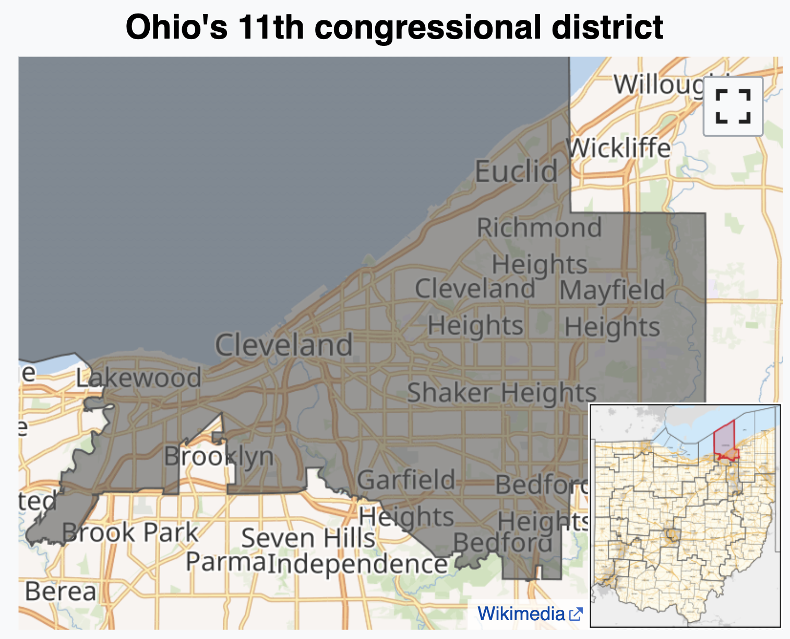
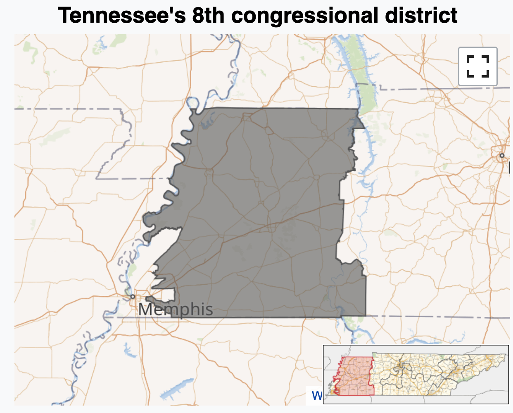
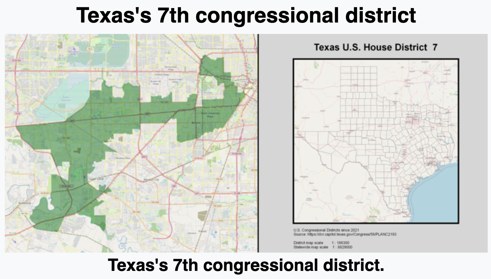
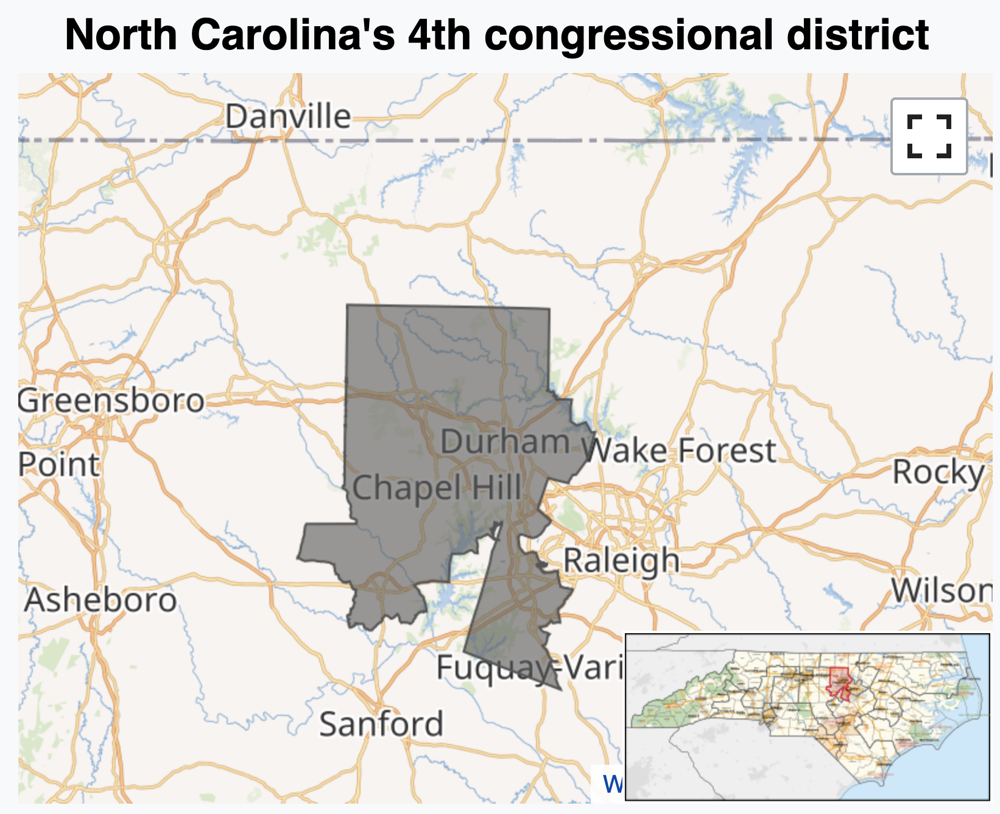
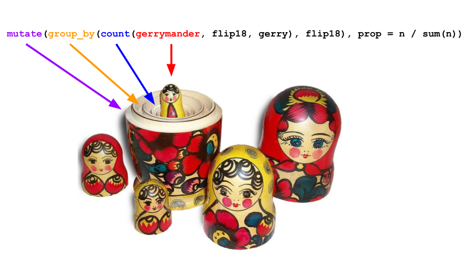
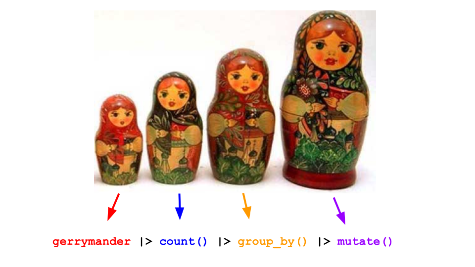

# Today's example

## So far...

| Data set | Occasion | Source | A row was a... |
|----------|----------|--------|----------------|
| `age_guesses` | Lecture 0 | file | 101 student  |
| `card_krueger` | Lecture 1 | file | restaurant  |
| `pokemon` | Lab 0 | file | Pokémon |
| `penguins` | Lab 0 | package | penguin |
| `nc_county` | Lab1, HW 1 | file | NC county |
| `bechdel` | Lecture 2+ | file | film |
| `gerrymander` | Today | package | US congressional district |

## Packages

-   For the data: [**usdata**](https://openintrostat.github.io/usdata/)

```{r}
library(usdata)
```

-   For the analysis: [**tidyverse**](https://www.tidyverse.org/packages/) and [**ggthemes**](https://jrnold.github.io/ggthemes/)

```{r}
library(tidyverse)
library(ggthemes)
```


## Data: `gerrymander` {.small}

```{r}
gerrymander
```

## What is gerrymandering?

<iframe width="560" height="315" src="https://www.youtube.com/embed/bGLRJ12uqmk?si=DAoLH-0Cwd2yg1LL" title="YouTube video player" frameborder="0" allow="accelerometer; autoplay; clipboard-write; encrypted-media; gyroscope; picture-in-picture; web-share" referrerpolicy="strict-origin-when-cross-origin" allowfullscreen>

</iframe>

## JZ's tour of the USA

{fig-align="center" width="75%"}

## JZ's tour of the USA

{fig-align="center" width="70%"}

## JZ's tour of the USA

{fig-align="center"}

## JZ's tour of the USA

{fig-align="center" width="70%"}

## Data: `gerrymander` {.scrollable .smaller}

::: question
What is a good first function to use to get to know a dataset?
:::

```{r}
glimpse(gerrymander)
```

## Data: `gerrymander`

-   Rows: Congressional districts

-   Columns:

    -   Congressional district and state

    -   2016 election: winning party, % for Clinton, % for Trump, whether a Democrat won the House election, name of election winner

    -   2018 election: winning party, whether a Democrat won the 2018 House election

    -   Whether a Democrat flipped the seat in the 2018 election

    -   Prevalence of gerrymandering: low, mid, and high

## Variable types: `district`

::: columns

::: {.column .xsmall}

| Variable     | Type                               |
|--------------|------------------------------------|
| `district`   | [categorical, ID]{.fragment}       |
| `last_name`  |                                    |
| `first_name` |                                    |
| `party16`    |                                    |
| `clinton16`  |                                    |
| `trump16`    |                                    |
| `dem16`      |                                    |
| `state`      |                                    |
| `party18`    |                                    |
| `dem18`      |                                    |
| `flip18`     |                                    |
| `gerry`      |                                    |

:::

::: {.column .small}

Congressional district:

```{r}
gerrymander |>
  select(district)
```

:::
:::

## Variable types: `last_name`

::: columns

::: {.column .xsmall}

| Variable     | Type                               |
|--------------|------------------------------------|
| `district`   | categorical, ID                    |
| `last_name`  | [categorical, ID]{.fragment}       |
| `first_name` |                                    |
| `party16`    |                                    |
| `clinton16`  |                                    |
| `trump16`    |                                    |
| `dem16`      |                                    |
| `state`      |                                    |
| `party18`    |                                    |
| `dem18`      |                                    |
| `flip18`     |                                    |
| `gerry`      |                                    |

:::

::: {.column .small}

Last name of 2016 election winner:

```{r}
gerrymander |>
  select(last_name)
```

:::
:::

## Variable types: `first_name`

::: columns

::: {.column .xsmall}

| Variable     | Type                               |
|--------------|------------------------------------|
| `district`   | categorical, ID                    |
| `last_name`  | categorical, ID                    |
| `first_name` | [categorical, ID]{.fragment}       |
| `party16`    |                                    |
| `clinton16`  |                                    |
| `trump16`    |                                    |
| `dem16`      |                                    |
| `state`      |                                    |
| `party18`    |                                    |
| `dem18`      |                                    |
| `flip18`     |                                    |
| `gerry`      |                                    |

:::

::: {.column .small}

First name of 2016 election winner:

```{r}
gerrymander |>
  select(first_name)
```

:::
:::

## Variable types: `party16`

::: columns

::: {.column .xsmall}

| Variable     | Type                               |
|--------------|------------------------------------|
| `district`   | categorical, ID                    |
| `last_name`  | categorical, ID                    |
| `first_name` | categorical, ID                    |
| `party16`    | [categorical]{.fragment}           |
| `clinton16`  |                                    |
| `trump16`    |                                    |
| `dem16`      |                                    |
| `state`      |                                    |
| `party18`    |                                    |
| `dem18`      |                                    |
| `flip18`     |                                    |
| `gerry`      |                                    |

:::

::: {.column .small}

Political party of 2016 election winner:

```{r}
gerrymander |>
  select(party16)
```

:::
:::

## Variable types: `clinton16`

::: columns

::: {.column .xsmall}

| Variable     | Type                               |
|--------------|------------------------------------|
| `district`   | categorical, ID                    |
| `last_name`  | categorical, ID                    |
| `first_name` | categorical, ID                    |
| `party16`    | categorical                        |
| `clinton16`  | [numerical, continuous]{.fragment} |
| `trump16`    |                                    |
| `dem16`      |                                    |
| `state`      |                                    |
| `party18`    |                                    |
| `dem18`      |                                    |
| `flip18`     |                                    |
| `gerry`      |                                    |

:::

::: {.column .small}

Percent of vote received by Clinton in 2016 Presidential Election:

```{r}
gerrymander |>
  select(clinton16)
```

:::
:::

## Variable types: `trump16`

::: columns

::: {.column .xsmall}

| Variable     | Type                               |
|--------------|------------------------------------|
| `district`   | categorical, ID                    |
| `last_name`  | categorical, ID                    |
| `first_name` | categorical, ID                    |
| `party16`    | categorical                        |
| `clinton16`  | numerical, continuous              |
| `trump16`    | [numerical, continuous]{.fragment} |
| `dem16`      |                                    |
| `state`      |                                    |
| `party18`    |                                    |
| `dem18`      |                                    |
| `flip18`     |                                    |
| `gerry`      |                                    |

:::

::: {.column .small}

Percent of vote received by Trump in 2016 Presidential Election:

```{r}
gerrymander |>
  select(trump16)
```

:::
:::

## Variable types: `dem16`

::: columns

::: {.column .xsmall}

| Variable     | Type                               |
|--------------|------------------------------------|
| `district`   | categorical, ID                    |
| `last_name`  | categorical, ID                    |
| `first_name` | categorical, ID                    |
| `party16`    | categorical                        |
| `clinton16`  | numerical, continuous              |
| `trump16`    | numerical, continuous              |
| `dem16`      | [categorical]{.fragment}           |
| `state`      |                                    |
| `party18`    |                                    |
| `dem18`      |                                    |
| `flip18`     |                                    |
| `gerry`      |                                    |

:::

::: {.column .small}

Did a Democrat win the 2016 House election. Levels of 1 (yes) and 0 (no):

```{r}
gerrymander |>
  select(dem16)
```

:::
:::

## Variable types: `state`

::: columns

::: {.column .xsmall}

| Variable     | Type                               |
|--------------|------------------------------------|
| `district`   | categorical, ID                    |
| `last_name`  | categorical, ID                    |
| `first_name` | categorical, ID                    |
| `party16`    | categorical                        |
| `clinton16`  | numerical, continuous              |
| `trump16`    | numerical, continuous              |
| `dem16`      | categorical                        |
| `state`      | [categorical]{.fragment}           |
| `party18`    |                                    |
| `dem18`      |                                    |
| `flip18`     |                                    |
| `gerry`      |                                    |

:::

::: {.column .small}

State the Representative is from:

```{r}
gerrymander |>
  select(state)
```

:::
:::

## Variable types: `party18`

::: columns

::: {.column .xsmall}

| Variable     | Type                               |
|--------------|------------------------------------|
| `district`   | categorical, ID                    |
| `last_name`  | categorical, ID                    |
| `first_name` | categorical, ID                    |
| `party16`    | categorical                        |
| `clinton16`  | numerical, continuous              |
| `trump16`    | numerical, continuous              |
| `dem16`      | categorical                        |
| `state`      | categorical                        |
| `party18`    | [categorical]{.fragment}           |
| `dem18`      |                                    |
| `flip18`     |                                    |
| `gerry`      |                                    |

:::

::: {.column .small}

Political Party of the 2018 election winner:

```{r}
gerrymander |>
  select(party18)
```

:::
:::

## Variable types: `dem18`

::: columns

::: {.column .xsmall}

| Variable     | Type                               |
|--------------|------------------------------------|
| `district`   | categorical, ID                    |
| `last_name`  | categorical, ID                    |
| `first_name` | categorical, ID                    |
| `party16`    | categorical                        |
| `clinton16`  | numerical, continuous              |
| `trump16`    | numerical, continuous              |
| `dem16`      | categorical                        |
| `state`      | categorical                        |
| `party18`    | categorical                        |
| `dem18`      | [categorical]{.fragment}           |
| `flip18`     |                                    |
| `gerry`      |                                    |

:::

::: {.column .small}

Did a Democrat win the 2018 House election. Levels of 1 (yes) and 0 (no):

```{r}
gerrymander |>
  select(dem18)
```

:::
:::

## Variable types: `flip18`

::: columns

::: {.column .xsmall}

| Variable     | Type                               |
|--------------|------------------------------------|
| `district`   | categorical, ID                    |
| `last_name`  | categorical, ID                    |
| `first_name` | categorical, ID                    |
| `party16`    | categorical                        |
| `clinton16`  | numerical, continuous              |
| `trump16`    | numerical, continuous              |
| `dem16`      | categorical                        |
| `state`      | categorical                        |
| `party18`    | categorical                        |
| `dem18`      | categorical                        |
| `flip18`     | [categorical]{.fragment}           |
| `gerry`      |                                    |

:::

::: {.column .small}

In the 2018 election, did the seat flip from D to R (-1), from R to D (1), or not change (0)?

```{r}
gerrymander |>
  select(flip18)
```

:::
:::

## Variable types: `gerry`

::: columns

::: {.column .xsmall}

| Variable     | Type                               |
|--------------|------------------------------------|
| `district`   | categorical, ID                    |
| `last_name`  | categorical, ID                    |
| `first_name` | categorical, ID                    |
| `party16`    | categorical                        |
| `clinton16`  | numerical, continuous              |
| `trump16`    | numerical, continuous              |
| `dem16`      | categorical                        |
| `state`      | categorical                        |
| `party18`    | categorical                        |
| `dem18`      | categorical                        |
| `flip18`     | categorical                        |
| `gerry`      | [categorical, ordinal]{.fragment}  |

:::

::: {.column .small}

Categorical variable for prevalence of gerrymandering with levels of low, mid and high:

```{r}
gerrymander |>
  select(gerry)
```

:::
:::

# Exploring two categorical variables

## Research question

::: question
Is a Congressional District more likely to have high prevalence of gerrymandering if a Democrat was able to flip the seat in the 2018 election? Support your answer with a visualization as well as summary statistics.
:::

## Step 1

```{r}
ggplot(gerrymander)
```

## Step 2

```{r}
ggplot(gerrymander, aes(x = flip18))
```

## Step 3

```{r}
ggplot(gerrymander, aes(x = flip18)) +
  geom_bar()
```

## Step 4

```{r}
ggplot(gerrymander, aes(x = flip18, fill = gerry)) +
  geom_bar()
```

## Step 5a

```{r}
ggplot(gerrymander, aes(x = flip18, fill = gerry)) +
  geom_bar(position = "dodge")
```

## Step 5b

```{r}
ggplot(gerrymander, aes(x = flip18, fill = gerry)) +
  geom_bar(position = "fill")
```

## What's the answer? {.small}

::: question
Is a Congressional District more likely to have high prevalence of gerrymandering if a Democrat was able to flip the seat in the 2018 election? 
:::

```{r}
ggplot(gerrymander, aes(x = flip18, fill = gerry)) +
  geom_bar(position = "fill")
```

## What are the actual numbers? {.scrollable .smaller}

::: question
Is a Congressional District more likely to have high prevalence of gerrymandering if a Democrat was able to flip the seat in the 2018 election? 
:::

```{r}
gerrymander |>
  count(flip18, gerry) |>
  group_by(flip18) |>
  mutate(prop = n / sum(n))
```

## Step 1 {.scrollable .medium}

```{r}
gerrymander
```

## Step 2 {.scrollable}

```{r}
gerrymander |>
  count(flip18, gerry)
```

## Recall

The heights of these bars are the counts in the table:

```{r}
ggplot(gerrymander, aes(x = flip18, fill = gerry)) +
  geom_bar(position = "dodge")
```

## Step 3 {.scrollable}

```{r}
gerrymander |>
  count(flip18, gerry) |>
  group_by(flip18)
```

## Step 4 {.scrollable}

```{r}
gerrymander |>
  count(flip18, gerry) |>
  group_by(flip18) |>
  mutate(prop = n / sum(n))
```

## The Full Monty {.smaller}

::: question
Is a Congressional District more likely to have high prevalence of gerrymandering if a Democrat flipped the seat in the 2018 election? (`flip18` = 1: Democrat flipped the seat, 0: No flip, -1: Republican flipped the seat.)
:::

::: {.columns}
::: {.column}

```{r}
ggplot(
  gerrymander, 
  aes(x = flip18, fill = gerry)
  ) +
  geom_bar(position = "fill")
```

:::
::: {.column}

```{r}
gerrymander |>
  count(flip18, gerry) |>
  group_by(flip18) |>
  mutate(prop = n / sum(n))
```

:::
:::

## New commands

- `count` creates a *new* data frame that tallies up the number of rows that fall into each bin;
- `group_by` silently *groups* the rows according to bin, and all subsequent operations are done *within* group;
- `mutate` either adds new columns that aren't already there, or modifies existing columns.

    - we used it to add a `prop` column that wasn't there before;
    - because the table of counts is *grouped*, the proportions were computed *within* each level of `flip18`.

# That pesky pipe

## We teach you to do this

```{r}
gerrymander |>
  count(flip18, gerry) |>
  group_by(flip18) |>
  mutate(prop = n / sum(n))
```

## You could do this instead {.scrollable .small}

Technically equivalent. Gives the same result. *Super* hard to read:

```{r}


mutate(group_by(count(gerrymander, flip18, gerry), flip18), prop = n / sum(n))
```

## Without the pipe



## With the pipe




# Drilling down: <br>`group_by()`, <br> `summarize()`, <br> `count()`

## What does `group_by()` do? {.scrollable}

::: question
What does `group_by()` do in the following pipeline?
:::

```{r}
gerrymander |>
  count(flip18, gerry) |>
  group_by(flip18) |>
  mutate(prop = n / sum(n))
```

## What does `group_by()` do? {.scrollable}

::: question
What does `group_by()` do in the following pipeline?
:::

```{r}
gerrymander |>
  count(flip18, gerry) |>
  #group_by(flip18) |>
  mutate(prop = n / sum(n))
```

## Let's simplify! {.scrollable}

::: question
What does `group_by()` do in the following pipeline?
:::

```{r}
gerrymander |>
  group_by(state) |>
  summarize(mean_trump16 = mean(trump16))
```

## Let's simplify! {.scrollable}

::: question
What does `group_by()` do in the following pipeline?
:::

```{r}
gerrymander |>
  #group_by(state) |>
  summarize(mean_trump16 = mean(trump16))
```

## `group_by()` {.scrollable .medium}

-   it converts a data frame to a grouped data frame, where subsequent operations are performed once per group

-   `ungroup()` removes grouping

```{r}
gerrymander |>
  group_by(state)
```

## `group_by()` {.scrollable .medium}

-   it converts a data frame to a grouped data frame, where subsequent operations are performed once per group

-   `ungroup()` removes grouping

```{r}
gerrymander |>
  group_by(state) |>
  ungroup()
```

## `group_by() |> summarize()` {.smaller}

A common pipeline is `group_by()` and then `summarize()` to **calculate** summary statistics for each group:

```{r}
gerrymander |>
  group_by(state) |>
  summarize(
    mean_trump16 = mean(trump16),
    median_trump16 = median(trump16)
  )
```

## `group_by() |> summarize()` {.smaller}

This pipeline can also be used to **count** number of observations for each group:

```{r}
gerrymander |>
  group_by(state) |>
  summarize(n = n())
```

## `summarize()` {.smaller}

``` r
... |>
  summarize(
    name_of_summary_statistic = summary_function(variable)
  )
```

. . .

-   `name_of_summary_statistic`: Anything you want to call it!
    -   Recommendation: Keep it short and evocative
-   `summary_function()`:
    -   `n()`: number of observations
    -   `mean()`: mean
    -   `median()`: median
    -   ...

## Spot the difference {.smaller}

::: question
What's the difference between the following two pipelines?
:::

::::: columns
::: column
```{r}
gerrymander |>
  group_by(state) |>
  summarize(n = n())
```
:::

::: column
```{r}
gerrymander |>
  count(state)
```
:::
:::::

## `count()`

::::: columns
::: {.column width="40%"}
``` r
... |>
  count(variable)
```
:::

::: {.column width="60%"}
``` r
... |>
  count(variable1, variable2)
```
:::
:::::

-   Count the number of observations in each level of variable(s)

-   Place the counts in a variable called `n`

## `count()` and `sort` {.scrollable}

::: question
What does the following pipeline do? Rewrite it with `count()` instead.
:::

```{r}
gerrymander |>
  group_by(state) |>
  summarize(n = n()) |>
  arrange(desc(n))
```

## `count()` and `sort` {.scrollable}

::: question
What does the following pipeline do? Rewrite it with `count()` instead.
:::

```{r}
gerrymander |>
  count(state) |>
  arrange(desc(n))
```

## `count()` and `sort` {.scrollable}

::: question
What does the following pipeline do? Rewrite it with `count()` instead.
:::

```{r}
gerrymander |>
  count(state, sort = TRUE)
```


# Summary

## "Science"?

::: incremental
- We call it "statistical *science*" or "data *science*," but frankly it's all much closer to *art* and *rhetoric* and *storytelling*;
- When you compress a data set down to pictures and summaries, you make countless *choices* about how to visualize, which summaries to inspect, how much detail to retain or discard, etc;
- A choice is good or bad insofar as a skeptical human audience finds it informative and persuasive.
:::

## Fine, but what dataviz should I use? {.medium}

If you want to know where to begin, the *number* and *type* of variables typically narrows down the menu of options:

. . .

| Variable combo | Options for a first pass |
|------|------|
| 1 numerical     |  histogram, density, box plot, ...    |
| 1 categorical     | bar chart, ~~pie chart~~     |
| 2 numerical     | scatterplot |
| numerical/categorical     | side-by-side boxes, stacked densities or histograms, ...     |
| 2 categorical     | stacked bar plot     |

. . .

For three or more variables, the human mind is limited, and you have to get creative (play with color, shape, texture, etc).

## Computational themes {.medium}

Every coding task in this class will be some combo of these two things:

. . .

::::: columns
::: {.column width="35%"}
Building cakes (`ggplot`) 
:::

::: {.column .fragment width="65%"}
Stacking dolls (pipe `|>`) 
:::
:::::

. . .

Master these, and everything will be coming up roses!

## Where to now?


## Where to now?

```{r}
#| warning: false
#| message: false
#| echo: false
bechdel <- read_csv("data/bechdel.csv")
ggplot(bechdel, 
       aes(x = budget_2013, 
           y = gross_2013)) + 
  geom_point() + 
  geom_smooth(method = "lm") + 
  labs(
    x = "Budget (2013 USD)",
    y = "Gross (2013 USD)",
    title = "Film finances (1990 - 2013)"
  ) +
  theme_minimal(base_size = 20)
```

Where did the line come from? How was it drawn? How do you interpret it? How do you use it? What about more than two variables? What about categorical variables?
