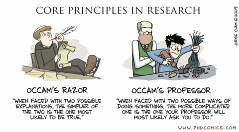
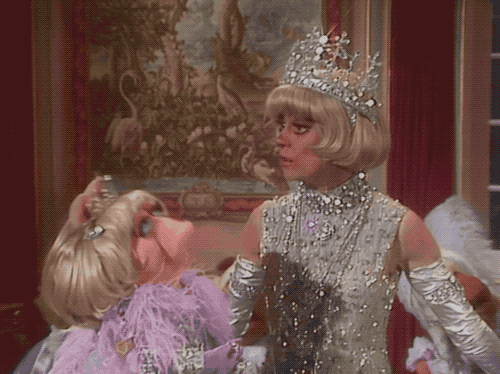
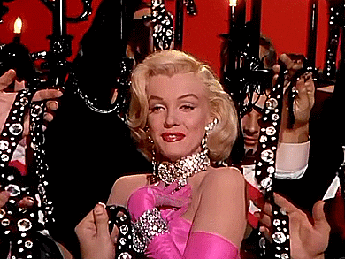
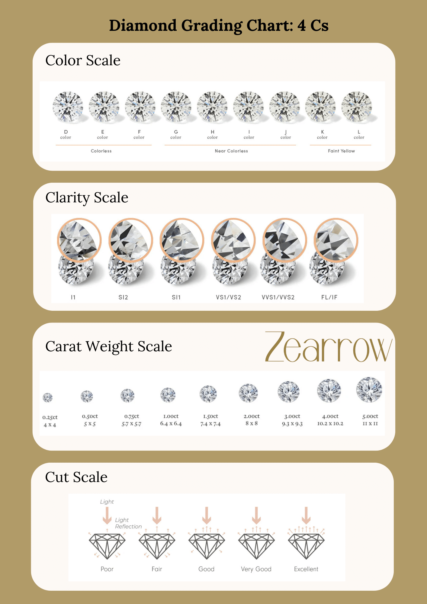
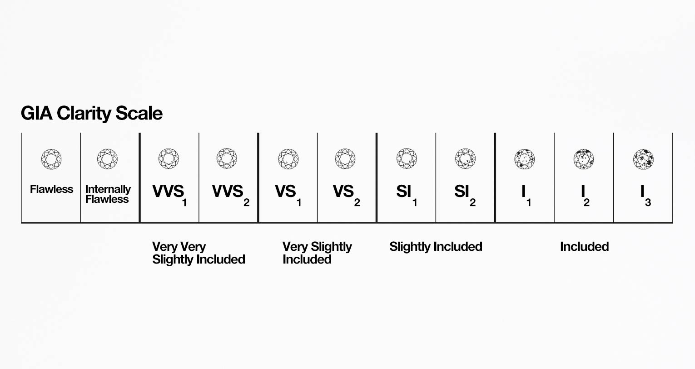

```{r}
#| echo: false
#| message: false
#| warning: false
library(tidyverse)
library(tidymodels)
library(palmerpenguins)
```

## Last time: $R^2$ for real

- $R^2$ measures a model's goodness-of-fit;
- $R^2$ is defined as the proportion of variation in the response variable explained by the model. So, one minus the proportion of variation *unexplained*:

$$
R^2=1-\frac{\text{var}(e_i)}{\text{var}(y_i)}.
$$

- $R^2=1$ indicates perfect fit, $R^2=0$ indicates horrific fit, and everything in between. Like a "Rotten Tomatoes score" for your model.

## Last time: penguins

We saw five different models all trying to predict the same thing:

```{r}
bm_fl_fit <- linear_reg() |>
  fit(body_mass_g ~ flipper_length_mm, penguins)

bm_island_fit <- linear_reg() |>
  fit(body_mass_g ~ island, penguins)

bm_fl_island_fit <- linear_reg() |>
  fit(body_mass_g ~ flipper_length_mm + island, penguins)

bm_fl_island_int_fit <- linear_reg() |>
  fit(body_mass_g ~ flipper_length_mm * island, penguins)

bm_fl_bl_fit <- linear_reg() |>
  fit(body_mass_g ~ flipper_length_mm + bill_length_mm, penguins)
```

## Model selection

**Question**: Given many competing models for *the same response*, which model is "best"? What does that even mean?

. . .

**Answer**: Assign a "quality score" to each model, and pick the model with the best score:

| Model | Score | Verdict |
| --- | --- | --- | 
| Simple | 0.1 | ❌ |
| Additive | 0.5 | ✅ |
| Interaction | 0.48 | ❌ |

. . .

**Variable selection**: all of our models were linear, and they differed only by which predictor variables are included. By ranking models by quality score and picking the "best" one, we can determine which predictors are the "most important" to include.

## Selection criteria

This is a big area of statistical research. There are loads of "quality scores" you could consider, and they prioritize different things: predictive accuracy, goodness-of-fit, simplicity, fairness, etc.

- $R^2$;
- adjusted $R^2$;
- Akaike Information criterion (AIC);
- Bayesian information criterion (BIC);
- ... so many more

We won't go into detail, but you will if you keep studying statistics.

## `tidymodels` reports many of these for free

```{r}
bm_fl_fit |>
  glance() |>
  select(r.squared, adj.r.squared, AIC, BIC)
```

## $R^2$'s dirty little secret

$R^2$ gives participation trophies. It *always* goes up when you add any new variable to the model, even if that variable is worthless.

## Adding a phony variable {.medium}


The original model fit:

```{r}
linear_reg() |>
  fit(body_mass_g ~ flipper_length_mm, penguins) |>
  glance() |>
  pull(r.squared)
```


. . .


Add a predictor that is literally just a bunch of random numbers:


```{r}
#| echo: false
set.seed(12345)
```

```{r}
noisy_penguins <- penguins |>
  mutate(
    bullshit = rnorm(nrow(penguins))
  )

linear_reg() |>
  fit(body_mass_g ~ flipper_length_mm + bullshit, noisy_penguins) |>
  glance() |>
  pull(r.squared)
```

## Adjusted $R^2$ {.scrollable}

Because vanilla $R^2$ blithely rewards the addition of *any* variable, no matter how meaningless, you shouldn't use it for model selection. Instead, use *adjusted* $R^2$. The formula is in the textbook if you're dying to know, but here's the tea:

::: incremental
- adjusted $R^2$ penalizes the inclusion of unnecessary predictors;
- It prioritizes a *parsimonious model*:
    - a model that fits/predicts well, *and*...
    - a model that's not too complicated (so our pea brains can still understand it);
- Occam's razor!
:::

. . .

{fig-align="center"}

## For the penguins

:::::: columns
:::: {.column width="50%"}
```{r}
bm_fl_fit |> glance() |>
  pull(adj.r.squared)
```

```{r}
bm_island_fit |> glance() |>
  pull(adj.r.squared)
```

```{r}
bm_fl_island_fit |> glance() |>
  pull(adj.r.squared)
```
::::


:::: {.column width="50%"}

```{r}
bm_fl_island_int_fit |> glance() |>
  pull(adj.r.squared)
```

```{r}
bm_fl_bl_fit |> glance() |>
  pull(adj.r.squared)
```

::::

::::::

. . .

Which model is "best"?


## Balancing fit and complexity

::: incremental

- More complex models (i.e., models with more predictors) tend to fit the data at hand better, but may not generalize well to new data.

- Model selection criteria, like adjusted $R^2$, help balance model fit and complexity to avoid overfitting by penalizing models with more predictors.

:::

## Overfitting 

::: incremental

- Overfitting occurs when a model captures not only the underlying relationship between predictors and outcome but also the random noise in the data;
- Overfitted models tend to perform well on the observed data but poorly on new, unseen data.
  - Good news: We have techniques to detect and prevent overfitting;
  - Bad news: We won't get into those until next week.
:::

## Back to variable selection

:::: columns 

::: column 
Given a set of competing models, all trying to predict the same response, we can line 'em up, compute *adjusted* $R^2$ for each model, and then pick the model with the highest score. 

Easy, right?
:::

::: {.fragment .column} 
{fig-align="center"}
:::

::::

## Listing out all the possible models {.medium .scrollable}

::: incremental
- The penguins dataset has $p=6$ variables apart from body mass: species, island, bill length, bill depth, flipper length, and sex;
- How many models is that (ignoring the possibility of interaction, which makes things worse):
  - `{r} choose(6, 0)` "empty" model: include no predictors;
  - `{r} choose(6, 1)` "simple" models: include only one predictor;
  - `{r} choose(6, 2)` two-predictor models;
  - `{r} choose(6, 3)` three-predictor models;
  - `{r} choose(6, 4)` four-predictor models;
  - `{r} choose(6, 5)` five-predictor models;
  - `{r} choose(6, 6)` "full" model: include all predictors.
- That's $2^6=64$ models in total you have to consider. Not the end of the world if you have a computer, but it gets worse...
:::


## Combinatorial explosion {.medium}

:::: columns

::: column

- If you have $p$ candidate predictors, then the set of all possible subsets you could include in a model grows *very* quickly;
- In the "big data" era, 100 predictors is amateur hour, so it becomes infeasible to fit every possible model; 
- It pays to "search" through the space of models in a smarter, less brute-force way.

:::

::: column

| $p$ | # of models = $2^p$ |
| --- | ------------------- |
| 2 | `{r} 2^2` |
| 5 | `{r} 2^5` |
| 10 | `{r} 2^10` |
| 20 | 1048576 |
| 30 | 1073741824 |
| 40 | $\approx 1.098\times 10^{12}$ |
| 50 | $\approx 1.13\times 10^{15}$ |
| 100 | $\approx 1.27\times 10^{30}$ |

:::

::::


## Backward elimination {.medium}

Start with the *full model* (the model that includes all potential predictor variables). Variables are eliminated one-at-a-time from the model until we cannot improve the model any further.

**Procedure**:

1. Start with a model that has all predictors we consider and compute the adjusted $R^2$.
1. Next fit every possible model with 1 fewer predictor.
1. Compare adjusted $R^2$s to select the best model (highest adjusted $R^2$) with 1 fewer predictor.
1. Repeat steps 2 and 3 until adjusted $R^2$ no longer increases.

## Example: recall the cars {.small .scrollable}

```{r}
mtcars
```

## Example: recall the cars {.scrollable}

(AIC is an alternative selection criterion. Lower is better.)

```{r}
backward_model <- lm(mpg ~ ., data = mtcars)

backward_model <- stats::step(backward_model, direction = "backward")
```


## Foreward stepwise regression {.medium}

Forward stepwise regression is the reverse of the backward elimination technique. Instead, of eliminating variables one-at-a-time, we start from an "empty model" and we add variables one-at-a-time until we cannot find any variables that improve the model any further.

**Procedure**:

1. Start with a model that has no predictors.
1. Next fit every possible model with 1 additional predictor and calculate adjusted $R^2$ of each model.
1. Compare adjusted $R^2$ values to select the best model (highest adjusted $R^2$) with 1 additional predictor.
1. Repeat steps 2 and 3 until adjusted $R^2$ no longer increases.

# A new application

## A girl's best friend


{width="49%"}{width="49%"}

## A game {.smaller}

::::::::: columns
:::: {.column width="33%"}
::: fragment
{width="100%"}

<ul>

<li>10-carat old mine brilliant-cut diamond</li>

<li>58 facets</li>

<li>Est.
at \$550K - \$1M</li>

</ul>
:::
::::

:::: {.column width="33%"}
::: fragment
{width="100%"}

<ul>

<li>5-carat antique cushion-cut diamond</li>

<li>\$280,000 price tag</li>

</ul>
:::
::::

:::: {.column width="33%"}
::: fragment
{width="100%"}

<ul>

<li>Est.
30-40-carat high color center diamond</li>

<li>1-carat oval side stones</li>

<li>Est.
value upwards of \$3M</li>

</ul>
:::
::::
:::::::::

## The 4 Cs

When evaluating a diamond, jewelers typically focus on four key characteristics known as the **4 Cs**:

::: incremental
-   **Carat** — How big is it?
-   **Cut** — How much does it sparkle?
-   **Clarity** — How flawless is it?
-   **Color** — How colorless is it?
:::

::: fragment
The 4 Cs are the primary factors that determine a diamond's value.
:::

## What do these things mean? {.scrollable}

<div style="overflow-y: scroll; height: 400px;" class="scroll-container">
  {fig-align="center" width="700"}
</div>


## What do these things mean?

For example:



## We have some data!

```{r}
#| label: load-data
#| message: false
#| echo: false
set.seed(847)
diamonds <- read_csv("data/diamonds.csv") |>
  rename(length_mm = x, width_mm = y) |>
  select(price, carat, cut, color, clarity, length_mm, width_mm) |>
  mutate(color = factor(color),
         cut = fct_relevel(cut, c("Ideal", "Premium", "Very Good", "Good", "Fair")),
         clarity = factor(clarity)) |>
  mutate(clarity = fct_collapse(clarity,
    "IF" = "IF",
    "VVS" = c("VVS1", "VVS2"),
    "VS" = c("VS1", "VS2"),
    "SI" = c("SI1", "SI2"),
    "I" = "I1")) |>
  mutate(clarity = fct_relevel(clarity, c("IF", "VVS", "VS", "SI", "I"))) |>
  filter(carat <= 3.0) |>
  sample_n(5000)
```

```{r}
diamonds
```


# Now, off to your container!

