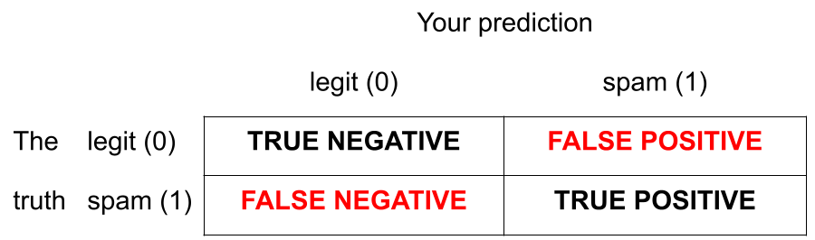

```{r}
#| label: load-packages
#| message: false
#| echo: false
library(tidyverse)
library(tidymodels)
library(openintro)
library(fivethirtyeight)
library(palmerpenguins)
library(MASS)
hp_spam <- read_csv("data/hp-spam.csv")
todays_ae <- "ae-06-spam-filter"
```

```{r}
#| label: cartoon-settings
#| message: false
#| echo: false

set.seed(8675309)
n <- 50
x <- rnorm(n, mean = 0, sd = 1)
b0 <- 0  
b1 <- 5
prob <- 1 / (1 + exp(-(b0 + b1 * x)))
y <- rbinom(n, 1, prob)
fit <- glm(y ~ x, family = binomial)
seq_x = seq(1.2 * min(x), 1.2 * max(x), length.out = 500)
y_vals <- 1 / (1 + exp(-(fit$coefficients[1] + fit$coefficients[2] * seq_x)))
```


# So where were we...

## Thus far...

We have been studying regression:

-   What combinations of data types have we seen?

-   What did the picture look like?

## Recap: simple linear regression

Numerical response and one numerical predictor:

```{r}
#| label: slr-1
#| message: false
#| echo: false
movie_scores <- fandango |>
  rename(
    critics = rottentomatoes, 
    audience = rottentomatoes_user
  )
ggplot(movie_scores, aes(x = critics, y = audience)) +
  geom_point(alpha = 0.5) + 
  geom_smooth(method = "lm", se = FALSE) + 
  labs(
    x = "Critics Score" , 
    y = "Audience Score",
    title = "Rotten Tomatoes Scores"
  )
```

## Recap: simple linear regression

Numerical response and one categorical predictor (two levels):

```{r}
#| echo: false 
#| warning: false
#| message: false
card_krueger <- read_csv("data/card-krueger-alt.csv")
card_krueger_wide <- card_krueger |>
  mutate(
    state = fct_relevel(state, "PA", "NJ"),
    time = fct_relevel(time, "before", "after")
  ) |>
  pivot_wider(
    names_from = time,
    values_from = c(wage, fte)
  ) |>
  mutate(
    emp_diff = fte_after - fte_before,
    statebin = if_else(state == "PA", 0, 1)
  )

ggplot(card_krueger_wide, aes(x = statebin, y = emp_diff)) + 
  geom_point() +
  geom_smooth(method = "lm") + 
  xlim(-0.5, 1.5) + 
  scale_x_continuous(breaks = c(0, 1),
                   labels = c("PA (0)", "NJ (1)")) +
  labs(
    title = "Card and Krueger data",
    y = "Employment difference",
    x = "State"
  )
```

## Recap: multiple linear regression

Numerical response; numerical and categorical predictors:

```{r}
#| label: additive-interaction-viz
#| layout-ncol: 2
#| echo: false
#| fig-asp: 1

# Plot A
bm_fl_island_fit <- linear_reg() |>
  fit(body_mass_g ~ flipper_length_mm + island, data = penguins)
bm_fl_island_aug <- augment(bm_fl_island_fit, new_data = penguins)
ggplot(
  bm_fl_island_aug, 
  aes(x = flipper_length_mm, y = body_mass_g, color = island)
  ) +
  geom_point(alpha = 0.5) +
  geom_smooth(aes(y = .pred), method = "lm") +
  labs(title = "Plot A - Additive model",
       x = "Flipper Length (mm)",
       y = "Body Mass (g)",
       color = "Island") +
  theme(legend.position = "bottom")

# Plot B
ggplot(
  penguins, 
  aes(x = flipper_length_mm, y = body_mass_g, color = island)
  ) +
  geom_point(alpha = 0.5) +
  geom_smooth(method = "lm", se = FALSE) +
  labs(title = "Plot B - Interaction model",
       x = "Flipper Length (mm)",
       y = "Body Mass (g)",
       color = "Island") +
  theme(legend.position = "bottom")
```

## Today: a *binary* response {.smaller}

$$
y = 
\begin{cases}
1 & &&\text{eg. Yes, Win, True, Heads, Success}\\
0 & &&\text{eg. No, Lose, False, Tails, Failure}.
\end{cases}
$$

```{r}
#| message: false
#| echo: false
par(mar = c(5, 5, 0.5, 0.5))
plot(x, y, pch = 19, cex = 0.5, ylim = c(-0.25, 1.25), cex.lab = 1.5,
     ylab = "y",
     xlab = "x")
```

## Who cares?

If we can model the relationship between predictors ($x$) and a binary response ($y$), we can use the model to do a special kind of prediction called *classification*.

## Example: is the e-mail spam or not? {.smaller}

$$
\mathbf{x}: \text{word and character counts in an e-mail.}
$$

{fig-align="center" width="70%"}

$$
y
= 
\begin{cases}
1 & \text{it's spam}\\
0 & \text{it's legit}
\end{cases}
$$

## Example: is it pneumonia or not? {.smaller}

$$
\mathbf{x}: \text{features in a medical image.}
$$

{fig-align="center"}

$$
y
= 
\begin{cases}
1 & \text{it's pneumonia}\\
0 & \text{it's healthy}
\end{cases}
$$

## Example: will they default? {.smaller}

$$
\mathbf{x}: \text{financial and demographic info about a loan applicant.}
$$

{fig-align="center" width="60%"}

$$
y
= 
\begin{cases}
1 & \text{applicant is at risk of defaulting on loan}\\
0 & \text{applicant is safe}
\end{cases}
$$

## Example: Who said it: TS or WS? {.smaller}

$$
\mathbf{x}: \text{word counts (e.g., thou, love, heartbreak), stylistic features}
$$

{fig-align="center" width="40%"}

$$
y
= 
\begin{cases}
1 & \text{Taylor Swift}\\
0 & \text{William Shakespeare}
\end{cases}
$$

## How do we model this type of data?

```{r}
#| message: false
#| echo: false
par(mar = c(5, 5, 0.5, 0.5))
plot(x, y, pch = 19, cex = 0.5, ylim = c(-0.25, 1.25), cex.lab = 1.5,
     ylab = "y",
     xlab = "x")
```

## Straight line of best fit is a little silly

```{r}
#| message: false
#| echo: false
par(mar = c(5, 5, 0.5, 0.5))
plot(x, y, pch = 19, cex = 0.5, ylim = c(-0.25, 1.25), cex.lab = 1.5,
     ylab = "y",
     xlab = "x")
abline(lm(y ~ x), col = "red", lwd = 3)
```

Possible, but silly.

## Instead: S-curve of best fit {.smaller}

Instead of modeling $y$ directly, we model the probability that $y=1$:

```{r}
#| message: false
#| echo: false
#| fig-asp: 0.4
par(mar = c(5, 5, 0.5, 0.5))
plot(x, y, pch = 19, cex = 0.5, ylim = c(-0.25, 1.25), cex.lab = 1.5,
     ylab = "Prob(y = 1 | x)",
     xlab = "x")
lines(seq_x, y_vals, col = "red", lwd = 3)
points(x, y, pch = 19, cex = 0.75)
```

-   "Given new email, what's the probability that it's spam?''
-   "Given new image, what's the probability that it's pneumonia?''
-   "Given new loan application, what's the probability that they default?''

## Why don't we model y directly?

-   **Recall regression with a numerical response**:

    -   Our models do not output *guarantees* for $y$, they output predictions that describe behavior *on average*;

-   **Similar when modeling a binary response**:

    -   Our models cannot directly guarantee that $y$ will be zero or one. The correct analog to "on average" for a 0/1 response is "what's the probability?"

# So, what is this S-curve, anyway?

## It's the *logistic function*

$$
\text{Prob}(y = 1\mid x)
=
\frac{e^{\beta_0+\beta_1x}}{1+e^{\beta_0+\beta_1x}}.
$$

If you set $p = \text{Prob}(y = 1\mid x)$ and do some algebra, you get the simple linear model for the *log-odds*:

$$
\log\left(\frac{p}{1-p}\right)
=
\beta_0+\beta_1x.
$$

This is called the *logistic regression* model.

## Log-odds? {.medium .scrollable}

::: incremental
-   $p = \text{Prob}(y = 1 \mid x)$ is a probability. A number between 0 and 1;
-   $o=p / (1 - p)$ is the odds. A number between 0 and $\infty$;
    - This is just an alternative way of communicating the probability: "The odds of this lecture going well are 10 to 1;"
-   The log odds $\log(o)=\log(p / (1 - p))$ is a number between $-\infty$ and $\infty$, which is suitable for the linear model;
-   Why does this "transformation" work? The log function maps positive numbers $(0, \infty)$ to all real numbers $(-\infty, \infty)$. 
:::

## Probability to odds

```{r}
#| echo: false
#| fig-asp: 0.6

curve(x/(1 - x), from = 0, to = 1, n = 500,
      xlab = "Probability: p", ylab = "Odds: p / (1 - p)",
      lwd = 2, col = "red", bty = "n")
```

## Zooming in

```{r}
#| echo: false
#| fig-asp: 0.6

curve(x/(1 - x), from = 0.10, to = 0.90, n = 500,
      xlab = "Probability: p", ylab = "Odds: p / (1 - p)",
      lwd = 2, col = "red", bty = "n")
```

## Odds to log odds

```{r}
#| echo: false
#| fig-asp: 0.6

curve(log(x), from = 0, to = 10, n = 1000,
      lwd = 2, col = "red", xaxt = "n", bty = "n",
      xlab = "Odds: p / (1 - p)", ylab = "Log-odds: log[p / (1 - p)]")
axis(1, pos = 0)
```

## Put it all together {.small}

:::::: columns
:::: {.column width="60%"}

```{r}
#| echo: false
#| fig-asp: 1
par(mar = c(5, 5, 0.5, 0.5))
curve(log(x / (1 - x)), from = 0, to = 1, n = 1000,
      lwd = 3, col = "red", xaxt = "n", bty = "n",
      xlab = "Probability: p", ylab = "log-odds: log[p / (1 - p)]", cex.lab = 2, cex.axis = 1.5)
axis(1, pos = 0, cex.axis = 1.5)
```

::::

:::: {.column width="40%"}

- $p = 0 \to \text{log-odds}=-\infty$;
- $p = 1/2 \to \text{log-odds}=0$;
- $p = 1 \to \text{log-odds}=\infty$;
- And everything in between.

The log-odds transformation takes probabilities between 0 and 1 and streeetches them out to numbers between $-\infty$ and $\infty$, for which the linear model is appropriate.

::::
::::::

## Logistic regression

$$
\log\left(\frac{p}{1-p}\right)
=
\beta_0+\beta_1x.
$$

-   The *logit* function $\log(p / (1-p))$ is an example of a *link function* that transforms the linear model to have an appropriate range;

-   This is an example of a *generalized linear model*. Take a class like STA 210 to learn more.

## How do the parameters control the shape? {.scrollable}

$$
p
=
\frac{e^{\beta_0+\beta_1x}}{1+e^{\beta_0+\beta_1x}} \quad \Longleftrightarrow\quad \log\left(\frac{p}{1-p}\right)
=
\beta_0+\beta_1x.
$$

```{shinylive-r}
#| standalone: true
#| viewerHeight: 500

library(shiny)

ui <- fluidPage(
  
  titlePanel("Adjusting the shape of the S-curve"),
  
  sidebarLayout(
    sidebarPanel(
      sliderInput("b0",
                  "β₀",
                  min = -5,
                  max = 5,
                  value = 0,
                  step = 0.1),
      sliderInput("b1",
                  "β₁",
                  min = -5,
                  max = 5,
                  value = 1,
                  step = 0.1)
    ),
    
    mainPanel(
      plotOutput("distPlot")
    )
  )
)

# Define server logic required to draw a histogram
server <- function(input, output) {
  
  output$distPlot <- renderPlot({
    
    b0 <- input$b0
    b1 <- input$b1

    curve(exp(b0 + b1 * x) / (1 + exp(b0 + b1 * x)), from = -5, to = 5, n = 1000, col = "red", bty = "n", ylab = "Prob(y = 1 | x)", xlab = "x", ylim = c(0, 1), lwd = 5)
    abline(v = 0)
    points(0, exp(b0) / (1 + exp(b0)), pch = 19, col = "red", cex = 2)
  })
}

# Run the application 
shinyApp(ui = ui, server = server)
```

# Estimation

## Estimation: picking the "best fitting" S-curve {.scrollable}


```{shinylive-r}
#| standalone: true
#| viewerHeight: 500

library(shiny)

ui <- fluidPage(
  
  titlePanel("Guess the best-fitting logistic curve"),
  
  sidebarLayout(
    sidebarPanel(
      
      actionButton("new_data", "Generate new data"),
      
      br(), br(),
      
      sliderInput("b0",
                  "b₀",
                  min = -5,
                  max = 5,
                  value = 0,
                  step = 0.1),
      
      sliderInput("b1",
                  "b₁",
                  min = -5,
                  max = 5,
                  value = 1,
                  step = 0.1),
      
      checkboxInput("show_mle",
                    "Show MLE",
                    value = FALSE)
    ),
    
    mainPanel(
      plotOutput("distPlot"),
      verbatimTextOutput("mle_output")
    )
  )
)

server <- function(input, output) {
  
  # Store simulated data
  sim_data <- reactiveVal()
  
  # Function to generate a new dataset
  generate_data <- function() {
    
    # Prior on parameters, restricted to slider bounds
    b0_true <- runif(1, -5, 5)
    b1_true <- runif(1, -5, 5)
    
    # Simulate x values
    n <- 100
    x <- runif(n, -5, 5)
    
    # Logistic probabilities
    p <- plogis(b0_true + b1_true * x)
    
    # Simulate y values
    y <- rbinom(n, size = 1, prob = p)
    
    data.frame(
      x = x,
      y = y,
      b0_true = b0_true,
      b1_true = b1_true
    )
  }
  
  # Generate initial data when app starts
  sim_data(generate_data())
  
  # Generate new data when button pressed
  observeEvent(input$new_data, {
    sim_data(generate_data())
  })
  
  output$distPlot <- renderPlot({
    
    d <- sim_data()
    
    b0 <- input$b0
    b1 <- input$b1
    
    # Plot the data
    plot(d$x, d$y,
         xlim = c(-5, 5),
         ylim = c(-0.05, 1.05),
         pch = 19,
         xlab = "x",
         ylab = "y",
         bty = "n")
    
    # User's curve
    curve(plogis(b0 + b1 * x),
          from = -5,
          to = 5,
          add = TRUE,
          col = "red",
          lwd = 5,
          n = 1000)
    
    abline(v = 0)
    
    points(0, plogis(b0),
           pch = 19,
           col = "red",
           cex = 2)
    
    # MLE curve
    if (input$show_mle) {
      
      fit <- glm(y ~ x, data = d, family = binomial)
      mle <- coef(fit)
      
      curve(plogis(mle[1] + mle[2] * x),
            from = -5,
            to = 5,
            add = TRUE,
            col = "blue",
            lwd = 3,
            lty = 2,
            n = 1000)
    }
  })
  
  # MLE coefficient display
  output$mle_output <- renderText({
    
    if (!input$show_mle) {
      return(NULL)
    }
    
    d <- sim_data()
    fit <- glm(y ~ x, data = d, family = binomial)
    mle <- coef(fit)
    
    paste0(
      "MLE:  b₀ = ", round(mle[1], 2),
      "    b₁ = ", round(mle[2], 2)
    )
  })
}

shinyApp(ui = ui, server = server)
```

## Estimation {.medium}

- Just like least squares linear regression, the problem of finding the "best-fitting" S-curve can be made mathematically precise and solved with calculus;
- That's not your problem. Trust that the computer knows what to do;
-   Given messy, incomplete, imperfect data, the fitted curve is:

$$
\log\left(\frac{\widehat{p}}{1-\widehat{p}}\right)
=
b_0+b_1x.
$$

- $b_0$ and $b_1$ are our best guess estimates of the ideal but unknown $\beta_0$ and $\beta_1$.  

## Today's data {.smaller}

```{r}
email |> 
  dplyr::select(c(spam, dollar, viagra, winner, password, exclaim_mess)) |> 
  glimpse()
```

## Fitting a logistic model

*Very* similar to code you have already seen:

```{r}
logistic_fit <- logistic_reg() |>
  fit(spam ~ exclaim_mess, data = email)

tidy(logistic_fit)
```

Fitted equation for the log-odds:

$$
\log\left(\frac{\hat{p}}{1-\hat{p}}\right)
=
-2.27
+
0.000272\times exclaim~mess
$$

# Interpretation

## Recall: simple linear regression

$$
\hat{y}=b_0+b_1x.
$$

```{r}
#| echo: false
b0 <- 10
b1 <- 5

x0 <- -2
x1 <- 2

curve(b0 + b1 * x, from = x0, to = x1, n = 100, col = "red", bty = "n",
      xaxt = "n", yaxt = "n", lwd = 2, ylab = "y")
abline(v = 0)
abline(h = 0)
```

## The intercept in linear regression

```{r}
#| echo: false

curve(b0 + b1 * x, from = x0, to = x1, n = 100, col = "red", bty = "n",
      xaxt = "n", yaxt = "n", lwd = 2, ylab = "y")
abline(v = 0)
abline(h = 0)
mtext("0", at = 0, side = 1)
mtext(expression(b[0]), at = b0, side = 2, las = 1)
segments(-100, b0, 0, b0, lty = 2, col = "red")
points(0, b0, pch = 19, cex = 2, col = "red")
```

It's the model's prediction for $y$ when $x=0$.

## The intercept in linear regression

Plug in $x=0$ and simplify:

$$
\hat{y}=b_0+b_1\cdot 0=b_0.
$$

If $x=0$, we predict $y$ will be $b_0$ on average.

## The slope in linear regression

```{r}
#| echo: false
x_ <- 0.5

curve(b0 + b1 * x, from = x0, to = x1, n = 100, col = "red", bty = "n",
      xaxt = "n", yaxt = "n", lwd = 2, ylab = "y")
abline(v = 0)
axis(1, at = c(-10, x_, x_ + 1, 10), labels = c("", "x", "x + 1", ""), pos = 0)
segments(x_, 0, x_, b0 + b1 * x_, lty = 2, col = "red")
segments(x_, b0 + b1 * x_, -10, b0 + b1 * x_, lty = 2, col = "red")
segments(x_ + 1, 0, x_ + 1, b0 + b1 * (x_+1), lty = 2, col = "red")
segments((x_+1), b0 + b1 * (x_+1), -10, b0 + b1 * (x_+1), lty = 2, col = "red")
mtext(expression(hat(y)^"(old)"), side = 2, 
      at = b0 + b1 * (x_),
      las = 1, line = 0.6)
mtext(expression(hat(y)^"(new)"), side = 2, 
      at = b0 + b1 * (x_+1),
      las = 1, line = 0.6)
```

How does the prediction change when you change the input?

## The slope in linear regression

At $x$, you predict: 

$$
\hat{y}^{(\text{old})} = b_0+b_1x.
$$

. . .

At $x + 1$, you predict: 

$$
\hat{y}^{(\text{new})} = b_0+b_1(x+1) = b_0+b_1x+b_1=\hat{y}^{(\text{old})}+b_1.
$$

. . .

So when the predictor shifts from $x$ to $x+1$, the slope $b_1$ tells you the *additive* adjustment you must make to go from the old prediction to the new one. It's the same adjustment regardless the $x$ you start from.

## The "intercept" in logistic regression

```{r}
#| echo: false
b0 <- -1
b1 <- 1

curve(exp(b0 + b1 * x) / (1 + exp(b0 + b1 * x)), from = -5, to = 5, n = 1000, col = "red", bty = "n", ylab = "Prob(y = 1 | x)", xlab = "x", ylim = c(0, 1), lwd = 5, yaxt = "n")
abline(v = 0)
axis(2, at = c(0, 1))
points(0, exp(b0) / (1 + exp(b0)), pch = 19, col = "red", cex = 2)
segments(-10, exp(b0) / (1 + exp(b0)), 0, exp(b0) / (1 + exp(b0)), lty = 2, lwd = 2, col = "red")
```

The "intercept" determines what the model predicts when x = 0.

## The "intercept" in logistic regression

Plug in $x=0$ and simplify the formula:

$$
\hat{p}=\widehat{P(y=1\mid x = 0)}=\frac{e^{b_0+b_1\times 0}}{1+e^{b_0+b_1\times 0}}=\frac{e^{b_0}}{1+e^{b_0}}.
$$

If $x=0$, we predict that on average $y=1$ with probability $\frac{e^{b_0}}{1+e^{b_0}}$.

## For our example

$$
\log\left(\frac{\hat{p}}{1-\hat{p}}\right)
=
-2.27
+
0.000272\times exclaim~mess
$$

If `exclaim_mess = 0`, then

$$
\hat{p}=\widehat{P(y=1\mid x = 0)}=\frac{e^{-2.27}}{1+e^{-2.27}}\approx 0.09.
$$

So, our model predicts that an email with no exclamation marks has a 9% probability of being spam.

## The "slope" in logistic regression

```{r}
#| echo: false
b0 <- -1
b1 <- 1
x_ <- 1


curve(exp(b0 + b1 * x) / (1 + exp(b0 + b1 * x)), from = -5, to = 5, n = 1000, col = "red", bty = "n", ylab = "Prob(y = 1 | x)", xlab = "", ylim = c(0, 1), lwd = 5, yaxt = "n",  xaxt = "n")
abline(v = 0)
axis(2, at = c(0, 1))
axis(1, at = c(-5, x_, x_ + 1, 5), labels = c("-5", "x", "x + 1", "5"))
segments(x_, 0, x_, exp(b0 + b1 * x_) / (1 + exp(b0 + b1 * x_)), lty = 2, col = "red")
segments(x_, exp(b0 + b1 * x_) / (1 + exp(b0 + b1 * x_)), -10, exp(b0 + b1 * x_) / (1 + exp(b0 + b1 * x_)), lty = 2, col = "red")
segments(x_ + 1, 0, x_ + 1, exp(b0 + b1 * (x_+1)) / (1 + exp(b0 + b1 * (x_+1))), lty = 2, col = "red")
segments((x_+1), exp(b0 + b1 * (x_+1)) / (1 + exp(b0 + b1 * (x_+1))), -10, exp(b0 + b1 * (x_+1)) / (1 + exp(b0 + b1 * (x_+1))), lty = 2, col = "red")
mtext(expression(hat(p)^"(old)"), side = 2, 
      at = exp(b0 + b1 * (x_)) / (1 + exp(b0 + b1 * (x_))),
      las = 1, line = 0.6)
mtext(expression(hat(p)^"(new)"), side = 2, 
      at = exp(b0 + b1 * (x_+1)) / (1 + exp(b0 + b1 * (x_+1))),
      las = 1, line = 0.6)
```

How does the prediction change when you change the input?

## The "slope" in logistic regression

```{r}
#| echo: false
b0 <- -1
b1 <- 1
x_ <- -1.5


curve(exp(b0 + b1 * x) / (1 + exp(b0 + b1 * x)), from = -5, to = 5, n = 1000, col = "red", bty = "n", ylab = "Prob(y = 1 | x)", xlab = "", ylim = c(0, 1), lwd = 5, yaxt = "n",  xaxt = "n")
abline(v = 0)
axis(2, at = c(0, 1))
axis(1, at = c(-5, x_, x_ + 1, 5), labels = c("-5", "x", "x + 1", "5"))
segments(x_, 0, x_, exp(b0 + b1 * x_) / (1 + exp(b0 + b1 * x_)), lty = 2, col = "red")
segments(x_, exp(b0 + b1 * x_) / (1 + exp(b0 + b1 * x_)), -10, exp(b0 + b1 * x_) / (1 + exp(b0 + b1 * x_)), lty = 2, col = "red")
segments(x_ + 1, 0, x_ + 1, exp(b0 + b1 * (x_+1)) / (1 + exp(b0 + b1 * (x_+1))), lty = 2, col = "red")
segments((x_+1), exp(b0 + b1 * (x_+1)) / (1 + exp(b0 + b1 * (x_+1))), -10, exp(b0 + b1 * (x_+1)) / (1 + exp(b0 + b1 * (x_+1))), lty = 2, col = "red")
mtext(expression(hat(p)^"(old)"), side = 2, 
      at = exp(b0 + b1 * (x_)) / (1 + exp(b0 + b1 * (x_))),
      las = 1, line = 0.6)
mtext(expression(hat(p)^"(new)"), side = 2, 
      at = exp(b0 + b1 * (x_+1)) / (1 + exp(b0 + b1 * (x_+1))),
      las = 1, line = 0.6)
```

Does the adjustment depend on the $x$ you're starting from?

## Three versions of the same model {.medium}

Probability:

$$
\hat{p}
=
\frac{e^{b_0+b_1x}}{1+e^{b_0+b_1x}}.
$$

Odds:

$$
\hat{o}=\frac{\widehat{p}}{1-\widehat{p}}=e^{b_0+b_1 x}.
$$

Log-odds:

$$
\log\left(\hat{o}\right)
=
\log\left(\frac{\widehat{p}}{1-\widehat{p}}\right)
=
b_0+b_1x.
$$

## How do the log-odds adjust? {.scrollable}

At $x$, you predict: 

$$
\log\left(\hat{o}^{(\text{old})}\right)
=
b_0+b_1x.
$$

. . .

At $x + 1$, you predict: 

$$
\begin{aligned}
\log\left(\hat{o}^{(\text{new})}\right)
&=
b_0+b_1(x+1)\\
&=
b_0+b_1x+b_1
\\
&=
\log\left(\hat{o}^{(\text{old})}\right)+b_1.
\end{aligned}
$$

. . .

Just like in linear regression, when the predictor shifts from $x$ to $x+1$, the "slope" $b_1$ tell you the additive adjustment you must make to go from the old **log-odds** to the new **log-odds**. It's the same adjustment regardless the $x$ you start from.

## How do the odds adjust? {.scrollable}

At $x$, you predict: 

$$
\hat{o}^{(\text{old})}
=
e^{b_0+b_1x}.
$$

. . .

At $x + 1$, you predict: 

$$
\hat{o}^{(\text{new})}
=
e^{b_0+b_1(x+1)}
=
e^{b_0+b_1x+b_1}
=
e^{b_0+b_1x}e^{b_1}
=
\hat{o}^{(\text{old})}\times e^{b_1}
.
$$

. . .

When the predictor shifts from $x$ to $x+1$, the *transformed* "slope" $e^{b_1}$ tell you the *multiplicative* adjustment you must make to go from the old **odds** to the new **odds**. It's the same adjustment regardless the $x$ you start from.

## wut

We have this:

$$
\hat{o}^{(\text{new})}
=
\hat{o}^{(\text{old})}\times e^{b_1}
.
$$

::: incremental
- If $b_1=0$, then $e^{b_1}=e^0=1$, so no change: $\hat{o}^{(\text{new})}=\hat{o}^{(\text{old})}$;
- If $b_1>0$, then $e^{b_1}>1$, so $\hat{o}^{(\text{new})}$ is *higher*;
- If $b_1<0$, then $0<e^{b_1}<1$, so $\hat{o}^{(\text{new})}$ is *lower*.
:::


## For our example

$$
\log\left(\frac{\hat{p}}{1-\hat{p}}\right)
=
-2.27
+
0.000272\times exclaim~mess
$$

If the email has an additional exclamation mark, we predict the odds of an email being spam to be **higher** by a multiplicative factor of $e^{0.000272}\approx 1.000272$ on average.

## How does the probability adjust? {.scrollable}

At $x$, you predict: 

$$
\hat{p}^{(\text{old})} = \frac{e^{b_0+b_1x}}{1+e^{b_0+b_1x}}
$$

At $x + 1$, you predict: 

$$
\hat{p}^{(\text{new})} = \frac{e^{b_0+b_1(x+1)}}{1+e^{b_0+b_1(x+1)}}
$$

This one is tougher. You are not responsible for it, but if you really want to know, the math is relatively painless if you're into that sort of thing:

. . .

::: {.callout-important collapse="true"}
## How are $\hat{p}^{(\text{old})}$ and $\hat{p}^{(\text{new})}$ related?
Like this:

$$
\hat{p}^{(\text{new})} = \frac{e^{b_1}\hat{p}^{(\text{old})}}{1-\hat{p}^{(\text{old})}+e^{b_1}\hat{p}^{(\text{old})}}
$$

The adjustment depends on the $x$ you are starting from, just like we saw in the picture.
:::

## Summary

- The "intercept" coefficient $b_0$ can be transformed into $\frac{e^{b_0}}{1+e^{b_0}}$, which is directly interpretable as the predicted *probability* that $y=1$ when $x=0$;
- The "slope" coefficient $b_1$ is more delicate. It can be transformed into $e^{b_1}$, which is interpretable as the *multiplicative* adjustment in the predicted *odds* when we go from $x$ to $x+1$.

## Summary: three equivalent representations {.small}


| Version | equation | interpreting LHS | Working with RHS |
|------|---------|-----|------|
| Probability: (0, 1) | $$\hat{p}=\frac{e^{b_0+b_1x}}{1+e^{b_0+b_1x}}$$      |  🙂  |      🙁  |
| Odds: $(0,\,\infty)$ | $$\hat{o}=\frac{\hat{p}}{1-\hat{p}}=e^{b_0+b_1x}$$     |  😐    |    😐   |
| Log-odds: $(-\infty,\,\infty)$ | $$\log(\hat{o})=b_0+b_1x$$       |  🙁  | 🙂  | |

Take your pick depending on what you're trying to do.

# Classification

## Classification

We have this model:

$$
\hat{p}=\widehat{\text{Prob}(y=1\mid x)} = \frac{e^{b_0+b_1x}}{1+e^{b_0+b_1x}}.
$$

Given $x$, we predict the *probability* that $y=1$. But...so? If you hand me $x$, is $y=1$ or not? How can we use this model to produce a concrete *prediction* for the *value* of $y$? Behold...

## Step 0: fit the model {.smaller}

Select a number $0 < p^* < 1$:

```{r}
#| label: step-0
#| message: false
#| echo: false
threshold <- 0.7
cutoff <- (log(threshold / (1 - threshold)) - fit$coefficients[1]) / fit$coefficients[2]
par(mar = c(5, 10, 0.5, 0.5))
plot(x, y, pch = 19, cex = 0.5, ylim = c(-0.25, 1.25), cex.lab = 1.5,
     #xlim = c(1.2 * min(x), 1.2 * max(x)),
     ylab = "",
     xlab = "")
lines(seq_x, y_vals, col = "red", lwd = 3)
points(x, y, pch = 19, cex = 0.75)
mtext("Prob(y = 1 | x)", side = 2, line = 8, at = 0.5, cex = 2)
mtext("x", side = 1, line = 4, at = 0, cex = 2)
#mtext(paste("p* =", threshold), side = 2, line = 1, las = 2, at = threshold, cex = 1.5)
#segments(1.2 * min(x), threshold, cutoff, threshold, lty = 2, lwd = 2)
```

-   if $\text{Prob}(y=1)\leq p^*$, then predict $\widehat{y}=0$;
-   if $\text{Prob}(y=1)> p^*$, then predict $\widehat{y}=1$.

## Step 1: pick a threshold {.smaller}

Select a number $0 < p^* < 1$:

```{r}
#| label: step-1
#| message: false
#| echo: false

cutoff <- (log(threshold / (1 - threshold)) - fit$coefficients[1]) / fit$coefficients[2]
par(mar = c(5, 10, 0.5, 0.5))
plot(x, y, pch = 19, cex = 0.5, ylim = c(-0.25, 1.25), cex.lab = 1.5,
     #xlim = c(1.2 * min(x), 1.2 * max(x)),
     ylab = "",
     xlab = "")
lines(seq_x, y_vals, col = "red", lwd = 3)
points(x, y, pch = 19, cex = 0.75)
mtext("Prob(y = 1 | x)", side = 2, line = 8, at = 0.5, cex = 2)
mtext("x", side = 1, line = 4, at = 0, cex = 2)
mtext(paste("p* =", threshold), side = 2, line = 1, las = 2, at = threshold, cex = 1.5)
segments(1.2 * min(x), threshold, cutoff, threshold, lty = 2, lwd = 2)
```

-   if $\text{Prob}(y=1)\leq p^*$, then predict $\widehat{y}=0$;
-   if $\text{Prob}(y=1)> p^*$, then predict $\widehat{y}=1$.

## Step 2: find the "decision boundary" {.smaller}

Solve for the x-value that matches the threshold:

```{r}
#| label: step-2
#| message: false
#| echo: false

cutoff <- (log(threshold / (1 - threshold)) - fit$coefficients[1]) / fit$coefficients[2]
par(mar = c(5, 10, 0.5, 0.5))
plot(x, y, pch = 19, cex = 0.5, ylim = c(-0.25, 1.25), cex.lab = 1.5,
     #xlim = c(1.2 * min(x), 1.2 * max(x)),
     ylab = "",
     xlab = "")
lines(seq_x, y_vals, col = "red", lwd = 3)
points(x, y, pch = 19, cex = 0.75)
mtext("Prob(y = 1 | x)", side = 2, line = 8, at = 0.5, cex = 2)
mtext("x", side = 1, line = 4, at = 0, cex = 2)
mtext(paste("p* =", threshold), side = 2, line = 1, las = 2, at = threshold, cex = 1.5)
segments(1.2 * min(x), threshold, cutoff, threshold, lty = 2, lwd = 2)
abline(v = cutoff, lty = 2, lwd = 2)
mtext("x*", side = 1, line = 1, at = cutoff, cex = 2)
```

-   if $\text{Prob}(y=1)\leq p^*$, then predict $\widehat{y}=0$;
-   if $\text{Prob}(y=1)> p^*$, then predict $\widehat{y}=1$.

## Step 3: classify a new arrival {.smaller}

A new person shows up with $x_{\text{new}}$. Which side of the boundary are they on?

```{r}
#| label: step-3
#| message: false
#| echo: false

cutoff <- (log(threshold / (1 - threshold)) - fit$coefficients[1]) / fit$coefficients[2]
par(mar = c(5, 10, 0.5, 0.5))
plot(x, y, pch = 19, cex = 0.5, ylim = c(-0.25, 1.25), cex.lab = 1.5,
     #xlim = c(1.2 * min(x), 1.2 * max(x)),
     ylab = "",
     xlab = "")
lines(seq_x, y_vals, col = "red", lwd = 3)
points(x, y, pch = 19, cex = 0.75)
mtext("Prob(y = 1 | x)", side = 2, line = 8, at = 0.5, cex = 2)
mtext("x", side = 1, line = 4, at = 0, cex = 2)
mtext(paste("p* =", threshold), side = 2, line = 1, las = 2, at = threshold, cex = 1.5)
segments(1.2 * min(x), threshold, cutoff, threshold, lty = 2, lwd = 2)
abline(v = cutoff, lty = 2, lwd = 2)
mtext("x*", side = 1, line = 1, at = cutoff, cex = 2)
polygon(c(-20, cutoff, cutoff, -20), c(-1, -1, 2, 2), col = rgb(1, .5, 0, alpha = 0.2), border = NA)
polygon(c(cutoff, 20, 20, cutoff), c(-1, -1, 2, 2), col = rgb(0, 0, 1, alpha = 0.2), border = NA)
text(-1, 0.5, expression(hat(y)~" = 0"), col = "orange", cex = 2)
text(1, 0.5, expression(hat(y)~" = 1"), col = "blue", cex = 2)
```

-   if $x_{\text{new}} \leq x^\star$, then $\text{Prob}(y=1)\leq p^*$, so predict $\widehat{y}=0$ for the new person;
-   if $x_{\text{new}} > x^\star$, then $\text{Prob}(y=1)> p^*$, so predict $\widehat{y}=1$ for the new person.

## Let's change the threshold {.smaller}

A new person shows up with $x_{\text{new}}$. Which side of the boundary are they on?

```{r}
#| label: lower-threshold
#| message: false
#| echo: false
threshold <- 0.15
cutoff <- (log(threshold / (1 - threshold)) - fit$coefficients[1]) / fit$coefficients[2]
par(mar = c(5, 10, 0.5, 0.5))
plot(x, y, pch = 19, cex = 0.5, ylim = c(-0.25, 1.25), cex.lab = 1.5,
     #xlim = c(1.2 * min(x), 1.2 * max(x)),
     ylab = "",
     xlab = "")
lines(seq_x, y_vals, col = "red", lwd = 3)
points(x, y, pch = 19, cex = 0.75)
mtext("Prob(y = 1 | x)", side = 2, line = 8, at = 0.5, cex = 2)
mtext("x", side = 1, line = 4, at = 0, cex = 2)
mtext(paste("p* =", threshold), side = 2, line = 1, las = 2, at = threshold, cex = 1.5)
segments(1.2 * min(x), threshold, cutoff, threshold, lty = 2, lwd = 2)
abline(v = cutoff, lty = 2, lwd = 2)
mtext("x*", side = 1, line = 1, at = cutoff, cex = 2)
polygon(c(-20, cutoff, cutoff, -20), c(-1, -1, 2, 2), col = rgb(1, .5, 0, alpha = 0.2), border = NA)
polygon(c(cutoff, 20, 20, cutoff), c(-1, -1, 2, 2), col = rgb(0, 0, 1, alpha = 0.2), border = NA)
text(-1, 0.5, expression(hat(y)~" = 0"), col = "orange", cex = 2)
text(1, 0.5, expression(hat(y)~" = 1"), col = "blue", cex = 2)
```

-   if $x_{\text{new}} \leq x^\star$, then $\text{Prob}(y=1)\leq p^*$, so predict $\widehat{y}=0$ for the new person;
-   if $x_{\text{new}} > x^\star$, then $\text{Prob}(y=1)> p^*$, so predict $\widehat{y}=1$ for the new person.

## Let's change the threshold {.smaller}

A new person shows up with $x_{\text{new}}$. Which side of the boundary are they on?

```{r}
#| label: higher-threshold
#| message: false
#| echo: false
threshold <- 0.9
cutoff <- (log(threshold / (1 - threshold)) - fit$coefficients[1]) / fit$coefficients[2]
par(mar = c(5, 10, 0.5, 0.5))
plot(x, y, pch = 19, cex = 0.5, ylim = c(-0.25, 1.25), cex.lab = 1.5,
     #xlim = c(1.2 * min(x), 1.2 * max(x)),
     ylab = "",
     xlab = "")
lines(seq_x, y_vals, col = "red", lwd = 3)
points(x, y, pch = 19, cex = 0.75)
mtext("Prob(y = 1 | x)", side = 2, line = 8, at = 0.5, cex = 2)
mtext("x", side = 1, line = 4, at = 0, cex = 2)
mtext(paste("p* =", threshold), side = 2, line = 1, las = 2, at = threshold, cex = 1.5)
segments(1.2 * min(x), threshold, cutoff, threshold, lty = 2, lwd = 2)
abline(v = cutoff, lty = 2, lwd = 2)
mtext("x*", side = 1, line = 1, at = cutoff, cex = 2)
polygon(c(-20, cutoff, cutoff, -20), c(-1, -1, 2, 2), col = rgb(1, .5, 0, alpha = 0.2), border = NA)
polygon(c(cutoff, 20, 20, cutoff), c(-1, -1, 2, 2), col = rgb(0, 0, 1, alpha = 0.2), border = NA)
text(-1, 0.5, expression(hat(y)~" = 0"), col = "orange", cex = 2)
text(1, 0.5, expression(hat(y)~" = 1"), col = "blue", cex = 2)
```

-   if $x_{\text{new}} \leq x^\star$, then $\text{Prob}(y=1)\leq p^*$, so predict $\widehat{y}=0$ for the new person;
-   if $x_{\text{new}} > x^\star$, then $\text{Prob}(y=1)> p^*$, so predict $\widehat{y}=1$ for the new person.

## Nothing special about one predictor... {.smaller}

Two numerical predictors and one binary response:

```{r}
#| message: false
#| echo: false
set.seed(20)
n <- 20
cloud1 <- mvrnorm(n, c(-0.5, -0.5) + 4, matrix(c(1, 0.5, 0.5, 1), 2, 2))
cloud2 <- mvrnorm(n, c(0.5, 0.5) + 4, matrix(c(1, -0.5, -0.5, 1), 2, 2))
X <- rbind(cloud1, cloud2)
y <- c(rep(0, n), rep(1, n))
par(mar = c(5, 5, 0.5, 0.5))
plot(X, 
     pch = 19, 
     col = c(rep("orange", n), rep("blue", n)),
     xlab = expression(x[1]),
     ylab = expression(x[2]),
     xlim = c(-4, 4) + 4,
     ylim = c(-4, 4) + 4,
     cex.lab = 2)
legend("bottomright", c("y = 0", "y = 1"), pch = 19, col = c("orange", "blue"), bty = "n", cex = 2)
```

## "Multiple" logistic regression

For the log-odds, a *multiple* linear regression:

$$
\log\left(\frac{p}{1-p}\right)
=
\beta_0+\beta_1x_1+\beta_2x_2+...+\beta_mx_m.
$$
On the probability scale:

$$
\text{Prob}(y = 1 \mid x)
=
\frac{e^{\beta_0+\beta_1x_1+\beta_2x_2+...+\beta_mx_m}}{1+e^{\beta_0+\beta_1x_1+\beta_2x_2+...+\beta_mx_m}}.
$$

## Decision boundary, again {.smaller}

It's linear! Consider two numerical predictors:

```{r}
#| message: false
#| echo: false
#| fig-align: "center"
fit <- glm(y ~ X, family = binomial)

b0 <- fit$coefficients[1]
b1 <- fit$coefficients[2]
b2 <- fit$coefficients[3]

p_thresh <- 0.5

# compute intercept and slope of decision boundary
bd_incpt <- (log(p_thresh / (1 - p_thresh)) - b0) / b2
bd_slp <- -b1 / b2

x_for_poly <- seq(-10, 10, length.out = 1000)
y_for_poly <- bd_incpt + bd_slp * x_for_poly

par(mar = c(4, 5, 0.5, 0.5))
plot(X, 
     pch = 19, 
     col = c(rep("orange", n), rep("blue", n)),
     xlab = expression(x[1]),
     ylab = expression(x[2]),
     xlim = c(-4, 4) + 4,
     ylim = c(-4, 4) + 4,
     cex.lab = 2)
abline(a = bd_incpt, b = bd_slp, lty = 2, lwd = 3)
polygon(c(x_for_poly, rev(x_for_poly)), c(y_for_poly, rep(10, 1000)), col = rgb(0, 0, 1, alpha = 0.2), border = NA)
polygon(c(x_for_poly, rev(x_for_poly)), c(y_for_poly, rep(-10, 1000)), col = rgb(1, .5, 0, alpha = 0.2), border = NA)
legend("left", expression(hat(y)~" = 0"), text.col = "orange", bty = "n", cex = 2)
legend("right", expression(hat(y)~" = 1"), text.col = "blue", bty = "n", cex = 2)
points(X, pch = 19, 
     col = c(rep("orange", n), rep("blue", n)))
legend("topright", "p* = 0.5", cex = 2, bty = "n")
```

-   if new $(x_1,\,x_2)$ below, $\text{Prob}(y=1)\leq p^*$. Predict $\widehat{y}=0$ for the new person;
-   if new $(x_1,\,x_2)$ above, $\text{Prob}(y=1)> p^*$. Predict $\widehat{y}=1$ for the new person.

## Decision boundary, again {.smaller}

It's linear! Consider two numerical predictors:

```{r}
#| message: false
#| echo: false
#| fig-align: "center"
fit <- glm(y ~ X, family = binomial)

b0 <- fit$coefficients[1]
b1 <- fit$coefficients[2]
b2 <- fit$coefficients[3]

p_thresh <- 0.15

# compute intercept and slope of decision boundary
bd_incpt <- (log(p_thresh / (1 - p_thresh)) - b0) / b2
bd_slp <- -b1 / b2

x_for_poly <- seq(-10, 10, length.out = 1000)
y_for_poly <- bd_incpt + bd_slp * x_for_poly

par(mar = c(4, 5, 0.5, 0.5))
plot(X, 
     pch = 19, 
     col = c(rep("orange", n), rep("blue", n)),
     xlab = expression(x[1]),
     ylab = expression(x[2]),
     xlim = c(-4, 4) + 4,
     ylim = c(-4, 4) + 4,
     cex.lab = 2)
abline(a = bd_incpt, b = bd_slp, lty = 2, lwd = 3)
polygon(c(x_for_poly, rev(x_for_poly)), c(y_for_poly, rep(10, 1000)), col = rgb(0, 0, 1, alpha = 0.2), border = NA)
polygon(c(x_for_poly, rev(x_for_poly)), c(y_for_poly, rep(-10, 1000)), col = rgb(1, .5, 0, alpha = 0.2), border = NA)
legend("left", expression(hat(y)~" = 0"), text.col = "orange", bty = "n", cex = 2)
legend("right", expression(hat(y)~" = 1"), text.col = "blue", bty = "n", cex = 2)
points(X, pch = 19, 
     col = c(rep("orange", n), rep("blue", n)))
legend("topright", "p* = 0.15", cex = 2, bty = "n")
```

-   if new $(x_1,\,x_2)$ below, $\text{Prob}(y=1)\leq p^*$. Predict $\widehat{y}=0$ for the new person;
-   if new $(x_1,\,x_2)$ above, $\text{Prob}(y=1)> p^*$. Predict $\widehat{y}=1$ for the new person.

## Decision boundary, again {.smaller}

It's linear! Consider two numerical predictors:

```{r}
#| message: false
#| echo: false
#| fig-align: "center"
fit <- glm(y ~ X, family = binomial)

b0 <- fit$coefficients[1]
b1 <- fit$coefficients[2]
b2 <- fit$coefficients[3]

p_thresh <- 0.9

# compute intercept and slope of decision boundary
bd_incpt <- (log(p_thresh / (1 - p_thresh)) - b0) / b2
bd_slp <- -b1 / b2

x_for_poly <- seq(-10, 10, length.out = 1000)
y_for_poly <- bd_incpt + bd_slp * x_for_poly

par(mar = c(4, 5, 0.5, 0.5))
plot(X, 
     pch = 19, 
     col = c(rep("orange", n), rep("blue", n)),
     xlab = expression(x[1]),
     ylab = expression(x[2]),
     xlim = c(-4, 4) + 4,
     ylim = c(-4, 4) + 4,
     cex.lab = 2)
abline(a = bd_incpt, b = bd_slp, lty = 2, lwd = 3)
polygon(c(x_for_poly, rev(x_for_poly)), c(y_for_poly, rep(10, 1000)), col = rgb(0, 0, 1, alpha = 0.2), border = NA)
polygon(c(x_for_poly, rev(x_for_poly)), c(y_for_poly, rep(-10, 1000)), col = rgb(1, .5, 0, alpha = 0.2), border = NA)
legend("left", expression(hat(y)~" = 0"), text.col = "orange", bty = "n", cex = 2)
legend("right", expression(hat(y)~" = 1"), text.col = "blue", bty = "n", cex = 2)
points(X, pch = 19, 
     col = c(rep("orange", n), rep("blue", n)))
legend("topright", "p* = 0.9", cex = 2, bty = "n")
```

-   if new $(x_1,\,x_2)$ below, $\text{Prob}(y=1)\leq p^*$. Predict $\widehat{y}=0$ for the new person;
-   if new $(x_1,\,x_2)$ above, $\text{Prob}(y=1)> p^*$. Predict $\widehat{y}=1$ for the new person.

## Note: the classifier isn't perfect {.medium}

```{r}
#| message: false
#| echo: false
#| fig-asp: 0.45
#| fig-align: "center"

fit <- glm(y ~ X, family = binomial)

b0 <- fit$coefficients[1]
b1 <- fit$coefficients[2]
b2 <- fit$coefficients[3]

p_thresh <- 0.5

# compute intercept and slope of decision boundary
bd_incpt <- (log(p_thresh / (1 - p_thresh)) - b0) / b2
bd_slp <- -b1 / b2

x_for_poly <- seq(-10, 10, length.out = 1000)
y_for_poly <- bd_incpt + bd_slp * x_for_poly

par(mar = c(4, 5, 0.5, 0.5))
plot(X, 
     pch = 19, 
     col = c(rep("orange", n), rep("blue", n)),
     xlab = expression(x[1]),
     ylab = expression(x[2]),
     xlim = c(-4, 4) + 4,
     ylim = c(-4, 4) + 4,
     cex.lab = 2)
abline(a = bd_incpt, b = bd_slp, lty = 2, lwd = 3)
polygon(c(x_for_poly, rev(x_for_poly)), c(y_for_poly, rep(10, 1000)), col = rgb(0, 0, 1, alpha = 0.2), border = NA)
polygon(c(x_for_poly, rev(x_for_poly)), c(y_for_poly, rep(-10, 1000)), col = rgb(1, .5, 0, alpha = 0.2), border = NA)
legend("left", expression(hat(y)~" = 0"), text.col = "orange", bty = "n", cex = 2)
legend("right", expression(hat(y)~" = 1"), text.col = "blue", bty = "n", cex = 2)
points(X, pch = 19, 
     col = c(rep("orange", n), rep("blue", n)))
legend("topright", "p* = 0.5", cex = 2, bty = "n")
```

-   There are blue points in the orange region: spam (1) emails misclassified as legit (0);
-   There are orange points in the blue region: legit (0) emails misclassified as spam (1).

## How do you pick the threshold? {.smaller}

To balance out the two kinds of errors:



-   High threshold \>\> Hard to classify as 1 \>\> FP less likely; FN more likely;
-   Low threshold \>\> Easy to classify as 1 \>\> FP more likely; FN less likely;
-   You don't want to make mistakes of either kind, you it's always a balancing act.

## Silly examples

-   Set p\* = 0

    -   Classify every email as spam (1);
    -   No false negatives, but *a lot* of false positives;

-   Set p\* = 1

    -   Classify every email as legit (0);
    -   No false positives, but *a lot* of false negatives.

You pick a threshold in between to strike a balance. The exact number depends on context.

# Now, off to your container!
