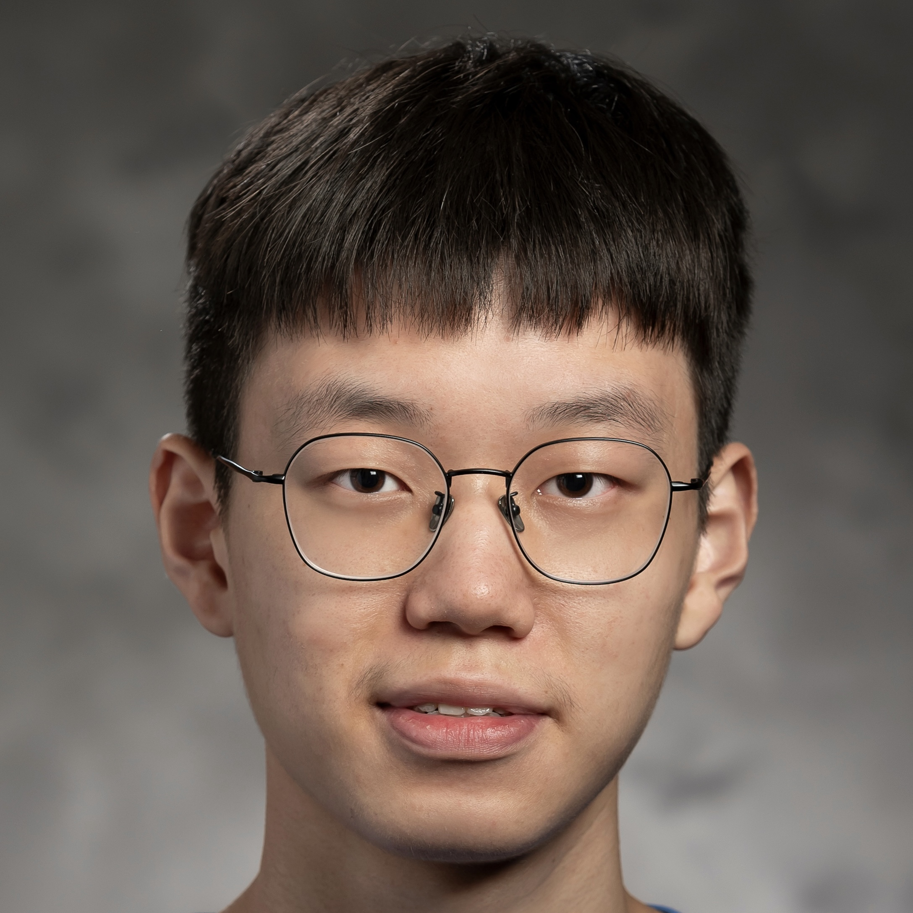
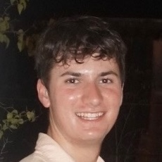
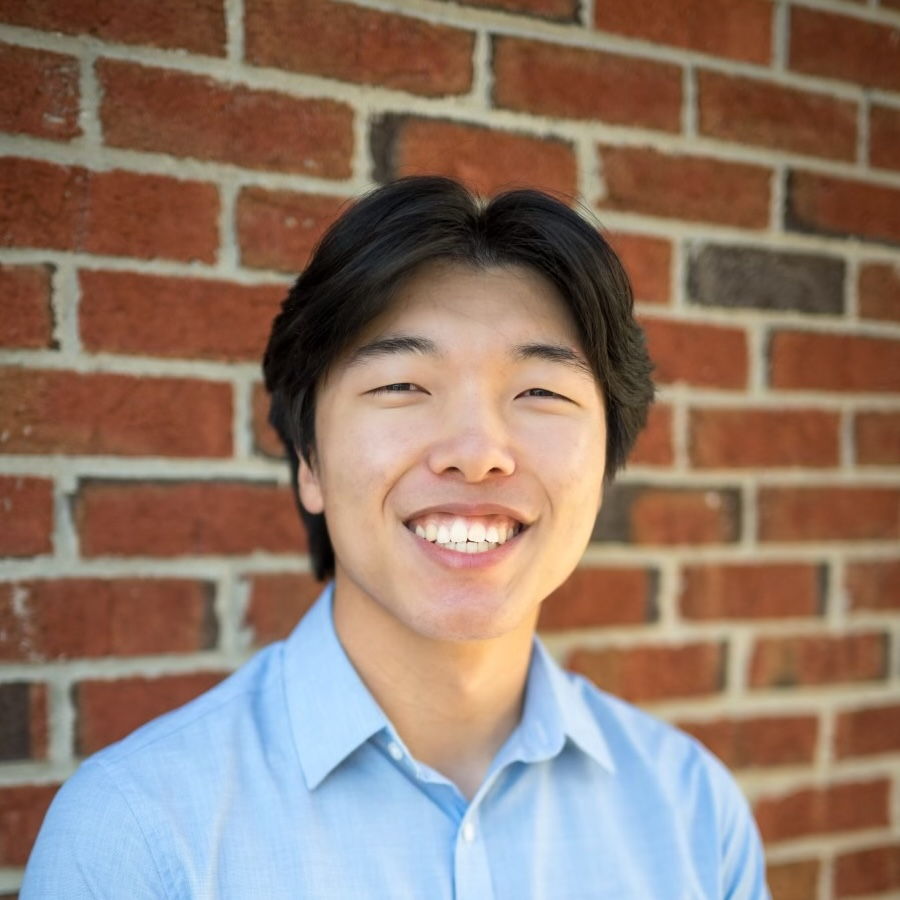
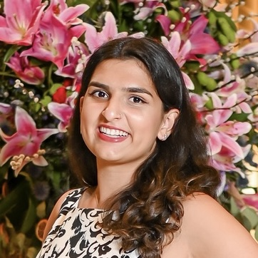
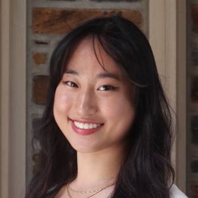
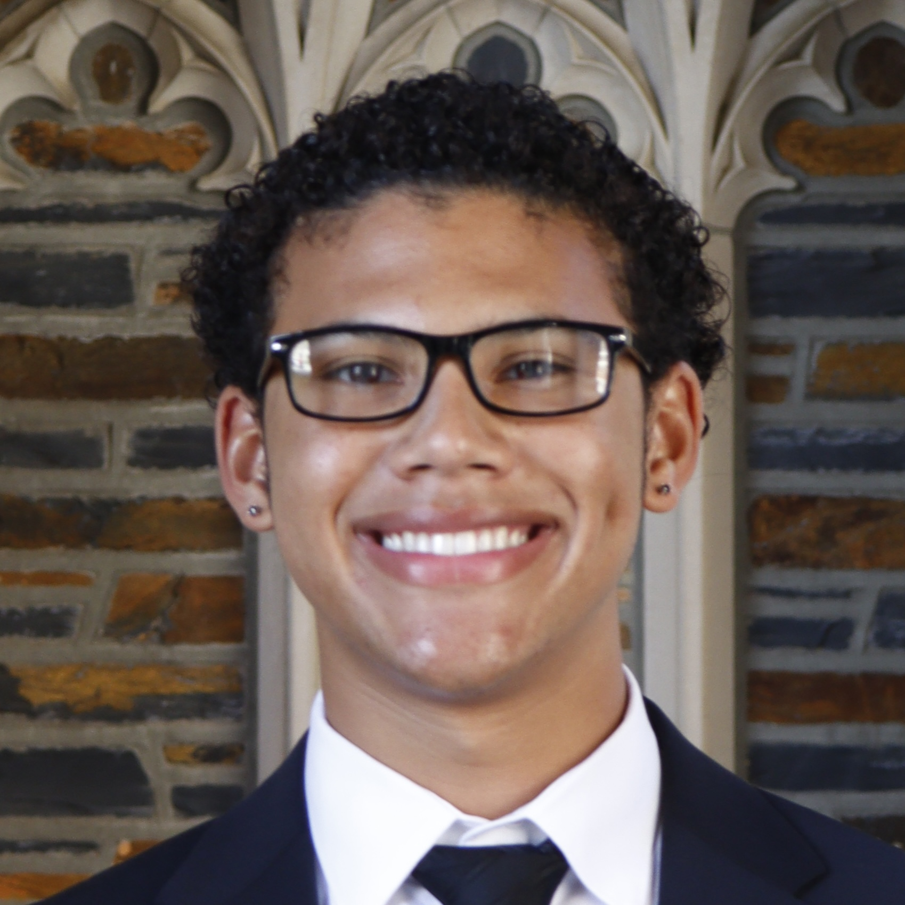

+------------------------------+--------------------+---------------+--------------------------------+
| Mug                          | Name               | Role          | Office Hours                   |
+==============================+====================+===============+================================+
| {.circ}   | Castillo, Jesus    | TA            | **Thu 10:00 AM - 12:00 PM**\   |
|                              |                    |               | Old Chem 203A                  |
+------------------------------+--------------------+---------------+--------------------------------+
| {.circ}    | Chen, Songliang    | TA            | **Tue 10:00 AM - 12:00 PM**\   |
|                              |                    |               | Old Chem 203A                  |
+------------------------------+--------------------+---------------+--------------------------------+
| {.circ}   | Del Preto, Matthew | TA            | **Mon 9:30 AM - 11:30 AM**\    |
|                              |                    |               | Old Chem 203A                  |
+------------------------------+--------------------+---------------+--------------------------------+
| {.circ}   | Kang, Joon         | TA            | **Wed 3:00 PM - 5:00 PM**\     |
|                              |                    |               | Zoom (link on Canvas)          |
+------------------------------+--------------------+---------------+--------------------------------+
| {.circ}    | Lasser, Sonya      | TA            | **Wed 5:00 PM - 7:00 PM**\     |
|                              |                    |               | Old Chem 203B                  |
+------------------------------+--------------------+---------------+--------------------------------+
| {.circ}    | Zhang, Christina   | TA            | **Thu 4:30 PM - 6:30 PM**\     |
|                              |                    |               | Old Chem 203B                  |
+------------------------------+--------------------+---------------+--------------------------------+
| {.circ}    | Zito, John         | Instructor    | **Wed 9:00 AM - 12:00 PM**\    |
|                              |                    |               | *or by appointment*\           |
|                              |                    |               | Old Chem 207                   |
+------------------------------+--------------------+---------------+--------------------------------+
: {tbl-colwidths="[20,20,20,40]"}

## ARC Peer Educator

ARC Peer Tutoring Groups are small groups of 2-5 students in the same course who meet weekly with a Peer Educator. This free resource is focused on allowing students to receive additional support for questions they have on the course content while being part of a community of fellow learners. 

Here are the details for our course:

:::: columns

::: column
- **Peer Educator**: Daniel Reynolds
- **Year**: Sophomore
- **Majors**: Statistical Science & Mathematics
- **Session Location**: Perkins LINK 070 (Seminar 4)
- **Session Time**: Thursdays from 4:45 pm to 5:45 pm
- **Meeting Frequency**: Weekly
- **Sign-up Portal**: [Penji](https://web.penjiapp.com/communities/24BUdkBzj8/learn) 
:::

::: column
{.circ}
:::

::::

Read more about ARC in the [slides](https://docs.google.com/presentation/d/1yskrBYxhtO9j5ais3KHj11InQNNPhJky/edit?usp=sharing&ouid=104386230990457193541&rtpof=true&sd=true) Dr. Swann presented in class on 9/1.

